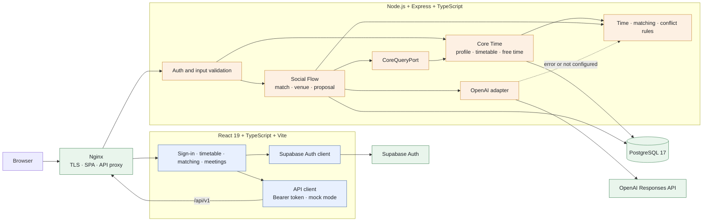

# Campus Mate

> Find open lunch hours from a class timetable, then match students who are free on the same campus.

Team project · 2026.08.16 · Codex Community Hackathon — Seoul for Students · Team 10 · [Korean](./README_KOR.md)

[Live site](https://campusmate.site) · [Demo video](https://github.com/han942/codex-hackerthon/blob/main/campusmate_demo.mov) · [Source code](https://github.com/han942/codex-hackerthon) · [Event page](https://codex-community-korea.skysplit.chatgpt.site/en/hackathon/seoul-2026)

Campus Mate calculates lunch-hour gaps from a student's timetable, recommends other students with overlapping availability, suggests a place to eat, and carries the match through to a meeting proposal. Four teammates who met on the morning of the event took it from feature definition to deployment and presentation in one day.

## 1. Goal

Having a gap between classes does not make it easy to find someone for lunch. Students still need to ask who is on the same campus, compare timetables, and agree on how long they can meet. Meeting someone new adds another round of coordination around shared interests and where to eat.

This project treats a timetable as **data for connecting people**, rather than something that is only displayed back to its owner.

- Calculate actual free periods from a class timetable.
- Find students on the same campus whose gaps and minimum meeting times overlap.
- Use shared interests and natural-language requests to rank candidates.
- Continue from a match to venue selection and a meeting proposal.

The team had 12 hours and had never worked together before, so we did not try to include every possible feature. We focused on a core flow that still worked without AI, stayed consistent when schedules changed or proposals were accepted concurrently, and allowed the frontend and two backend owners to develop without waiting on one another.

## 2. Architecture

The React frontend and Express backend run separately, with nginx serving the SPA and proxying `/api/v1`. Supabase handles authentication, while PostgreSQL stores application data. The OpenAI API is optional and is used only to interpret natural-language requests and adjust recommendation order.



### Free-time calculation and matching

`Core Time` owns profiles, class schedules, and preferred lunch periods. It first finds gaps between classes, limits them to the `11:00–15:00` service window, and intersects them with the times a user has chosen. Even when two students have an overlapping gap, the match is discarded if it does not meet both users' minimum-duration settings.

`Social Flow` does not query timetable tables directly. It receives only the data it needs through `CoreQueryPort`.

```ts
interface CoreQueryPort {
  getUserMatchView(userId: string): Promise<UserMatchView>;
  listDiscoverableCampusUsers(campusId: string, excludeUserId: string): Promise<UserMatchView[]>;
  getEffectiveSlots(userId: string): Promise<TimeSlot[]>;
}
```

While Backend A implemented the real timetable features, Backend B worked against a fake implementation of this interface. The same boundary also lets HTTP tests use an in-memory store instead of PostgreSQL.

### Where AI fits

AI does not decide who is eligible for a match. The server first checks campus, visibility settings, overlapping free time, and minimum meeting duration. AI only changes the order of candidates that have already passed those rules and provides a short recommendation reason.

```text
Natural-language request
→ extract date, time, duration, and budget
→ filter and score candidates with server rules
→ adjust candidate order with AI
→ validate the response shape and returned IDs
→ return recommendations
```

The model can choose at most five students from the rule-scored top 50 and three venues from the top 30. It receives anonymous IDs and matching evidence such as shared interests, but not email addresses, course names, or complete timetables. Responses are checked with a Zod schema. If the API key is missing or the response is invalid, the server uses its original ranking and prewritten reasons.

### Preventing meeting conflicts

A schedule may change after a student opens the candidate list, so common availability is checked again both when a proposal is created and when it is accepted. If the time now conflicts with an accepted meeting, the API returns `409` with the current available slots so the user can choose again.

A per-user lock and conditional status update ensure that only one of two simultaneous acceptances can succeed. An accepted `MeetingProposal` is also the appointment record, avoiding a second table with the same information.

### Implementation

| Area | Technology | Responsibility |
|---|---|---|
| Frontend | React 19, TypeScript, Vite | Sign-in, onboarding, timetable, chat, matching, venue, and meeting screens |
| Backend | Node.js 22, Express 5, Zod | Auth, validation, free-time calculation, matching, and proposal transitions |
| Database | PostgreSQL 17, raw SQL migrations | Profiles, timetables, venues, and meeting data |
| Auth | Supabase Auth | Email authentication and session management |
| AI | OpenAI API | Natural-language intent parsing and re-ranking valid candidates |
| Infrastructure | Docker Compose, nginx | Full-stack runtime, TLS, and SPA/API routing |

The backend is assembled in `createApp()` from an injected store, token verifier, `CoreQueryPort`, AI adapter, and clock. This keeps the HTTP layer independent of concrete database and external-service implementations and makes lightweight test substitutes possible.

The real API and mock API paths share the same frontend TypeScript contracts. With `VITE_USE_MOCK_API=true`, timetable, availability, match, venue, and proposal data live in browser memory, so the same screens and user flow can be developed before the backend is ready.

### How the team split the work

All four teammates met for the first time at the event, and implementation could not start until the afternoon. Instead of immediately dividing up screens and endpoints, we spent the first hour agreeing on the feature source of truth and API contract.

1. Set `docs/funtiondalspec.md` as the single source of truth for scope and business rules.
2. Define requests and responses in `docs/api/` so frontend and backend work from the same contract.
3. Split the backend into `Core Time` and `Social Flow`, with clear file ownership and no-touch areas.
4. Use a fake `CoreQueryPort` to remove waiting time between the two backend workstreams.
5. Integrate in a fixed order: skeleton merge → rebase → real port → migrate, seed, test, and smoke test.

| Member | Role | Main work |
|---|---|---|
| 신진범 (bumsoft) | Backend A — Core Time | Server skeleton, auth, profiles, schedule CRUD, free-time calculation, infrastructure and deployment |
| 한승원 (han942) | Backend B — Social Flow | Match, venue, and proposal routes; chat-based AI matching API |
| HangJun | Frontend | React screens, timetable UI, and chat integration |
| 박진희 | Planning | Functional specification and presentation |

## 3. Results

The final version covers the complete path from account and profile setup to timetable registration, free-time matching, venue selection, proposal, and acceptance. A student can ask, “Find me someone for lunch for an hour at noon on Thursday,” or browse the candidate list directly.

| Flow | Result |
|---|---|
| Profile and timetable | Register school, campus, interests, classes, and preferred lunch periods |
| Free-time matching | Recommend students who satisfy campus and common-availability rules |
| Venue recommendation | Return up to three options based on walking distance, budget, and remaining time; custom input is also supported |
| Meeting proposal | Reflect acceptance or rejection in both students' meeting lists |
| Failure handling | Re-check changed schedules and concurrent acceptances; use rule results when AI fails |

The React SPA, Express API, and PostgreSQL database were deployed to `campusmate.site` as a Docker Compose stack, with nginx handling TLS and API proxying. Seed data covers schools, campuses, venues, and 100 demo members. The frontend can also run through the same screens in mock mode without the backend.

The commit-intensive period from the first commit to deployment and submission was about **3 hours 15 minutes**.

| Time (KST) | Work completed |
|---|---|
| 14:16 | Repository initialized |
| 14:33–14:49 | Functional source of truth, API docs, and backend work-split guide |
| 14:56–15:00 | Backend skeleton, Core Time API, authentication, and contract tests |
| 15:24–15:39 | Initial frontend screens and match/proposal routes |
| 16:06–16:22 | PostgreSQL persistence and 100-member demo seed |
| 16:33–16:37 | Chat-based AI matching and frontend–backend integration |
| 16:51–17:26 | Deployment fixes, TLS proxy, and demo video |
| 17:30 | Codex Build Logs and presentation submitted |

### What we learned

- With a newly formed team, agreeing on the API and areas of ownership saved more time than starting code immediately.
- A small interface such as `CoreQueryPort` was enough to let the two backend owners work independently.
- Placing rules and validation around AI kept the core feature available even when the API failed.
- For a one-day project, deciding what not to build was as important as choosing what to build.

### Limitations and next steps

Self-built token/session APIs, blocking and reporting, timetable OCR, live venue search, activities other than `LUNCH`, and real-time notifications were left out of the one-day scope. We also did not have time to measure match quality, proposal acceptance rate, or time to first meeting with real users. Those measurements should come before deciding which feature to add next.

## Running the project

Node.js 22 or later and Docker are required.

```bash
git clone https://github.com/han942/codex-hackerthon.git
cd codex-hackerthon
cp .env.example .env      # set POSTGRES_PASSWORD; set SUPABASE_* for real auth
docker compose up -d --build
# frontend  http://localhost:5173
# backend   http://localhost:3000
docker compose down
```

To run the backend on its own:

```bash
cd backend
cp .env.example .env
docker compose up -d       # PostgreSQL
npm run migrate
npm run seed
npm start
npm test                   # uses the in-memory store; no database required
```

- Local demo auth: `Authorization: Bearer demo:user_a`
- Frontend mock mode: `VITE_USE_MOCK_API=true`
- Without AI: leave `OPENAI_API_KEY` unset to use rule-based recommendations

## Team and event

The Codex Community Hackathon — Seoul for Students ran from 09:00 to 21:00 on August 16, 2026. One hundred university students participated in 25 teams formed on site. Because the judges also reviewed how each team used Codex and recovered from problems, we removed system prompts and secrets from the per-member session logs and submitted them under [`codexlog/`](https://github.com/han942/codex-hackerthon/tree/main/codexlog).

- **Organizer:** [Codex Community Korea](https://codex-community-korea.skysplit.chatgpt.site/)
- **Co-hosts:** [ToBigs](https://www.datamarket.ai.kr/), [Pseudo Lab](https://pseudo-lab.com/), [BITAmin](https://www.bitamin.ai.kr/)
- **Partners:** [OpenAI Codex](https://openai.com/codex/), [AWS](https://aws.amazon.com/), [Runpod](https://www.runpod.io/), Elev8, [DEVOCEAN](https://devocean.sk.com/), Hugging Face KREW, [Endplan](https://endplan.ai/ko)
- **Contact:** Seung-Won Han — [@han942](https://github.com/han942)

> This folder documents a hackathon submission. The source repository does not declare a license.
