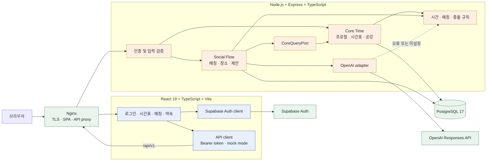

# Campus Mate

> 수업 시간표에서 공강을 찾아, 같은 시간에 만날 수 있는 캠퍼스 친구와 식사 장소를 추천하는 서비스

팀 프로젝트 · 2026.08.16 · Codex Community Hackathon — Seoul for Students · Team 10 · [English](./README.md)

[서비스](https://campusmate.site) · [데모 영상](https://github.com/han942/codex-hackerthon/blob/main/campusmate_demo.mov) · [소스 코드](https://github.com/han942/codex-hackerthon) · [행사 페이지](https://codex-community-korea.skysplit.chatgpt.site/en/hackathon/seoul-2026)

Campus Mate는 시간표를 등록하면 점심시간의 공강을 계산하고, 시간이 겹치는 학생과 식사 장소를 추천해 약속까지 잡을 수 있게 만든 서비스다. 행사 당일 처음 만난 네 명이 기능 정의부터 배포와 발표까지 하루 안에 진행했다.

## 1. Goal

수업 사이에 시간이 비어 있어도 함께 밥을 먹을 사람을 찾기는 쉽지 않다. 누가 같은 캠퍼스에 있는지, 서로 언제 비는지, 어느 정도 시간을 낼 수 있는지를 하나씩 물어봐야 하기 때문이다. 새로운 사람을 만나려면 관심사와 식사 장소까지 추가로 조율해야 한다.

이 프로젝트에서는 시간표를 단순히 보여주는 데서 그치지 않고, **사람을 연결하는 데이터로 활용**하고자 했다.

- 수업 시간표에서 실제 공강을 계산한다.
- 같은 캠퍼스에서 공강과 최소 만남 시간이 겹치는 학생을 찾는다.
- 관심사와 자연어 요청을 반영해 후보를 추천한다.
- 장소 선택과 약속 제안까지 하나의 흐름으로 이어준다.

처음 만난 팀원들이 12시간 안에 결과물을 만들어야 했기 때문에 모든 기능을 넣으려 하지는 않았다. 대신 AI를 사용할 수 없는 상황에서도 매칭이 동작하고, 시간이 바뀌거나 두 약속이 동시에 수락될 때도 데이터가 꼬이지 않으며, 프론트엔드와 백엔드가 서로를 기다리지 않고 개발할 수 있는 구조를 우선했다.

## 2. Architecture

React 프론트엔드와 Express 백엔드를 분리하고, nginx가 정적 SPA와 `/api/v1` 요청을 전달하도록 구성했다. 인증은 Supabase에 맡기고, 서비스 데이터는 PostgreSQL에 저장했다. OpenAI API는 자연어 의도 파악과 추천 순서 조정에만 선택적으로 사용한다.



### 공강 계산과 매칭

`Core Time`은 프로필, 수업 시간표, 선호 점심 시간을 관리한다. 먼저 시간표에서 수업이 없는 구간을 찾고, 서비스 시간인 `11:00~15:00` 안으로 범위를 줄인 뒤 사용자가 지정한 가능 시간과 교집합을 구한다. 두 학생의 시간이 겹치더라도 양쪽이 설정한 최소 만남 시간을 충족하지 못하면 후보에서 제외한다.

`Social Flow`는 시간표 테이블을 직접 조회하지 않고 `CoreQueryPort`를 통해 필요한 정보만 받는다.

```ts
interface CoreQueryPort {
  getUserMatchView(userId: string): Promise<UserMatchView>;
  listDiscoverableCampusUsers(campusId: string, excludeUserId: string): Promise<UserMatchView[]>;
  getEffectiveSlots(userId: string): Promise<TimeSlot[]>;
}
```

이 인터페이스를 기준으로 Backend A가 실제 시간표 기능을 만드는 동안 Backend B는 fake 구현을 연결해 먼저 작업할 수 있었다. 테스트에서는 같은 경계에 in-memory store를 넣어 PostgreSQL 없이 HTTP 흐름을 확인했다.

### AI가 개입하는 범위

AI가 누구를 만날 수 있는지 직접 결정하게 하지는 않았다. 캠퍼스, 공개 설정, 공통 공강, 최소 만남 시간은 서버가 먼저 검사하고, AI는 통과한 후보의 순서를 조정하고 추천 이유를 만드는 역할만 맡는다.

```text
자연어 요청
→ 날짜·시간·소요 시간·예산 추출
→ 서버 규칙으로 후보 필터링 및 점수 계산
→ AI로 후보 순서 조정
→ 응답 형식과 후보 ID 재검사
→ 추천 결과 반환
```

학생 추천은 규칙 점수 상위 50명 중 최대 5명, 장소 추천은 상위 30곳 중 최대 3곳으로 제한했다. 모델에는 익명 ID와 공통 관심사 같은 추천 근거만 보내며, 이메일·과목명·전체 시간표는 보내지 않는다. 응답은 Zod schema로 검사하고, API key가 없거나 응답이 잘못되면 서버가 계산한 순서와 미리 만든 추천 문구를 그대로 사용한다.

### 약속 충돌 방지

추천 목록을 본 뒤 상대방의 시간표가 바뀔 수 있기 때문에, 공통 시간은 제안을 만들 때와 수락할 때 각각 다시 확인한다. 이미 확정된 약속과 겹치면 `409`와 현재 가능한 시간을 돌려주고 사용자가 다시 고르게 했다.

동시에 여러 제안을 수락하는 경우에는 사용자 단위 lock과 조건부 상태 변경을 적용해 하나만 성공하도록 했다. 수락된 `MeetingProposal` 자체를 약속으로 사용하므로 같은 정보를 담는 `Appointment` 테이블은 따로 만들지 않았다.

### 구현 구성

| 영역 | 사용 기술 | 맡은 역할 |
|---|---|---|
| Frontend | React 19, TypeScript, Vite | 로그인, 온보딩, 시간표, 채팅, 매칭, 장소 선택, 약속 화면 |
| Backend | Node.js 22, Express 5, Zod | 인증, 입력 검증, 공강 계산, 매칭, 제안 상태 변경 |
| Database | PostgreSQL 17, raw SQL migration | 프로필, 시간표, 장소, 약속 데이터 저장 |
| Auth | Supabase Auth | 이메일 인증과 session 관리 |
| AI | OpenAI API | 자연어 요청 해석과 검증된 후보 재정렬 |
| Infra | Docker Compose, nginx | 전체 stack 실행, TLS, SPA와 API routing |

백엔드는 `createApp()`에서 store, token verifier, `CoreQueryPort`, AI adapter, clock을 주입받는다. 외부 서비스와 DB 구현을 바꿔 끼울 수 있어 HTTP 테스트에서는 가벼운 대역을 사용할 수 있다.

프론트엔드는 실제 API와 mock API가 같은 TypeScript contract를 공유한다. `VITE_USE_MOCK_API=true`로 실행하면 시간표, 가능 시간, 매칭, 장소, 제안 데이터를 브라우저의 in-memory state로 처리하므로 백엔드가 준비되지 않은 상태에서도 화면과 사용자 흐름을 만들 수 있었다.

### 팀 작업을 나눈 방법

네 명 모두 행사 당일 처음 만났고, 실제 commit은 오후부터 시작해야 했다. 바로 코드를 나누면 서로 다른 API를 만들 가능성이 컸기 때문에 첫 한 시간 동안 기능 정본과 API 계약부터 작성했다.

1. `docs/funtiondalspec.md`를 기능 범위와 규칙의 단일 정본으로 정했다.
2. `docs/api/`에 요청과 응답 형태를 먼저 적어 프론트엔드와 백엔드가 같은 기준으로 작업하게 했다.
3. 백엔드를 `Core Time`과 `Social Flow`로 나누고 담당 파일과 수정하지 않을 영역을 명시했다.
4. `CoreQueryPort`의 fake 구현으로 두 백엔드 작업 사이의 대기 시간을 없앴다.
5. skeleton 병합 → rebase → 실제 port 연결 → migrate·seed·test·smoke test 순으로 통합했다.

| 팀원 | 역할 | 주요 작업 |
|---|---|---|
| 신진범 (bumsoft) | Backend A — Core Time | 서버 skeleton, 인증, 프로필, 시간표 CRUD, 공강 계산, 인프라·배포 |
| 한승원 (han942) | Backend B — Social Flow | 매칭·장소·제안 route, 채팅 기반 AI 매칭 API |
| HangJun | Frontend | React 화면, 시간표 UI, 채팅 연동 |
| 박진희 | 기획 | 기능 명세서, 발표 자료 |

## 3. Results

최종 버전에서는 회원가입과 프로필 설정부터 시간표 등록, 공강 매칭, 식사 장소 선택, 약속 제안과 수락까지 한 번에 진행할 수 있다. 사용자는 “목요일 12시에 한 시간 점심 친구 찾아줘”처럼 채팅으로 요청하거나 후보 목록을 직접 볼 수 있다.

| 구현한 흐름 | 결과 |
|---|---|
| 프로필과 시간표 | 학교·캠퍼스·관심사, 수업, 선호 점심 시간 등록 |
| 공강 매칭 | 같은 캠퍼스와 공통 가능 시간을 만족하는 학생을 추천 |
| 장소 추천 | 도보 거리, 예산, 남은 시간을 반영해 최대 3곳 추천; 직접 입력도 가능 |
| 약속 제안 | 상대방의 수락·거절과 양쪽 약속 목록 반영 |
| 예외 처리 | 시간 변경과 중복 수락을 재검사하고, AI 오류 시 규칙 기반 결과 사용 |

React SPA, Express API, PostgreSQL을 Docker Compose로 묶어 `campusmate.site`에 배포했고, nginx에서 TLS와 API proxy를 처리했다. 학교·캠퍼스·장소와 100명의 demo member를 seed해 실제 흐름을 바로 확인할 수 있게 했다. 백엔드가 없어도 프론트엔드 mock mode로 같은 화면을 실행할 수 있다.

첫 commit부터 배포와 제출까지 commit이 집중된 시간은 약 **3시간 15분**이었다.

| 시각 (KST) | 진행 내용 |
|---|---|
| 14:16 | 저장소 초기화 |
| 14:33~14:49 | 기능 정본, API 문서, 백엔드 작업 분배 문서 작성 |
| 14:56~15:00 | 백엔드 skeleton, Core Time API, 인증, contract test |
| 15:24~15:39 | 프론트엔드 초기 화면, 매칭·제안 route |
| 16:06~16:22 | PostgreSQL 저장, demo member 100명 seed |
| 16:33~16:37 | 채팅 기반 AI 매칭과 프론트엔드–백엔드 연동 |
| 16:51~17:26 | 배포 수정, TLS proxy, 데모 영상 제작 |
| 17:30 | Codex Build Log와 발표 자료 제출 |

### 개발 과정에서 확인한 점

- 처음 만난 팀에서는 코드를 빨리 쓰는 것보다 API와 담당 범위를 먼저 합의하는 편이 전체 개발 시간을 줄였다.
- `CoreQueryPort`처럼 작은 인터페이스 하나가 두 백엔드 작업을 독립적으로 진행하는 데 큰 도움이 되었다.
- AI 앞뒤에 규칙과 검증을 두면 API가 실패해도 핵심 기능을 그대로 유지할 수 있었다.
- 하루 안에 끝내야 하는 프로젝트에서는 만들지 않을 기능을 미리 정하는 것도 중요한 설계 결정이었다.

### 한계와 다음 단계

자체 token/session API, 차단·신고, 시간표 OCR, 실시간 장소 검색, `LUNCH` 이외의 활동, 실시간 알림은 하루 개발 범위에서 제외했다. 실제 사용자를 대상으로 매칭 품질, 제안 수락률, 첫 약속까지 걸리는 시간을 측정하지 못한 점도 한계다. 다음 단계에서는 이 지표를 먼저 수집한 뒤 필요한 기능의 우선순위를 정할 예정이다.

## 실행 방법

Node.js 22 이상과 Docker가 필요하다.

```bash
git clone https://github.com/han942/codex-hackerthon.git
cd codex-hackerthon
cp .env.example .env      # POSTGRES_PASSWORD 설정, 실제 인증 사용 시 SUPABASE_* 설정
docker compose up -d --build
# frontend  http://localhost:5173
# backend   http://localhost:3000
docker compose down
```

백엔드만 실행하려면 다음 명령을 사용한다.

```bash
cd backend
cp .env.example .env
docker compose up -d       # PostgreSQL
npm run migrate
npm run seed
npm start
npm test                   # in-memory store 사용, DB 불필요
```

- 로컬 demo 인증: `Authorization: Bearer demo:user_a`
- 프론트엔드 mock mode: `VITE_USE_MOCK_API=true`
- AI 없이 실행: `OPENAI_API_KEY`를 설정하지 않으면 규칙 기반 추천 사용

## 팀과 행사

Codex Community Hackathon — Seoul for Students는 2026년 8월 16일 09:00~21:00에 진행되었다. 대학생 100명이 25개 팀으로 참가했으며, 팀은 현장에서 처음 구성되었다. Codex를 어떻게 활용하고 문제를 복구했는지도 심사 대상이었기 때문에 팀원별 session log에서 system prompt와 secret을 제거한 뒤 [`codexlog/`](https://github.com/han942/codex-hackerthon/tree/main/codexlog)에 함께 제출했다.

- **주최:** [Codex Community Korea](https://codex-community-korea.skysplit.chatgpt.site/)
- **공동 주최:** [투빅스](https://www.datamarket.ai.kr/), [가짜연구소](https://pseudo-lab.com/), [비타민](https://www.bitamin.ai.kr/)
- **파트너:** [OpenAI Codex](https://openai.com/codex/), [AWS](https://aws.amazon.com/), [Runpod](https://www.runpod.io/), Elev8, [DEVOCEAN](https://devocean.sk.com/), Hugging Face KREW, [Endplan](https://endplan.ai/ko)
- **연락처:** 한승원 — [@han942](https://github.com/han942)

> 이 폴더는 해커톤 제출물을 정리한 기록이다. 소스 저장소에는 별도의 license가 명시되어 있지 않다.
