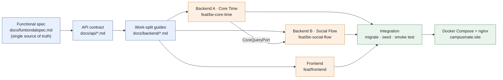

# Campus Mate

Codex Community Hackathon — Seoul for Students · Team 10 · [Korean](./README_KOR.md)

[Live Site](https://campusmate.site) · [Demo Video](https://github.com/han942/codex-hackerthon/blob/main/campusmate_demo.mov) · [Event Page](https://codex-community-korea.skysplit.chatgpt.site/en/hackathon/seoul-2026) · [Source Repository](https://github.com/han942/codex-hackerthon)

## About The Project

Students have gaps between classes, but no way to know who else on campus is free at the same time.

Campus Mate reads a class timetable, computes the free periods, and matches two students whose gaps overlap — then suggests somewhere nearby to eat. The goal was to turn a timetable into a matching signal, built in a single day by a team formed on the spot.

### The Event

| | |
|---|---|
| Event | [Codex Community Hackathon — Seoul for Students](https://codex-community-korea.skysplit.chatgpt.site/en/hackathon/seoul-2026) |
| Organizer | Codex Community Korea |
| Date | August 16, 2026 · 09:00–21:00 |
| Scale | 100 university students · 25 teams |
| Awards | 1st $5,000 · 2nd $2,500 · 3rd $1,000 in API credits |

The event's defining constraint: *"Meet for the first time, then build from scratch on site."* **Teams are formed on the day** — no pre-arranged teams, no pre-built projects, and applicants are balanced between developer-major and non-developer-major participants. Problem definition, implementation, and verification all had to happen within the event.

Judging weighed *"the value and feasibility of the problem, team decisions, Codex use and recovery, and verification evidence—not only whether the output works."* The **Codex Build Log** is itself a reviewed submission artifact, which is why every member's session log is committed under [`codexlog/`](https://github.com/han942/codex-hackerthon/tree/main/codexlog) — sanitized of system prompts and secrets.

### Built With

| Layer | Choice | Note |
|---|---|---|
| Frontend | React 19, TypeScript, Vite | Mock API mode for backend-free screen checks |
| Backend | Node.js 22, Express 5, TypeScript | `tsx` runtime, `vitest` for tests |
| Database | PostgreSQL 17 | Raw SQL migrations, no ORM |
| Auth | Supabase | External provider only — no self-built tokens |
| AI | OpenAI API + Zod | Structured output, schema-validated |
| Infra | Docker Compose, nginx | TLS proxy in front of the stack |

## Getting Started

### Prerequisites

- Node.js 22 or later
- Docker

### Installation

Full stack (frontend + backend + PostgreSQL):

```bash
git clone https://github.com/han942/codex-hackerthon.git
cd codex-hackerthon
cp .env.example .env      # set POSTGRES_PASSWORD, and SUPABASE_* if using real auth
docker compose up -d --build
# frontend  http://localhost:5173
# backend   http://localhost:3000
docker compose down
```

Backend only:

```bash
cd backend
cp .env.example .env
docker compose up -d       # PostgreSQL
npm run migrate
npm run seed
npm start
npm test                   # in-memory store, no database needed
```

Notes:

- `VITE_USE_MOCK_API=true` runs the frontend against mock data with no backend at all.
- Local demo auth uses `Authorization: Bearer demo:user_a`.
- `OPENAI_API_KEY` is optional — without it the AI paths fall back to rule-based ranking.

## Usage

1. **Sign in** and complete the profile — school, campus, interests.
2. **Register your timetable**, then add your preferred lunch times. This step is required: with no registered availability there are no common free periods to compute. The server derives free time inside an `11:00–15:00` window.
3. **Ask in the chat** — "목요일 12시에 한 시간 점심 친구 찾아줘" — or browse the mate list directly. Candidates are filtered to the same campus, overlapping free time, and both sides' minimum meeting duration.
4. **Pick a venue** from the 3 recommendations, ranked by walking distance, budget, and remaining time — or type your own (2–50 characters).
5. **Send the proposal.** The recipient accepts or rejects; accepted proposals appear for both sides under appointments.

A `409` conflict on creation or acceptance is a normal part of the flow — the common free time is re-checked at both points, and the UI re-offers the current slots.

## Development Timeline



> Spec first, contract second, code third — so three agents could work in parallel without stepping on each other

| Time (KST) | Event |
|---|---|
| 09:00 | Event opens; teams formed on site from strangers |
| 14:16 | Initial commit, repo setup |
| 14:33 – 14:49 | Functional spec, API docs, backend work-split guide |
| 14:56 – 15:00 | Backend skeleton, core-time APIs, auth provider, contract tests |
| 15:24 – 15:39 | First frontend screens; match & proposal routes |
| 16:06 – 16:22 | PostgreSQL persistence, demo seed (100 members) |
| 16:33 – 16:37 | Chat-based AI matching API, frontend ↔ server integration |
| 16:51 – 17:26 | Deployment fixes, TLS proxy, demo video |
| 17:30 | Codex Build Logs and presentation submitted |
| 21:00 | Event closes |

Roughly **3 hours 15 minutes** of commits, inside a 12-hour day that also had to cover meeting the team, agreeing on a problem, and preparing the presentation.

### How the parallel work was organized

| Member | Role | Main output |
|---|---|---|
| 신진범 (bumsoft) | Backend A — Core Time | Server skeleton, auth, profile, schedule CRUD, free-time calculation, infra & deploy |
| 한승원 (han942) | Backend B — Social Flow | Match/venue/proposal routes, chat-based AI matching API |
| HangJun | Frontend | React screens, timetable UI, chat integration |
| 박진희 | Spec | Functional specification, presentation |

Four people who had not worked together before needed a way to write code simultaneously without colliding. The answer was to spend the first hour writing documents instead of code:

1. **Fix a single source of truth.** `docs/funtiondalspec.md` defines scope and rules, with an explicit precedence order — spec > API docs > code — and a rule that no P0 feature may be added from the API docs alone.
2. **Turn the spec into an HTTP contract** (`docs/api/`) before any implementation, so frontend and backend could start simultaneously against the same endpoints.
3. **Split the backend into two non-overlapping owners** with a file-ownership table and an explicit "do not touch" list.
4. **Decouple the two halves with an interface.** Backend B never queries A's timetable tables — it goes through `CoreQueryPort`, built against a **fake implementation** until A's real one landed.

   ```ts
   interface CoreQueryPort {
     getUserMatchView(userId: string): Promise<UserMatchView>;
     listDiscoverableCampusUsers(campusId: string, excludeUserId: string): Promise<UserMatchView[]>;
     getEffectiveSlots(userId: string): Promise<TimeSlot[]>;
   }
   ```

5. **Integrate in a fixed order** — A's skeleton merges first, B rebases, the fake port is swapped for the real one, then migrate/seed/test/smoke on a clean clone.

### AI design

AI is used as a **re-ranker inside a rule-filtered candidate set**, never as the source of truth:

- The server first enforces same school/campus, discoverability, common available time, and minimum meeting duration
- Only anonymized candidate IDs and shared-attribute evidence reach the model — no emails, course names, or full timetables
- The model re-ranks at most **5 mates** (from a rule-scored top 50) and **3 venues** (from top 30), and returns IDs the server re-validates
- Every AI response is parsed through a Zod schema; on failure the system falls back to rule-based ranking with templated reasons

The natural-language intent parser follows the same pattern: the model extracts date, time, duration, budget, and atmosphere, and the server does the actual matching.

## Roadmap

Cut from the one-day build on purpose: self-built token/session APIs, block & report, timetable OCR, live venue search, and any activity other than `LUNCH`. Real-time notifications were also left out.

The event page will become a public archive after results are confirmed:

- [ ] Winning teams and selection rationale
- [ ] Project gallery of participating teams
- [ ] Public GitHub and demo links
- [ ] Event recap and verified participation statistics

## Takeaways

- **Writing the contract before the code is what made parallel agent work possible.** Four strangers generating code simultaneously will collide unless ownership and endpoints are decided up front.
- **An interface seam (`CoreQueryPort`) plus a fake implementation removed the blocking dependency** — Backend B was not idle while Backend A built the foundation.
- **Constraining the AI beats trusting it.** Rules filter, AI re-ranks, server re-validates, fallback always exists. The demo works even with the OpenAI key removed.
- **A written "do not build this" list** kept scope from expanding past what a single day allows.
- **The build log is part of the deliverable.** Because judging reviewed *how* Codex was used and recovered from, keeping a clean session log mattered as much as shipping the feature.

## Contact

Seung-Won Han — [@han942](https://github.com/han942)

Source repository: https://github.com/han942/codex-hackerthon

> This folder is a write-up of a hackathon submission, not an open-source project accepting contributions. The source repository declares no license.

## Acknowledgments

- **Organizer** — [Codex Community Korea](https://codex-community-korea.skysplit.chatgpt.site/)
- **Co-hosts** — [투빅스 (ToBigs)](https://www.datamarket.ai.kr/), [가짜연구소 (Pseudo Lab)](https://pseudo-lab.com/), [비타민 (BITAmin)](https://www.bitamin.ai.kr/)
- **Partners** — [OpenAI Codex](https://openai.com/codex/), [AWS](https://aws.amazon.com/), [Runpod](https://www.runpod.io/), Elev8, [DEVOCEAN](https://devocean.sk.com/), Hugging Face KREW, [Endplan](https://endplan.ai/ko)
- Teammates 신진범, HangJun, and 박진희, met on the morning of the event
