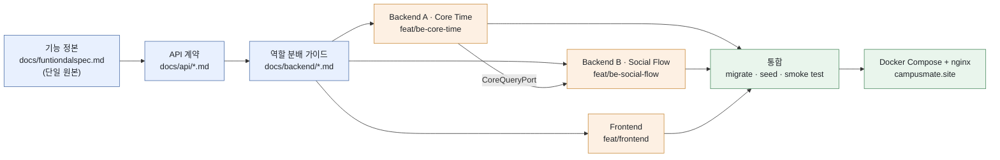

# Campus Mate

Codex Community Hackathon — Seoul for Students · Team 10 · [English](./README.md)

[서비스 바로가기](https://campusmate.site) · [데모 영상](https://github.com/han942/codex-hackerthon/blob/main/campusmate_demo.mov) · [행사 페이지](https://codex-community-korea.skysplit.chatgpt.site/en/hackathon/seoul-2026) · [소스 저장소](https://github.com/han942/codex-hackerthon)

## 프로젝트 소개

학생에게는 수업 사이의 공강이 존재하지만, 같은 캠퍼스에서 누가 그 시간에 비어 있는지 알 방법이 없다.

Campus Mate는 수업 시간표를 읽어 공강을 계산하고, 공강이 겹치는 두 학생을 매칭한 뒤 근처에서 식사할 장소를 제안한다. 시간표를 매칭 신호로 전환하는 것이 목표였으며, 현장에서 구성된 팀이 하루 만에 구현하였다.

### 행사 개요

| | |
|---|---|
| 행사 | [Codex Community Hackathon — Seoul for Students](https://codex-community-korea.skysplit.chatgpt.site/en/hackathon/seoul-2026) |
| 주최 | Codex Community Korea |
| 일시 | 2026년 8월 16일 · 09:00~21:00 |
| 규모 | 대학생 100명 · 25팀 |
| 시상 | 1등 $5,000 · 2등 $2,500 · 3등 $1,000 (API 크레딧) |

이 행사를 규정하는 제약은 *"Meet for the first time, then build from scratch on site"*이다. **팀은 당일 현장에서 구성되며**, 사전 구성 팀과 사전 제작 프로젝트는 허용되지 않는다. 지원자는 개발 전공·비개발 전공으로 구분되어 균형 있게 배치된다. 문제 정의, 핵심 구현, 검증이 모두 행사 당일 안에서 이루어져야 한다.

심사는 *"문제의 가치와 실현 가능성, 팀의 의사결정, Codex 활용과 복구 과정, 검증 근거"*를 함께 보며, 결과물의 동작 여부만으로 평가하지 않는다. **Codex Build Log 자체가 심사 대상 제출물**이며, 이것이 팀원별 session log를 [`codexlog/`](https://github.com/han942/codex-hackerthon/tree/main/codexlog)에 커밋한 이유이다. System prompt와 secret은 제거된 상태이다.

### 기술 스택

| 계층 | 선택 | 비고 |
|---|---|---|
| Frontend | React 19, TypeScript, Vite | Mock API mode로 backend 없이 화면 점검 가능 |
| Backend | Node.js 22, Express 5, TypeScript | `tsx` runtime, test는 `vitest` |
| Database | PostgreSQL 17 | Raw SQL migration, ORM 미사용 |
| Auth | Supabase | 외부 제공자만 사용, 자체 token 미구현 |
| AI | OpenAI API + Zod | Structured output, schema 검증 |
| Infra | Docker Compose, nginx | Stack 앞단에 TLS proxy 배치 |

## 시작하기

### 사전 요구사항

- Node.js 22 이상
- Docker

### 설치 및 실행

전체 stack (frontend + backend + PostgreSQL):

```bash
git clone https://github.com/han942/codex-hackerthon.git
cd codex-hackerthon
cp .env.example .env      # POSTGRES_PASSWORD 설정, 실제 인증 사용 시 SUPABASE_* 설정
docker compose up -d --build
# frontend  http://localhost:5173
# backend   http://localhost:3000
docker compose down
```

Backend 단독 실행:

```bash
cd backend
cp .env.example .env
docker compose up -d       # PostgreSQL
npm run migrate
npm run seed
npm start
npm test                   # 인메모리 저장소 사용, DB 불필요
```

참고 사항:

- `VITE_USE_MOCK_API=true`로 두면 backend 없이 mock 데이터로 화면을 확인할 수 있다.
- 로컬 demo 인증은 `Authorization: Bearer demo:user_a` 형식이다.
- `OPENAI_API_KEY`는 선택이며, 없으면 AI 경로가 규칙 기반 순위로 fallback한다.

## 사용 방법

1. **로그인** 후 학교·캠퍼스·관심사 프로필을 완성한다.
2. **시간표를 등록**하고 선호하는 점심 시간을 추가한다. 이 단계는 필수이다. 등록된 가능 시간이 없으면 공통 공강을 계산할 수 없다. 서버는 `11:00~15:00` 구간 내에서 공강을 산출한다.
3. **채팅으로 요청**하거나("목요일 12시에 한 시간 점심 친구 찾아줘") 메이트 목록을 직접 탐색한다. 후보는 동일 캠퍼스, 공통 가능 시간, 양측 최소 만남 시간 조건으로 필터링된다.
4. **장소를 선택**한다. 도보 거리·예산·남은 시간 기준으로 정렬된 3개 추천에서 고르거나 2~50자로 직접 입력할 수 있다.
5. **제안을 전송**한다. 상대가 수락·거절하며, 수락된 제안은 양쪽 약속 목록에 표시된다.

생성·수락 시 발생하는 `409` 충돌은 예외가 아니라 정상적인 사용 흐름이다. 두 시점 모두에서 공통 가능 시간을 다시 검사하며, UI는 최신 시간대를 다시 제시한다.

## 개발 타임라인



> 정본 → 계약 → 코드 순서를 지켜, 3명의 agent 작업이 서로 충돌하지 않도록 하였다

| 시각 (KST) | 내용 |
|---|---|
| 09:00 | 행사 시작, 현장에서 팀 구성 |
| 14:16 | Initial commit, 저장소 초기 세팅 |
| 14:33 ~ 14:49 | 기능 명세, API 문서, backend 역할 분배 가이드 작성 |
| 14:56 ~ 15:00 | Backend skeleton, core-time API, 인증 연동, contract test |
| 15:24 ~ 15:39 | Frontend 초기 페이지, 매칭·제안 route 구현 |
| 16:06 ~ 16:22 | PostgreSQL 영속화, demo seed(100명) |
| 16:33 ~ 16:37 | 채팅 기반 AI 매칭 API, frontend ↔ server 연동 |
| 16:51 ~ 17:26 | 배포 수정, TLS proxy, demo 영상 |
| 17:30 | Codex Build Log 및 발표 자료 제출 |
| 21:00 | 행사 종료 |

커밋이 이루어진 구간은 약 **3시간 15분**이다. 팀원과 처음 만나고, 문제를 합의하고, 발표를 준비하는 과정이 모두 포함된 12시간 안에서 진행되었다.

### 병렬 작업 구성 방식

| 팀원 | 역할 | 주요 산출물 |
|---|---|---|
| 신진범 (bumsoft) | Backend A — Core Time | 서버 skeleton, 인증, 프로필, 수업 CRUD, 공강 계산, 인프라·배포 |
| 한승원 (han942) | Backend B — Social Flow | 매칭·장소·제안 route, 채팅 기반 AI 매칭 API |
| HangJun | Frontend | React 화면, 시간표 UI, 채팅 연동 |
| 박진희 | Spec | 기능 명세서, 발표 자료 |

함께 일해본 적 없는 4명이 동시에 코드를 작성하면서도 충돌하지 않을 방법이 필요하였다. 해법은 첫 한 시간을 코드가 아니라 문서에 사용하는 것이었다.

1. **단일 정본을 먼저 고정하였다.** `docs/funtiondalspec.md`가 범위와 기능 규칙의 유일한 원본이며, 충돌 시 적용 순서는 `정본 > API 문서 > 코드`이다. API 문서만 보고 P0 기능을 추가하는 것은 금지하였다.
2. **구현 전에 정본을 HTTP 계약으로 구체화하였다**(`docs/api/`). Frontend와 Backend가 동일한 endpoint를 기준으로 동시에 착수하기 위함이다.
3. **Backend를 겹치지 않는 두 소유 영역으로 분리하였다.** 파일 단위 소유권 표와 금지 항목 목록을 명시하였다.
4. **두 영역을 interface로 분리하였다.** Backend B는 A의 시간표 table을 직접 조회하지 않고 `CoreQueryPort`를 경유하며, A의 실제 구현이 완성되기 전까지 **fake 구현**으로 개발을 진행하였다.

   ```ts
   interface CoreQueryPort {
     getUserMatchView(userId: string): Promise<UserMatchView>;
     listDiscoverableCampusUsers(campusId: string, excludeUserId: string): Promise<UserMatchView[]>;
     getEffectiveSlots(userId: string): Promise<TimeSlot[]>;
   }
   ```

5. **통합 순서를 고정하였다.** A의 skeleton을 먼저 병합하고, B가 rebase한 뒤 fake port를 실제 구현으로 교체하며, clean clone에서 migrate·seed·test·smoke test를 실행한다.

### AI 설계

AI는 정답을 만드는 주체가 아니라, **규칙으로 걸러낸 후보군 내부의 re-ranker**로만 사용하였다.

- 서버가 동일 학교·캠퍼스, 발견 허용 여부, 공통 가능 시간, 최소 만남 시간을 먼저 검증한다
- 모델에는 익명 후보 ID와 공통 속성 근거만 전달하며, 이메일·과목명·전체 시간표는 전달하지 않는다
- 규칙 점수 상위 50명 중 최대 **5명**, 상위 30개 장소 중 최대 **3개**만 재정렬하며, 모델이 반환한 ID는 서버가 다시 검증한다
- 모든 AI 응답은 Zod schema로 파싱하며, 실패 시 규칙 순위와 템플릿 이유로 fallback한다

자연어 의도 파싱도 동일한 구조이다. 모델은 날짜·시간·소요 시간·예산·분위기만 추출하고, 실제 매칭 연산은 서버가 수행한다.

## Roadmap

1일 개발 범위에서 의도적으로 제외한 항목은 다음과 같다. 자체 token·session API, 차단·신고, 시간표 OCR, 실시간 장소 검색 API, `LUNCH` 외 활동, 실시간 알림.

행사 페이지는 결과 확정 후 공개 아카이브로 전환될 예정이다.

- [ ] 수상 팀 및 선정 사유
- [ ] 참가 팀 프로젝트 갤러리
- [ ] 공개 GitHub·데모 링크
- [ ] 행사 recap 및 검증된 참여·성과 통계

## Takeaways

- **코드보다 계약을 먼저 작성한 것이 병렬 agent 작업을 가능하게 하였다.** 처음 만난 4명이 동시에 코드를 생성하는 환경에서는 소유권과 endpoint를 선행 확정하지 않으면 충돌이 발생한다
- **Interface seam(`CoreQueryPort`)과 fake 구현이 blocking dependency를 제거하였다.** Backend A가 기반을 구축하는 동안 Backend B가 대기하지 않았다
- **AI를 신뢰하기보다 제약하는 편이 유리하다.** 규칙이 필터링하고, AI가 재정렬하며, 서버가 재검증하고, fallback이 항상 존재한다. OpenAI key 없이도 demo가 동작한다
- **"만들지 않을 것" 목록을 문서화한 것이 범위 확산을 막았다**
- **Build log는 제출물의 일부이다.** 심사가 Codex를 어떻게 활용하고 어떻게 복구했는지를 함께 검토하는 만큼, 깔끔한 session log를 남기는 일이 기능 구현만큼 중요하였다

## 연락처

한승원 — [@han942](https://github.com/han942)

소스 저장소: https://github.com/han942/codex-hackerthon

> 이 폴더는 해커톤 제출물에 대한 기록이며, 기여를 받는 오픈소스 프로젝트가 아니다. 소스 저장소에는 별도의 license가 명시되어 있지 않다.

## 감사의 말

- **주최** — [Codex Community Korea](https://codex-community-korea.skysplit.chatgpt.site/)
- **공동 주최** — [투빅스 (ToBigs)](https://www.datamarket.ai.kr/), [가짜연구소 (Pseudo Lab)](https://pseudo-lab.com/), [비타민 (BITAmin)](https://www.bitamin.ai.kr/)
- **파트너** — [OpenAI Codex](https://openai.com/codex/), [AWS](https://aws.amazon.com/), [Runpod](https://www.runpod.io/), Elev8, [DEVOCEAN](https://devocean.sk.com/), Hugging Face KREW, [Endplan](https://endplan.ai/ko)
- 행사 당일 아침에 만난 팀원 신진범, HangJun, 박진희
