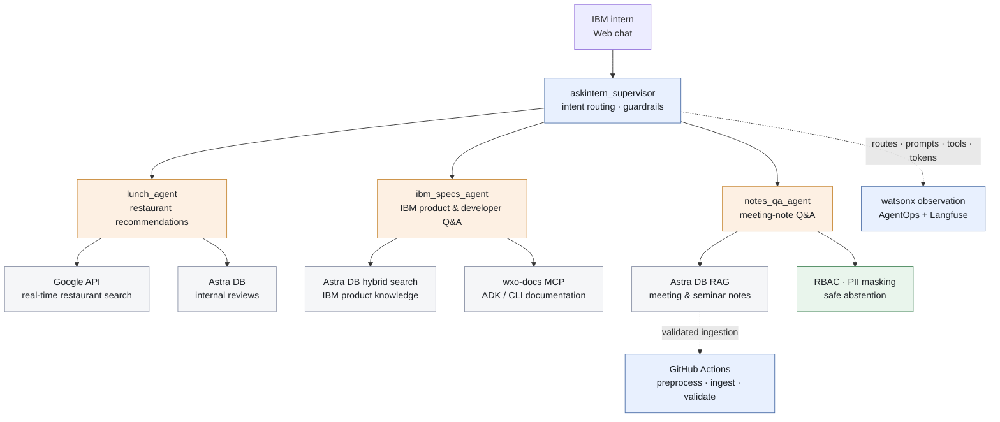

# AskIntern: Multi-Agent Workspace Assistant for IBM Interns

> One workplace chat for lunch recommendations, IBM product questions, and
> meeting-note retrieval

Prototype project · IBM watsonx Orchestrate · [Korean](./README_KOR.md)

[Watch the demo](./demo_askintern_zoom.mp4) ·
[View the presentation](./AskIntern_presentation.pdf)

AskIntern is a multi-agent assistant designed around the recurring questions
IBM interns encounter during the workday. A supervisor agent classifies each
request, sends it to the appropriate specialist, and returns a single response
through a web chat interface.

## 1. Goal

Interns often need information from different systems: nearby restaurant data,
IBM product documentation, developer references, and internal meeting notes.
Searching each source separately creates repeated work, while exposing every
tool to one general-purpose agent makes routing, access control, and failure
handling harder to manage.

AskIntern aims to provide one trustworthy entry point that can:

- route each question to an agent with a clearly defined responsibility;
- combine internal knowledge with real-time external information;
- retrieve answers with traceable sources and abstain when evidence is absent;
- enforce role-based access and mask personal information; and
- expose failures, tool calls, and evaluation results for review.

The project treats routing, retrieval, security, reliability, and observability
as parts of the assistant's core behavior.

## 2. Architecture



### Agent responsibilities

| Agent | User need | Tools and controls |
|---|---|---|
| `lunch_agent` | Find a suitable restaurant near the workplace | Google API, internal review RAG, preference collection, availability filtering |
| `ibm_specs_agent` | Understand IBM products or look up watsonx Orchestrate ADK/CLI usage | Astra DB hybrid search, Granite embeddings, `wxo-docs` MCP |
| `notes_qa_agent` | Retrieve and summarize meeting or seminar notes | Astra DB RAG, RBAC, PII masking, evidence-based abstention |

### Request flow

1. The supervisor classifies the user's intent and checks request guardrails.
2. It routes the request to one specialist agent instead of exposing every tool
   to every agent.
3. The specialist retrieves internal evidence, calls an external service, or
   executes a workflow as required.
4. Access rules and response controls are applied before the answer is returned.
5. Routing, model calls, tools, prompts, tokens, sessions, and tags are captured
   for evaluation and debugging.

### Retrieval and automation

The IBM knowledge agent uses hybrid retrieval to combine semantic and lexical
signals. The documented design adds title prefixes to chunks and uses
Korean-aware Granite embeddings to improve source traceability and Korean query
quality. Product questions and ADK/CLI lookups are routed to different sources.

Meeting-note ingestion follows a validated automation path:

```text
Raw note
  → preprocessing
  → Astra DB ingestion
  → validation
  → searchable note
```

The GitHub Actions design runs this flow when a new raw file is detected, stops
when validation fails, and skips the job when there is no new input.

### Reliability and enterprise controls

- Tool, flow, and agent failures are represented separately with fields such as
  `error_kind`, `retriable`, and a user-facing note.
- Retry and failure branches prevent collection errors from appearing as normal
  answers.
- Deterministic document IDs and upsert-style writes reduce duplicate notes.
- Delete/insert ordering and bounded retries protect concurrent writes.
- Anonymous `Guest` users cannot access meeting notes; authenticated users with
  `role=intern` can be routed to `notes_qa_agent`.
- Names and email addresses are masked before note-based responses are returned.
- Supervisor guardrails cover abusive input and prompt-injection attempts.

## 3. Results

### Evaluation snapshot

The project evaluates the full journey from case definition to agent execution,
trace review, feedback, and iteration.

| Evaluation area | Reported prototype result |
|---|---|
| `ibm_specs_agent` cases | 7 evaluated · 6 passed · 1 failed |
| Agent-level metrics | Mostly `1.00` in the reported run |
| Citation accuracy | `0.86` |
| Tool calls | Expected and actual calls matched in the tested cases |
| Reproducibility | No reported metric drift across two evaluation runs |

Metrics cover three levels:

- **Agent:** journey success, routing accuracy, total and LLM steps, response
  time, keyword match, semantic match, and text match.
- **Tool:** expected and correct calls, missed or irrelevant calls, bad
  parameters, precision, recall, and match success.
- **RAG:** faithfulness, factual correctness, answer relevance, context recall,
  citation accuracy, and abstention accuracy.

The failed `case07_related_product_trap` exposed a weakness in keyword-based
scoring: surface-level term overlap can pass even when the answer does not
satisfy the intended product distinction. It motivated stronger semantic,
tool-use, and case-level checks.

### Reliability results

| Tested scenario | Before | After |
|---|---:|---:|
| Document loss during concurrent writes | 51% | **0%** |
| Successful writes with retry handling | 30 / 48 | **48 / 48** |

These results support the use of deterministic IDs, explicit write ordering,
and bounded retries in the tested ingestion workflow.

### What the prototype demonstrated

- Three specialist agents can serve distinct workplace needs through one chat
  interface while keeping their tools and permissions scoped.
- RAG, MCP, workflow execution, and external APIs can be combined behind a
  supervisor without losing agent-level traceability.
- RBAC, PII masking, prompt-injection defenses, safe abstention, and structured
  failure handling can be designed into the end-to-end flow.
- Session-oriented traces make routing and tool behavior easier to inspect than
  final-answer evaluation alone.

### Limitations and next steps

- The reported numbers are a prototype snapshot from the presentation, not a
  production benchmark or service-level guarantee.
- Judge-based evaluation can overlook missing tool calls and may vary across
  repeated judgments.
- Raw evaluation JSON is difficult to review without a concise case-level
  explanation.
- The proposed next step is an IBM Bob workflow that reruns cases, independently
  checks metrics, and generates a `SUMMARY.md` with Pass/Fail evidence.
- The evaluation set should expand beyond the seven reported
  `ibm_specs_agent` cases to cover routing, lunch recommendations, note access,
  privacy controls, abstention, and failure recovery.

## Project artifacts

| File | Description |
|---|---|
| [AskIntern_presentation.pdf](./AskIntern_presentation.pdf) | Architecture, agent flows, reliability work, observability, and evaluation |
| [demo_askintern_zoom.mp4](./demo_askintern_zoom.mp4) | AskIntern prototype demonstration |
| [README_KOR.md](./README_KOR.md) | Korean project documentation |

This folder contains the presentation and demo artifacts rather than the full
executable source. Deployment commands and environment-variable setup are
therefore outside the scope of this repository snapshot.
