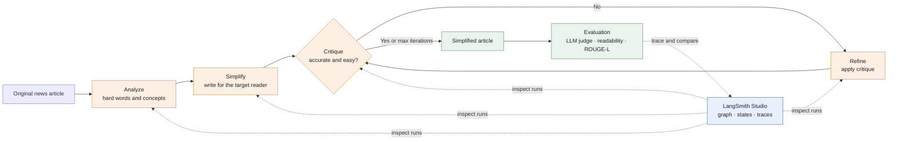

# News Simplification Agent

An observable LangChain/LangGraph agent that rewrites difficult Korean news for
upper-elementary to middle-school readers. It extends the original
[fine-tuning project](./README.md) with an iterative workflow that can be
improved through prompts instead of model retraining.

## 1. Goal

The agent aims to make hard news easier for young readers **without changing
its meaning**. A useful rewrite should:

- replace difficult words and expressions with familiar language;
- explain complex concepts in context;
- preserve the people, events, numbers, and relationships in the source; and
- read naturally for upper-elementary to middle-school students.

The original project approached this task by fine-tuning a small language
model. This follow-up focuses on faster iteration and operational visibility.

| | Fine-tuning project | This agent |
|---|---|---|
| Core approach | QLoRA fine-tuning of `gemma-3-1b-it` | Prompted OpenAI models orchestrated by LangGraph |
| Quality improvement | Curate data and retrain | Edit versioned prompts and rerun experiments |
| Quality control | Offline test-set metrics | In-graph critique/refinement plus post-run evaluation |
| Observability | Notebook outputs | LangSmith Studio graph inspection and execution traces |

## 2. Architecture

The workflow separates rewriting from quality control. After producing a first
draft, the agent checks whether the meaning was preserved and whether the text
is simple enough. If issues remain, it revises the draft and checks it again,
up to `MAX_REFINE_ITERS`.



### Components

- **LangGraph** defines the `analyze → simplify → critique ↔ refine` state
  graph and its stopping condition.
- **LangChain** provides the `ChatOpenAI` calls used by every graph node.
- **LangSmith Studio** visualizes the graph, intermediate state, model calls,
  and errors while the local Agent Server is running.
- **LangSmith tracing** records runs for later comparison when enabled.
- **Local prompts** keep the simplification workflow runnable without a
  separate prompt-management service.

## 3. Results

### Agent output

Each run returns the simplified article together with the information needed to
inspect how it was produced:

```json
{
  "original": "어려운 뉴스 원문...",
  "simplified": "독자가 이해하기 쉽게 바꾼 뉴스...",
  "analysis": "어려운 표현과 핵심 개념 분석...",
  "iterations": 1,
  "approved": true,
  "critiques": [
    {
      "approved": true,
      "issues": [],
      "suggestions": []
    }
  ]
}
```

This makes the final text, refinement history, and approval decision available
to both CLI users and downstream applications.

### Evaluation

Results are evaluated from three complementary perspectives:

| Signal | What it checks |
|---|---|
| LLM-as-judge | Meaning preservation, simplicity, age appropriateness, and fluency |
| Korean readability proxy | Average sentence length, token length, and long-token ratio |
| ROUGE-L | Overlap with `simplified_human` when a human reference is available |

Dataset experiments run the same agent over `result.csv` and store comparable
runs in Langfuse. Without Langfuse, the command runs locally and prints the
aggregate scores. This repository does not claim a fixed benchmark for the
agent yet; scores depend on the selected model, prompt version, and experiment
run. The metrics reported in the original [README](./README.md#evaluation-results)
belong to the fine-tuned Gemma model, not this agent.

## Quick start

All commands below should be run from `projects/NLP_Newspaper_CUAI`.

```bash
pip install -r requirements-agent.txt
cp .env.example .env
```

Set `OPENAI_API_KEY` in this project's `.env`, then simplify an article:

```bash
python -m agent.cli simplify \
  --text "인천 청라시티타워 '운명의 날'…내일 추진 여부 결정" \
  --evaluate
```

To send the LangChain/LangGraph execution trace to a LangSmith project, add:

```dotenv
LANGSMITH_TRACING=true
LANGSMITH_API_KEY=lsv2_your_key
LANGSMITH_PROJECT=NLP-Newspaper-Agent
```

No source upload is required. Run the CLI normally and LangSmith creates the
named tracing project on first ingestion. This tracing can run alongside
Langfuse.

Langfuse is optional. When its credentials are absent, tracing and remote
prompt management become no-ops and the prompts in `agent/prompts.py` are used.

### LangSmith Studio

The graph is configured for LangSmith Studio through `langgraph.json`. From
this project directory, start the local Agent Server with:

```bash
source .venv/bin/activate
langgraph dev
```

Studio opens in the browser and connects to the local server at
`http://127.0.0.1:2024`. Select `newspaper-agent`, then provide only the input
article:

```json
{
  "article": "어려운 뉴스 원문..."
}
```

Studio shows the `analyze`, `simplify`, `critique`, and optional `refine`
steps, including their intermediate state and model calls. Code changes are
hot-reloaded while the development server is running. A LangSmith API key is
required for Studio; set `LANGSMITH_TRACING=false` if traces should remain on
the local server instead of being sent to LangSmith.

### Environment variables

| Variable | Required | Purpose |
|---|---|---|
| `OPENAI_API_KEY` | Yes | OpenAI API access |
| `OPENAI_MODEL` | No | Rewrite model; default: `gpt-4o` |
| `JUDGE_MODEL` | No | Analyze, critique, and judge model; default: `gpt-4o-mini` |
| `AGENT_MAX_TOKENS` | No | Maximum output tokens per model call; default: `4000` |
| `AGENT_TEMPERATURE` | No | Sampling temperature; default: `0.3` |
| `AGENT_EFFORT` | No | Reasoning effort for supported models; default: `medium` |
| `TARGET_READER` | No | Description of the intended reader |
| `MAX_REFINE_ITERS` | No | Maximum number of refinement passes; default: `2` |
| `LANGSMITH_TRACING` | No | Set to `true` to send LangChain/LangGraph traces to LangSmith |
| `LANGSMITH_API_KEY` | Yes for Studio | Connects the local Agent Server to LangSmith Studio and enables tracing |
| `LANGSMITH_PROJECT` | No | Destination tracing project; default in `.env.example`: `NLP-Newspaper-Agent` |
| `LANGFUSE_PUBLIC_KEY` / `LANGFUSE_SECRET_KEY` | No | Enable tracing, prompt management, and remote experiments |
| `LANGFUSE_HOST` | No | Langfuse Cloud or a self-hosted URL |
| `LANGFUSE_PROMPT_LABEL` | No | Prompt label to fetch; default: `production` |

## Usage

```bash
# Push the built-in prompts to Langfuse once.
python -m agent.cli seed-prompts

# Simplify text or a file. Add --json for structured output.
python -m agent.cli simplify --text "<원문>" --evaluate
python -m agent.cli simplify --file article.txt --json

# Evaluate an existing original/simplified pair.
python -m agent.cli eval \
  --original "<원문>" \
  --simplified "<쉬운 버전>" \
  --reference "<사람이 작성한 참조문>"

# Upload the test set and run a named experiment.
python -m agent.cli upload-dataset --csv result.csv --limit 50
python -m agent.cli experiment --run-name baseline-v1
```

### Python API

```python
from agent import NewsSimplifierAgent, load_settings

agent = NewsSimplifierAgent(load_settings())
result = agent.run("어려운 뉴스 원문...")

print(result.simplified)
print(result.iterations, result.approved)
```

## Project structure

| File | Responsibility |
|---|---|
| `agent/agent.py` | LangGraph simplification and refinement workflow |
| `agent/prompts.py` | Built-in prompts and Langfuse prompt management |
| `agent/evaluation.py` | LLM judge, Korean readability proxy, and ROUGE-L |
| `agent/dataset.py` | Dataset upload and experiment execution |
| `agent/tracing.py` | Langfuse callbacks, scores, and flushing |
| `agent/llm.py` | `ChatOpenAI` factory and response parsing |
| `agent/config.py` | Environment-based runtime settings |
| `agent/cli.py` | Command-line interface |
| `agent/studio.py` | Compiled graph exported to LangSmith Studio |
| `langgraph.json` | Local Agent Server and Studio configuration |

## Design notes

- The original project used FKGL, an English-oriented readability formula. The
  agent instead reports a transparent Korean-language proxy and treats the LLM
  judge as its main quality signal.
- Analyze, critique, and judge calls use `gpt-4o-mini` by default to reduce
  cost; simplification and refinement use `gpt-4o`. Both can be overridden with
  environment variables.
