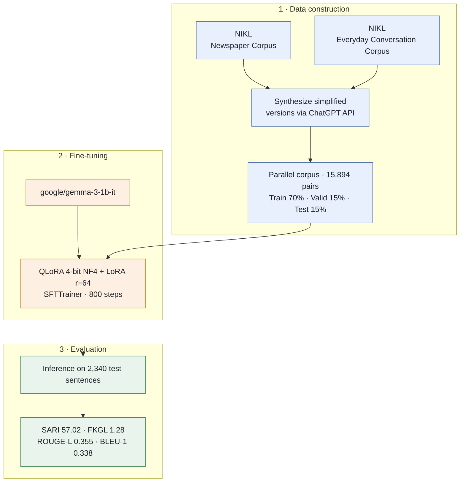

# CUAI NLP Project (2025.03.01 ~ 2025.07.03)

[Korean](readme_KOR.md)

Final project by CUAI (a university AI club) NLP Team 1. Presented on 2025.07.01.



> Hard news articles → sentences at an upper-elementary / middle-school reading level

## Team

| Name | Major |
|---|---|
| Jiho Kim | Media & Communication |
| Donghoon Ryu | Electronic & Electrical Engineering |
| Youngbeom Cho | Industrial Security |
| Seungwon Han | Energy Systems Engineering |

Weekly meeting: Wednesdays 11 PM, remote.

## Goal

Children and teenagers rarely read difficult, adult-level news articles. This project aims to **rewrite hard news articles into language suitable for upper-elementary to middle-school students**, so that young readers can more easily access and engage with hard news.

## Dataset

- **Source**: 국립국어원 (National Institute of Korean Language) newspaper corpus + everyday conversation corpus
- **Problem**: No existing parallel corpus pairs adult-level news with a simplified, kid-friendly version.
- **Solution**: Synthetically generated parallel data using the ChatGPT API, with the following prompt:

  > "Rewrite the following sentence so that upper-elementary to middle-school students can easily understand it. Keep the original meaning, use simple words, and explain complex concepts in simple terms." (원문: 다음 문장을 초등학교 고학년~중학생이 쉽게 이해할 수 있도록 바꿔주세요. 원래 의미는 유지하되, 쉬운 단어를 사용하고, 복잡한 개념은 간단히 풀어서 설명해주세요.)

- **Dataset size**: 15,894 parallel pairs (70% train / 15% validation / 15% test)
- **Example**
  - Original: "인천 청라시티타워 '운명의 날'…내일 추진 여부 결정" ("Incheon Cheongna City Tower's 'day of destiny'... decision tomorrow on whether to proceed")
  - Simplified: "인천 청라시티타워의 중요한 날이 다가왔어요. 내일 이 건물을 계속 만들지 결정할 거예요." ("An important day has come for Incheon Cheongna City Tower. Tomorrow, they'll decide whether to keep building this building.")

## Model & Training

- **Base model**: `google/gemma-3-1b-it` — a lightweight (1B parameter) model chosen for supporting a longer context than Gemma 2, balancing performance against resource constraints
- **Fine-tuning approach**: QLoRA (4-bit NF4 quantization, bf16 compute) + LoRA (`r=64`, `lora_alpha=16`, `dropout=0.1`, target modules: q/k/v/o_proj, gate/up/down_proj) via `trl`'s `SFTTrainer`
- **Training setup**: 5 epochs, batch size 1, gradient accumulation 8, `paged_adamw_8bit` optimizer, lr=2e-4, cosine scheduler, bf16, trained to 800 total steps (checkpoint saved every 50 steps)
- **Prompt format** (Gemma chat template)

```
<start_of_turn>user
다음 뉴스를 초등학생이 이해하기 쉽게 간단하게 바꿔줘: {original}<end_of_turn>
<start_of_turn>model
{simplified}
```

## Evaluation Results

On the 2,340-sample test set in `result.csv` (`original` vs. `simplified_by_model`):

| Metric | Value |
|---|---|
| BLEU-1 | 0.338 |
| ROUGE-1 (F1) | 0.363 |
| ROUGE-2 (F1) | 0.162 |
| ROUGE-L (F1) | 0.355 |
| SARI | 57.02 |
| FKGL (model output) | 1.28 |
| FKGL (human reference) | 1.34 |

Against the team's own benchmark thresholds from the presentation (SARI ≥ 40 = excellent, FKGL 1–1.3 = lower-elementary reading level), both the SARI score of 57.02 and the FKGL of 1.28 meet or exceed the target. By FKGL, the model's generated text reads about as easily as — or slightly more easily than — the human-written reference (1.34).

## Limitations

- Gemma 3 1B is the smallest, least capable model in the Gemma 3 family, which limits performance
- Quality and validity of the synthetic parallel corpus (generated via ChatGPT API) were not thoroughly verified
- Hyperparameter search was limited due to resource constraints

## Repository Contents

| File | Description |
|---|---|
| `Final_NLP_Newspaper.ipynb` | Full pipeline notebook: data loading, QLoRA/LoRA fine-tuning, inference, and evaluation (BLEU/ROUGE/SARI/FKGL) |
| `result.csv` | Test set (2,340 samples) with original text, human reference simplification, and model-generated simplification |
| `NLP 1팀 최종.pptx` | Final presentation slides (2025.07.01) |
| `readme.md` / `readme.en.md` | Project description (Korean / English) |
