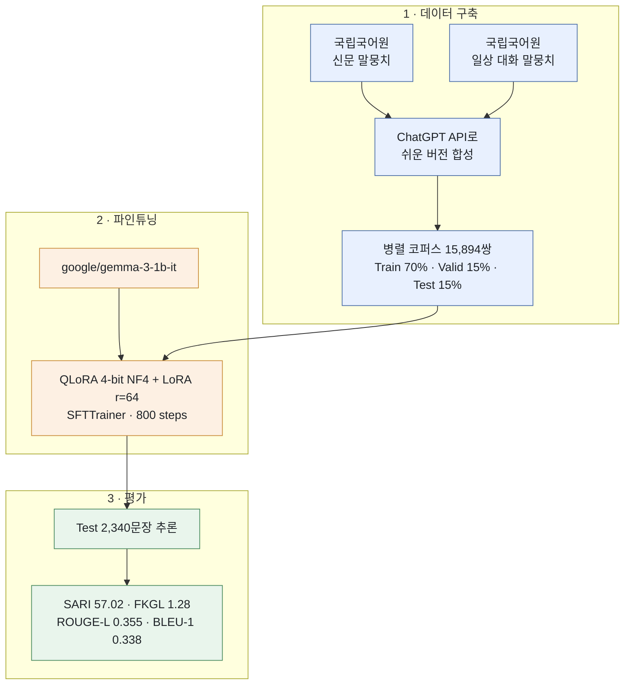

# CUAI NLP 프로젝트 (2025.03.01 ~ 2025.07.03)

[English](readme.en.md)

CUAI(대학생 AI 연합 동아리) NLP 1팀 최종 프로젝트입니다. 2025년 7월 1일 발표되었습니다.



> 어려운 시사 뉴스 → 초등 고학년~중학생 눈높이의 쉬운 문장

## 팀 소개

| 이름 | 전공 |
|---|---|
| 김지호 | 미디어커뮤니케이션학과 |
| 류동훈 | 전자전기공학과 |
| 조영범 | 산업보안학과 |
| 한승원 | 에너지시스템공학과 |

매주 수요일 밤 11시, 비대면으로 진행.

## 프로젝트 목표

아이들과 청소년들은 어려운 성인용 뉴스 기사를 잘 읽지 않습니다. 이 프로젝트는 **어려운 시사 뉴스를 초등학교 고학년~중학생 눈높이에 맞게 쉬운 언어로 재작성**하여, 아이들이 하드 뉴스(hard news)를 더 많이 접하고 이해할 수 있도록 돕는 것을 목표로 합니다.

## 데이터셋

- **원천 데이터**: 국립국어원 신문 말뭉치 + 일상 대화 말뭉치
- **문제점**: 성인용 뉴스와 아동용 쉬운 버전이 짝지어진 병렬 코퍼스가 존재하지 않음
- **해결 방법**: ChatGPT API를 이용해 병렬 데이터를 합성 생성

  > "다음 문장을 초등학교 고학년~중학생이 쉽게 이해할 수 있도록 바꿔주세요. 원래 의미는 유지하되, 쉬운 단어를 사용하고, 복잡한 개념은 간단히 풀어서 설명해주세요."

- **데이터 규모**: 총 15,894쌍 (Train 70% / Validation 15% / Test 15%)
- **예시**
  - 원문: "인천 청라시티타워 '운명의 날'…내일 추진 여부 결정"
  - 변환: "인천 청라시티타워의 중요한 날이 다가왔어요. 내일 이 건물을 계속 만들지 결정할 거예요."

## 모델 & 학습

- **베이스 모델**: `google/gemma-3-1b-it` — Gemma 2 대비 더 긴 컨텍스트를 지원하는 경량(1B) 모델로, 성능과 자원 제약 사이의 균형을 고려해 선택
- **파인튜닝 방법**: QLoRA(4-bit NF4 양자화, bf16 연산) + LoRA(`r=64`, `lora_alpha=16`, `dropout=0.1`, target modules: q/k/v/o_proj, gate/up/down_proj), `trl`의 `SFTTrainer` 사용
- **학습 설정**: 5 epochs, batch size 1, gradient accumulation 8, `paged_adamw_8bit` optimizer, lr=2e-4, cosine scheduler, bf16, 총 800 steps까지 학습 (50 step마다 체크포인트 저장)
- **프롬프트 포맷** (Gemma 챗 템플릿)

```
<start_of_turn>user
다음 뉴스를 초등학생이 이해하기 쉽게 간단하게 바꿔줘: {원문}<end_of_turn>
<start_of_turn>model
{변환된 문장}
```

## 평가 결과

`result.csv`의 테스트셋 2,340개 샘플 기준 (`original` vs `simplified_by_model`):

| 지표 | 값 |
|---|---|
| BLEU-1 | 0.338 |
| ROUGE-1 (F1) | 0.363 |
| ROUGE-2 (F1) | 0.162 |
| ROUGE-L (F1) | 0.355 |
| SARI | 57.02 |
| FKGL (모델 생성문) | 1.28 |
| FKGL (사람이 만든 참조문) | 1.34 |

발표 자료에서 정의한 자체 기준(SARI 40점 이상 = 우수, FKGL 1~1.3 = 초등 저학년 수준)에 비추어 볼 때, SARI 57.02와 FKGL 1.28 모두 목표치를 충족하거나 상회하는 결과입니다. FKGL 기준으로는 모델 생성문이 사람이 직접 작성한 참조문(1.34)과 비슷하거나 더 쉬운 수준의 가독성을 보였습니다.

## 한계점

- Gemma 3 1B는 Gemma 3 계열 중 파라미터 수가 가장 적은 경량 모델로, 성능에 제약이 있음
- ChatGPT API로 생성한 합성 병렬 코퍼스의 품질/타당성 검증이 충분하지 않음
- 자원 제약으로 인해 하이퍼파라미터 탐색이 제한적으로 이루어짐

## 저장소 구성

| 파일 | 설명 |
|---|---|
| `Final_NLP_Newspaper.ipynb` | 데이터 로드, QLoRA/LoRA 파인튜닝, 추론, 평가(BLEU/ROUGE/SARI/FKGL)를 포함한 전체 파이프라인 노트북 |
| `result.csv` | 테스트셋 2,340개 샘플의 원문/사람 참조문/모델 생성문 |
| `NLP 1팀 최종.pptx` | 최종 발표 자료 (2025.07.01) |
| `readme.md` / `readme.en.md` | 프로젝트 설명 (국문 / 영문) |
