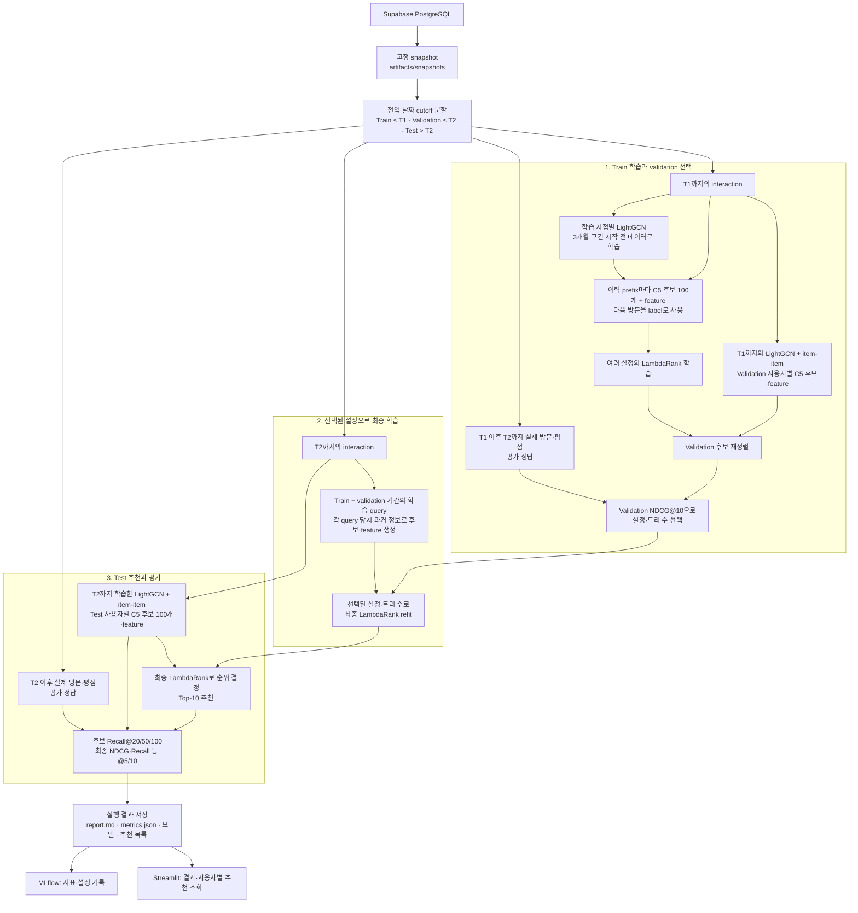

# Current Baseline

기준일: 2026-10-02. V2의 현재 모델은 **C5 후보 검색 + R1 LambdaRank**다.

## 구조와 설정

| 단계 | 구성 | 현재 설정 |
|---|---|---|
| C1 | 과거 방문 식당의 co-occurrence 기반 item-item | 사용자 이력과 유사한 미방문 식당 검색 |
| C4 | LightGCN, 방문 기반 BPR | 3 layers, 64 dimensions, 20 epochs, L2 1e-4 |
| C5 | C1·C4의 Reciprocal Rank Fusion | RRF 상수 60, Top-100, 방문한 식당 제외 |
| R1 | LightGBM LambdaRank | 16개 feature, Top-10, learning rate 0.05, seed 42 |

C0 인기·C2 지역 인기·이전 C3는 참고 목록이다. C5 결합에는 C1·C4만 쓴다.
Ranker feature는 인기도·식당 평균, item-item·LightGCN 점수/순위, RRF·후보 순위,
사용자 이력 길이·평균, 지역 비율이다. LightGCN 점수는 query 내에서 표준화한다.
리뷰 텍스트는 현재 baseline의 입력에 포함되지 않는다.

사용자·식당 평균은 단순 평균(`rating_shrinkage_strength=0`)이다. 선택적 shrinkage는
`(평점 합 + λ × 과거 전체 평균)/(평가 수 + λ)`로 두 평균 feature만 보정한다.
학습 label이나 후보 생성 방식은 바꾸지 않는다.

## 훈련부터 평가까지의 전체 흐름

**학습**에서는 C5가 검색한 식당별 feature와 다음 방문 label로 ranker를 만든다.
**Validation**에서는 T1 시점에 만든 후보를 재정렬하고, 이후 실제 방문과 비교해
설정·트리 수를 고른다. **최종 학습**은 선택된 설정을 유지한 채 T2까지 다시 학습한다.
**Test**에서는 T2 시점의 이력·후보·feature를 고정하고, T2 이후 방문으로 성능을 계산한다.

미래 방문·평점은 정답 경로로만 들어간다. Validation/test의 정답 식당을 후보에
추가하거나 그 평점을 사용자·식당 평균에 미리 반영하지 않는다. Test 지표로
설정이나 트리 수를 다시 선택하지 않는다.

같은 snapshot·생성 조건이면 후보·feature·label·group을 `artifacts/prepared/`에
저장해 재사용한다. 트리 수나 ranker 설정만 바꿀 때 과거 LightGCN과 학습 행을 다시
만들지 않는다. 후보 모델·feature·학습 정답 구성 등이 바뀌면 새 조건의 파일을 만든다.
Cutoff 이전 정보만 쓰는 규칙과 학습·평가 구조는 동일하다.

## 학습과 평가

1. 모든 사용자에게 같은 날짜 T1·T2를 적용한다. Train은 T1까지, validation은
   (T1, T2], test는 T2 이후다. 각 사용자·식당 쌍의 최초 interaction만 사용한다.
2. 기본 학습은 `prefix/relevance`: 과거 이력으로 다음 방문 하나를 정답으로 둔다.
   평점 4 이상은 label 2, 3 이상 4 미만은 1, 나머지와 미관측 후보는 0이다.
   LambdaRank gain은 0/1/3이다. 사용자 평점을 정규화해 예측하는 모델은 아니다.
3. 정답이 실제 C5 후보에 포함된 학습 query만 사용한다. 정답을 후보에 끼워 넣지
   않는다. 학습 query의 LightGCN은 3개월 구간 시작 전 데이터로만 학습한다.
4. Validation NDCG@10으로 ranker 설정·트리 수를 선택하고 T2까지 refit한다.
   Grid는 leaves 15/31/63 × min_child 10/100(최대 1,000 trees, early stopping 50)
   및 고정 150 trees / leaves 15 / min_child 10이다.
5. Test는 미래 window의 여러 방문을 정답으로 평가한다. 후보·feature·평점 prior는
   cutoff 이전 정보만 쓴다. Ranker 점수가 같으면 C5 순위를 유지한다.

후보 Recall@20/50/100, 최종 NDCG·Recall·Precision·MAP·MRR@5/10을 기록한다.
정답이 있는 사용자만 정확도 평균에 포함한다. Coverage·novelty·지역 다양성은
모든 추천 query를 대상으로 계산한다. 모델 선택에는 test를 사용하지 않는다.

### 트리 수를 선택하는 이유

R1은 여러 결정 트리의 출력을 더해 식당의 **순위 점수**를 만드는 모델이다.
앞선 트리들이 놓친 순서 차이를 다음 트리가 보정한다. 트리 수(`n_estimators`)는
이 보정을 몇 번 누적할지 정하는 하이퍼파라미터다. 너무 적으면 학습이 부족할 수
있고, 너무 많으면 학습 데이터에 과도하게 맞춰질 수 있다. 학습·추론 비용도 늘어난다.
트리 하나의 복잡도는 `num_leaves`가 정하며, 현재 learning rate는 0.05로 고정한다.

현재 선택 과정은 **하이퍼파라미터 탐색 + early stopping**이다.

1. `num_leaves` 15/31/63과 `min_child_samples` 10/100의 6개 조합을 학습한다.
   Leaves는 트리 하나의 최대 말단 수, min child는 말단의 최소 학습 샘플 수 설정이다.
2. 각 조합은 최대 1,000회까지 트리를 추가한다. Validation NDCG@10이 50회 연속
   개선되지 않으면 멈추고, 그동안 가장 좋았던 회차를 트리 수로 선택한다.
   트리 수별 모델을 처음부터 각각 다시 학습하는 방식은 아니다.
3. 별도로 early stopping 없이 150개 트리를 사용하는 기준 설정도 비교한다.
   총 7개 설정 중 validation NDCG@10이 가장 높은 설정을 고른다.
   동점이면 Recall@10, 다시 동점이면 grid 순서를 따른다.
4. 선택된 설정·트리 수를 고정하고 T2까지의 데이터로 최종 학습한다.
   Test는 선택이 끝난 모델의 성능을 확인하는 데만 사용한다.

Early stopping의 NDCG는 검색된 후보 안의 정답을 기준으로 정규화한다.
설정 간 최종 비교와 report의 NDCG는 미래 window 전체 정답을 기준으로 정규화한다.
두 단계 모두 validation을 사용하지만 계산 범위에는 이 차이가 있다.

이번 baseline의 1 tree와 shrinkage의 96 trees는 각각 검증 과정에서 선택된 결과다.
트리가 더 많다고 더 좋은 모델이라는 뜻은 아니다. 1 tree 선택은 해당 검증 조건에서
후속 보정의 이득이 없었다는 관찰이며, 원인을 알려면 학습 곡선·feature·label을
별도로 살펴봐야 한다. 평균 평점 shrinkage와 boosting의 learning rate는 별개 설정이다.

## 현재 측정값

[2026-10-02 비교 원본](./artifacts/comparisons/shrinkage/20261002T062004863532Z-e7896add/report.md)의
baseline 조건이다. 현재 코드의 동점 처리·validation 지표를 적용해 다시 학습했다.

| 조건 | 값 |
|---|---|
| Snapshot | `e7896add5b4b5939`, interaction 88,554 / 사용자 14,008 / 식당 4,587 |
| T1 / T2 | 2025-12-19 / 2026-05-04 |
| Train / validation / test interaction | 70,883 / 8,934 / 8,737 |
| Test 사용자 | 과거 이력 1,580명, positive가 있는 평가 사용자 1,573명 |
| 최종 학습 | 15,929 groups / 1,574,652 feature rows |
| 이 데이터에서 선택된 ranker | leaves 15 / min_child 10 / 1 tree |

| Test 지표 | Baseline |
|---|---:|
| 후보 Recall@100 | 20.1626% |
| NDCG@5 / NDCG@10 | 0.023906 / 0.029360 |
| Recall@10 | 4.1284% |
| Precision@10 | 1.5639% |
| MAP@10 / MRR@10 | 0.015684 / 0.051154 |

Shrinkage λ=10의 test NDCG@10은 0.028207, Recall@10은 4.0369%였다.
NDCG 차이 −0.001153의 paired bootstrap 95% CI [−0.005006, +0.002692]는 0을
포함한다. 이 한 번의 비교로 기본 모델에 채택하지 않는다. 현재 수치는 과거
2026-09-30 run과 동점 처리·validation 계산이 달라 그 결과와 섞어 비교하지 않는다.

실행·실험 후보와 한계는 [PLAN.md](./PLAN.md)에 모아 둔다.
