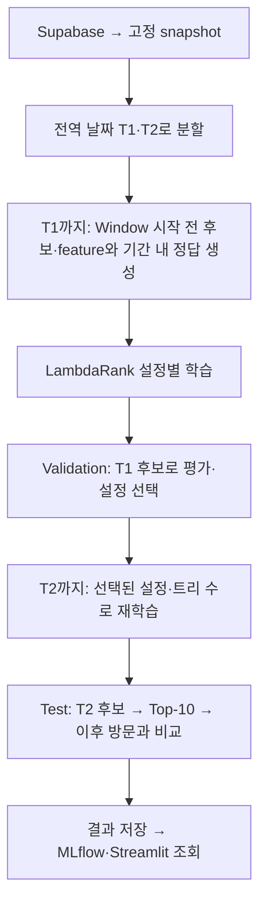

# Current Baseline

기준일: 2026-10-04. **현재 reference는 개인별 만족도 정답을 쓰는 Window 학습 + C5 후보 100개 + R1 Top-10이다.**
이 문서는 평점·방문 이력 baseline의 현재 구현과 측정 결과를 기록한다. 사용자 과거 리뷰와 식당 정보를 더한 모델이 이 baseline보다 만족할 식당을 더 잘 추천하는지(RQ1), 어떤 구조가 그 목표를 더 잘 수행하는지(RQ2) 비교할 기준이다.
현재 입력은 방문 이력과 평점이며, 리뷰 텍스트와 외부 식당 정보는 포함하지 않는다. R1은 별점이 아닌 순위 점수를 출력한다.
현재 구조는 Two-stage이며 Two-Tower는 미적용이다. 학습은 3개월 Window 안의 여러 방문을 정답으로 쓰며, 최종 평가는 T2 이후 약 145일의 여러 실제 방문을 사용한다. 방문 순서 자체를 인코딩하는 순차 모델은 아니다.

**평가 기준:** 실제 방문·평점은 고평점만 추리지 않고 전부 유지한다. 강한 만족 경계 h는 과거 이력 10건 미만이면 4점, 10건 이상이면 `clip(4 + 0.5 × (과거 사용자 평균 − 4), 3.5, 4.5)`다. h 이상은 등급 2, 3점 이상 h 미만은 등급 1, 3점 미만은 등급 0이다. 평균은 query cutoff 이전 이력으로만 계산한다. 최소 이력의 근거와 적용 예시는 [SATISFACTION_BASELINE.md](./SATISFACTION_BASELINE.md)에 있다.

주 비교 지표는 validation에서 설정을 고르는 Graded NDCG@10이다. 후보 Recall@100·4점 이상 Recall@10·3점 미만 방문 포함률은 진단 지표다. 별점 예측값은 출력하지 않아 MAE/RMSE는 없다.

## 새 기준의 실행 결과

2026-10-04 Window + 개인별 기준 실행을 완료했다.

| 핵심 Test 지표 | 값 |
|---|---:|
| 후보 Recall@100 | 20.1626% |
| 최종 Graded NDCG@10 | 0.025467 |
| 최종 Recall@10 | 3.6502% |
| 4점 이상 Recall@10 | 3.5105% |
| 3점 미만 방문의 Top-10 포함 | 3 / 43 (6.98%) |

Validation으로 leaves 63 / min_child_samples 100 / trees 76을 선택하고 T2까지 refit했다.
최종 학습은 Window group 8,043개·feature rows 804,232개다.
Test 이력 사용자 1,580명 중 862명에게 개인 기준, 718명에게 절대 기준을 적용했다.

같은 평가 기준의 R0 후보 순서 NDCG@10은 0.026590이다. R1 − R0 차이 −0.001124의
paired bootstrap 95% CI [−0.005053, +0.002694]는 0을 포함한다. 이번 실행에서 재정렬의
이득은 확인하지 못했다. Test 결과로 설정을 다시 선택하지 않았다.

출처: [전체 실행 보고서](./artifacts/runs/20261004T125314601899Z-e7896add/report.md).
기준 선택 근거·실행 비용·검증은 [개인별 만족도 기록](./SATISFACTION_BASELINE.md)에 있다.

## 과거 Prefix 측정 (2026-10-02)

아래 수치는 Prefix와 절대 등급을 사용한 과거 실행 결과다. 새 Window·개인별 기준의 성능과 직접 비교하지 않는다.

| 핵심 Test 지표 | 값 | 의미 |
|---|---:|---|
| 후보 Recall@100 | 20.1626% | 기존 positive(3점 이상) test 식당 중 후보 100개에 포함된 비율 |
| 최종 NDCG@10 | 0.029360 | 기존 graded relevance 기준의 순위 품질 지표 |
| 최종 Recall@10 | 4.1284% | 기존 positive(3점 이상) test 식당 중 최종 추천 10개에 포함된 비율 |

출처: [2026-10-02 shrinkage 비교의 baseline 조건](./artifacts/comparisons/shrinkage/20261002T062004863532Z-e7896add/report.md).
확정한 연구 질문·test label·평가 지표와 다음 실험은 [PLAN.md](./PLAN.md#연구-질문과-평가-기준)에 있다.

현재 baseline은 선택한 개인별 만족도 정답을 구현한 Window 모델이다. 모든 후속 모델도
같은 평가 기준을 적용하며, 평가 정의가 다른 과거 점수와의 크기 차이를 개선으로 해석하지 않는다.
이번 실행은 `--ranker-training-mode window --satisfaction-mode history-aware`를 명시한다.
CLI 기본 Prefix/absolute는 과거 재현용으로 유지한다.

## 후보 검색과 재정렬

**Two-stage 추천**은 많은 식당에서 후보를 좁힌 뒤, 후보 안의 순서를 정하는 구조다.
검색 단계는 정답 식당을 놓치지 않는 데, 재정렬 단계는 좋은 후보를 위에 배치하는 데 집중한다.

| 구성 | 역할과 방법 | 현재 설정 |
|---|---|---|
| C1: item-item | 함께 방문된 식당 관계로 이력과 유사한 미방문 식당 검색 | 방문 co-occurrence 사용 |
| C4: LightGCN | 사용자–식당 방문 그래프에서 표현을 학습하고 내적으로 검색 | 3 layers, 64 dimensions, 20 epochs, L2 1e-4 |
| C5: RRF 결합 | C1·C4의 순위별 점수를 합산하는 Reciprocal Rank Fusion | 상수 60, Top-100, 방문 식당 제외 |
| R1: LambdaRank | 후보 간 순서를 학습하는 LightGBM 모델로 C5 재정렬 | 16개 feature, Top-10, learning rate 0.05, seed 42 |

LightGCN은 방문 식당을 미관측 식당보다 높게 두는 BPR(Bayesian Personalized Ranking) 목적함수를 쓴다.
RRF는 모델별 점수 척도가 달라도 순위로 결합할 수 있다. C0 인기·C2 지역 인기·이전 C3는 참고 후보이며 C5에 넣지 않는다.

R1의 feature는 다음과 같다. LightGCN 점수는 한 추천 요청의 후보 안에서 표준화한다.

- 식당 인기도·평균 평점
- Item-item·LightGCN 점수와 순위
- RRF 점수·후보 순위
- 사용자 이력 길이·평균 평점·지역 비율

사용자·식당 평균은 **단순 평균**(`rating_shrinkage_strength=0`)이다.
선택적 shrinkage는 관측 수가 적은 평균을 과거 전체 평균 쪽으로 보정한다.

`보정 평균 = (평점 합 + λ × 과거 전체 평균) / (평가 수 + λ)`

이 옵션은 평균 feature 두 개만 바꾸며, 학습 정답이나 후보 생성 방식은 바꾸지 않는다.

## 훈련부터 평가까지의 전체 흐름

모든 사용자에게 같은 **cutoff(과거와 미래를 나누는 날짜)**를 적용한다.
사용자·식당 쌍은 최초 방문 기록만 사용한다.

| 단계 | 입력·학습 범위 | 정답과 목적 |
|---|---|---|
| Train | T1까지. 각 Window 시작 전 이력으로 후보·feature 생성 | 기간 내 여러 방문으로 후보 간 순서 학습 |
| Validation | T1까지 학습한 후보 모델·사용자 이력 | (T1, T2] 방문으로 설정·트리 수 선택 |
| 최종 학습(refit) | T2까지. Window 전체를 재구성하고 시작 전 정보로 학습 행 생성 | 선택된 설정·트리 수로 다시 학습 |
| Test | T2까지 학습한 후보 모델·사용자 이력 | T2 이후 여러 방문으로 최종 성능 확인 |

**미래 방문·평점은 정답으로만 사용한다.** 정답 식당을 후보에 삽입하거나 미래 평점을 평균 feature에 반영하지 않는다.
Test 지표로 설정이나 트리 수를 다시 선택하지 않는다.

같은 snapshot·생성 조건의 후보·feature·label·group은 `artifacts/prepared/`에서 재사용한다.
Ranker 설정만 바꾸면 후보·학습 행을 다시 만들지 않는다. 조건은 [PLAN의 저장 데이터 안내](./PLAN.md#baseline-데이터-재사용)에 있다.

## 학습 정답과 동점 처리

현재 기준 실행은 **`window/relevance` + `history-aware`**다. 기간 시작 전 사용자 이력으로
기간 내 모든 방문을 정답으로 둔다. 과거 재현용 CLI 기본값은 `prefix/relevance` + `absolute`다.
학습 group은 한 사용자·한 시점의 후보 목록이며, label은 정답 등급, gain은 그 등급에 부여한 가치다.

| Window 내 방문의 평점 | Label | LambdaRank gain |
|---|---:|---:|
| 개인별 강한 만족 경계 h 이상 | 2 | 3 |
| 3 이상 h 미만 | 1 | 1 |
| 3 미만 또는 후보 목록의 나머지 | 0 | 0 |

- 정답이 실제 C5 후보에 포함된 학습 query만 사용한다. 후보 밖 정답을 끼워 넣지 않는다.
- 학습 query의 LightGCN은 해당 3개월 구간 시작 전 데이터로만 학습한다.
- 출력은 순위 점수다. 사용자 평점을 정규화하거나 별점을 예측하는 모델이 아니다.
- 재정렬 점수가 같으면 C5 순위를 유지한다.
- 현재 LambdaRank label은 관측된 저평점 방문과 후보의 나머지를 모두 0 gain으로 둔다. 별점 예측 실험에서는 실제 저평점 label을 보존하고, 단순 미관측과 구분한다.

## 설정과 트리 수 선택

R1은 결정 트리의 출력을 누적해 순위 점수를 만든다.
트리 수는 보정 횟수, `num_leaves`는 트리의 최대 말단 수, `min_child_samples`는 말단의 최소 샘플 수다.
트리를 늘리면 비용과 과적합 가능성이 함께 증가하므로 validation에서 선택한다.

| 비교 설정 | 선택 방법 |
|---|---|
| Leaves 15/31/63 × min_child 10/100: 6개 조합 | 최대 1,000 trees, validation NDCG@10이 50회 연속 개선되지 않으면 종료 |
| Leaves 15 / min_child 10 / 고정 150 trees | Early stopping 없이 학습하는 기준 설정 |

1. 탐색 설정마다 validation이 가장 좋았던 회차의 트리 수를 사용한다.
2. 고정 기준까지 총 7개 설정을 **전체 validation NDCG@10**으로 비교한다. 동점이면 Recall@10, 다시 동점이면 grid 순서를 따른다.
3. 설정·트리 수를 고정하고 T2까지 refit한 뒤 test를 평가한다.

Early stopping은 검색된 positive(정답 등급이 0보다 큰 후보)가 있는 group의 **후보 내부 NDCG**를 쓴다.
설정 선택과 보고서는 **후보 밖 정답까지 포함한 미래 기간 전체 NDCG**를 쓰므로 계산 범위가 다르다.

## 평가 지표와 집계 범위

| 평가 대상 | 지표 | 집계 범위 |
|---|---|---|
| 후보 검색 | Recall@20/50/100; 별도 4점 이상 Recall | 해당 test target이 있는 사용자 |
| 최종 추천 | Graded NDCG·Recall·Precision·MAP·MRR@5/10; 별도 4점 이상 Recall | relevance target이 하나 이상 있는 사용자, 분모 기록 |
| 별점 예측 | MAE/RMSE | 실제 미래 평점이 있는 모든 test 사용자–식당 쌍; 저평점 포함 |
| 저평점 점검 | 실제 3점 미만 test 방문의 Top-K 포함 수·비율 | 모든 평가 query에서 별도 집계 |
| 추천 분포 | Coverage·novelty·지역 다양성 | 모든 추천 query |

Precision은 추천 중 정답 비율, MAP·MRR은 정답이 앞쪽에 나타나는 정도를 측정한다.
Coverage는 노출 식당 범위, novelty는 덜 인기 있는 식당의 추천 정도다.
test 기간에 방문·평점이 기록되지 않은 다른 후보는 낮은 평점 정답이 아니다. 추천 노출 기록이 없으므로 오프라인 결과는 기록된 미래 방문과의 일치이며, 실제 노출 후 만족도나 인과 효과를 증명하지 않는다.

## 과거 측정 조건과 추가 결과 (2026-10-02)

| 조건 | 값 |
|---|---|
| Snapshot | `e7896add5b4b5939`: interaction 88,554 / 사용자 14,008 / 식당 4,587 |
| T1 / T2 | 2025-12-19 / 2026-05-04 |
| Train / validation / test interaction | 70,883 / 8,934 / 8,737 |
| Test 사용자 | 과거 이력 1,580명 / 기존 3점 이상 relevance 기준 positive 사용자 1,573명 |
| 최종 학습 | 15,929 groups / 1,574,652 feature rows |
| 선택된 ranker | Leaves 15 / min_child 10 / 1 tree |

| 추가 Test 지표 | Baseline |
|---|---:|
| NDCG@5 | 0.023906 |
| Precision@10 | 1.5639% |
| MAP@10 / MRR@10 | 0.015684 / 0.051154 |

**관측:** Shrinkage λ=10은 96 trees가 선택됐고, test NDCG@10 0.028207·Recall@10 4.0369%였다.
Baseline 대비 NDCG 차이 −0.001153의 사용자별 paired bootstrap 95% 신뢰구간은 [−0.005006, +0.002692]로 0을 포함한다.
Paired bootstrap은 같은 사용자의 두 결과를 묶어 재표본추출해 차이의 불확실성을 추정한다.

**판단:** 이 비교에서는 λ=0을 유지한다. λ·seed 각 1개 결과로 모든 보정 방식의 효과를 단정하지 않는다.
1 tree 선택의 원인도 학습 곡선·feature·label을 따로 확인해야 한다. 평균 평점 shrinkage와 boosting의 learning rate는 별개 설정이다.

현재 수치는 동점 처리·validation 계산을 수정해 다시 학습한 결과다.
2026-09-30 run과 동일 조건으로 섞어 비교하지 않는다.
