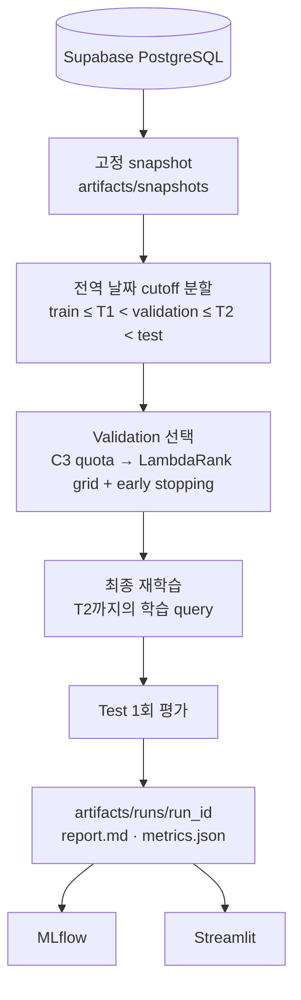

# Two-stage 모델과 평가 방식

## 1. 목적

사용자가 아직 방문하지 않은 식당의 순위를 매긴다. 후보 생성(Stage 1)과
재정렬(Stage 2)을 분리해, 정답을 후보 단계에서 놓쳤는지 재정렬 단계에서 아래로
밀었는지를 따로 측정한다. 이후 LightGCN, two-tower, content vector 같은 후보
모델을 같은 ranker 아래에서 비교하기 위한 골격이다.

| ID | 구성 | 단계 | 역할 |
|---|---|---|---|
| C0 | 전체 인기 | 후보 | 비개인화 하한선 |
| C1 | Item-item co-occurrence | 후보 | 이력 기반 개인화 |
| C2 | 지역 인기 | 후보 | 사용자가 주로 가는 지역의 인기 식당 |
| C3 | C0·C1·C2 quota RRF | 후보 결합 | Stage 2에 넘기는 Top-100 |
| R0 | C3 순서 그대로 | 재정렬 기준선 | 재정렬 없이 자른 Top-10 |
| R1 | LightGBM LambdaRank | 재정렬 | 최종 Top-10 |

## 2. 전체 흐름



## 3. 데이터와 분할

입력은 `recsys.reviews`에서 사용자·식당 쌍마다 최초 방문 하나만 남긴 interaction이다.
정답 리뷰의 본문과 세부 점수(맛·가격·서비스)는 입력에 넣지 않는다.

분할은 모든 사용자에게 같은 두 날짜를 적용한다. T1, T2는 전체 interaction 날짜의
80%, 90% 지점이다(`--train-fraction`, `--validation-fraction`).

```text
사용자 A:  r1  r2  r3 │ r4  r5 │ r6  r7
                   T1        T2
train  ≤ T1       : r1 r2 r3
validation window : r4 r5   (이력 r1~r3)
test window       : r6 r7   (이력 r1~r5)
```

| Relevance | 조건 |
|---:|---|
| 2 | 평점 4.0 이상 |
| 1 | 평점 3.0 이상 4.0 미만 |
| 0 | 그 외, 또는 방문 기록 없음 |

방문 기록이 없는 식당은 싫어서 안 간 것인지 몰라서 안 간 것인지 알 수 없는 약한
negative다.

## 4. Query

Query 하나는 한 사용자가 한 시점에 받는 추천 1회다. 학습과 평가는 query 형태가 다르다.

| | 학습 query | 평가 query |
|---|---|---|
| 만드는 방법 | 이력 prefix: (r1 → r2), (r1, r2 → r3), … | 사용자 1명 × window 1개 |
| 정답 수 | 1개 | window 안의 방문 전부 (평균 약 3.6개) |
| 시점 제한 | 튜닝: 정답 ≤ T1 / 최종: 정답 ≤ T2 | 이력 ≤ window 시작 |
| 대상 | 두 번째 방문부터 | window 시작 전에 이력이 있는 사용자 |

- 후보와 feature는 각 query 시점 이전의 전체 interaction으로만 계산한다. Query를
  시간순으로 처리하면서 인기도·co-occurrence를 증분 갱신한다.
- 학습 query에서 정답이 후보 100개 밖에 있으면 정답 행을 추가한다(injection).
  평가 query에는 추가하지 않고, 후보에 없으면 그대로 실패로 센다.
- Window 시작 전 이력이 없는 사용자는 개인화할 수 없어 평가하지 않고 수만 기록한다.

## 5. Stage 1: 후보 생성

- C0: cutoff 이전 interaction 수 내림차순. 동률은 `restaurant_id` 오름차순.
- C1: 두 식당을 함께 방문한 사용자 수를 빈도로 cosine 정규화한 유사도를 이력에 대해 합산.

  ```text
  sim(i, j)  = cooccurrence(i, j) / sqrt(freq(i) · freq(j))
  score(j|u) = Σ_{i ∈ history(u)} sim(i, j)
  ```

- C2: 사용자의 과거 방문 지역 비율 × 그 식당의 interaction 수.
- C3: 점수 척도가 달라 원점수를 더하지 않고 순위로 결합한다
  (RRF = Σ 1/(60 + rank)). 먼저 C0+C1 RRF 상위 `quota × 100`개를 채우고, 나머지를
  C0+C1+C2 RRF로 채운다. Quota는 validation에서 고른다.

모든 후보에서 사용자가 이미 방문한 식당은 뺀다.

## 6. Stage 2: LambdaRank

Feature는 모두 query 시점 이전 데이터로 계산한다.

- 인기도, 식당 평균 평점
- Item-item 유사도 합·최대
- Source별 포함 여부와 역순위, RRF 점수, C3 내 역순위
- 사용자 이력 길이와 평균 평점
- 과거 방문 지역 대비 후보 지역 비율 (`--region-mode without_region`이면 제외)

학습 설정: group = query, label = relevance 0/1/2, label gain 0/1/3, learning rate
0.05, seed 42, deterministic. Query당 정답이 1개인 학습 query로 학습하므로 실제로는
정답 1개와 오답 약 99개를 구분하는 pairwise 학습에 가깝다.

## 7. 설정 선택 (validation만 사용)

1. C3 quota: `--quota-grid` 후보 중 validation C3 Recall@100이 가장 높은 값.
2. LambdaRank: `num_leaves × min_child_samples` 조합마다 validation NDCG@10으로 early
   stopping(50 round)한 모델, 그리고 고정 설정(150 trees, 15 leaves) 중
   validation NDCG@10이 가장 높은 것. 트리 수는 그 모델의 best iteration.
3. 최종 모델: 고른 설정과 트리 수로 T2까지의 학습 query(train + validation window)로
   다시 학습한다.
4. Test window는 이 뒤에 한 번만 평가한다. 결과를 보고 설정을 다시 바꾸지 않는다.

테스트로 확인하는 것: test 구간 데이터만 바꿔도 선택 결과, validation 지표, 최종 모델
파일이 바이트 단위로 같다.

## 8. 평가 지표

모든 정확도 지표는 사용자(query)별로 계산해 평균한다. 정답(relevance > 0)이 1개
이상인 사용자만 평균에 넣는다.

후보 생성 (C0~C3, K = 20/50/100):

| 지표 | 정의 |
|---|---|
| Recall@K | 후보 K개 안의 정답 수 / 그 사용자의 전체 정답 수 |

C3 Recall@100이 Stage 2가 도달할 수 있는 상한이다.

LTR 재정렬 (R0, R1, K = 5/10):

| 지표 | 정의 |
|---|---|
| Recall@K | Top-K 안의 정답 수 / 전체 정답 수 |
| Precision@K | Top-K 안의 정답 수 / K |
| NDCG@K | gain 2^rel − 1, 할인 1/log2(rank+1), 사용자 정답으로 만든 ideal DCG로 정규화 |
| MAP@K | 정답이 나온 위치마다의 precision 합 / min(K, 정답 수) |
| MRR@K | 첫 정답 순위의 역수 |
| Catalog coverage@K | 전체 후보 catalog 중 한 번 이상 추천된 식당 비율 |
| Novelty@K | 추천 식당 인기 비율의 −log2 평균 |
| 지역 다양성@K | 한 목록 안에서 지역이 다른 식당 쌍의 비율 |

R1 − R0 차이는 같은 사용자끼리 짝지은 paired bootstrap(2,000회) 95% 신뢰구간으로
보고한다. 신뢰구간이 0을 포함하면 차이가 없다고 해석한다.

## 9. 출력

`artifacts/runs/<run_id>/` 폴더 하나에 모든 결과가 있다.

| 파일 | 내용 |
|---|---|
| `report.md` | 결과 보고서: 요약, 데이터와 조건, validation 선택, 후보 지표, LTR 지표, 해석(직접 기입), 재현 |
| `manifest.json` | 조건, snapshot, 구간 경계, 누수 경계, commit·환경, 단계별 시간 |
| `metrics.json` | validation/test 단계별 지표, bootstrap, 선택 grid, 학습 데이터 요약, feature importance |
| `queries_*.jsonl` | 사용자별 이력과 window 정답 |
| `recommendations_*.jsonl` | 사용자별 Top-10 (점수, C3 내 순위 포함) |
| `model.txt` | 최종 LambdaRank |

MLflow(experiment `rating-recsys`)에는 지표·파라미터·tag만 기록하고 파일은 복사하지
않는다. 폴더 구조와 정리 기준은 [artifacts/README.md](./artifacts/README.md)에 있다.

## 10. 한계

- Query당 학습 정답이 1개이고, 학습 positive의 약 70%가 injection으로 들어간다.
  학습과 평가의 후보 분포가 다르다.
- 관측된 리뷰만 정답으로 쓰는 오프라인 평가다. 추천했지만 방문 기록이 없는 식당을
  실제 dislike로 해석할 수 없다.
- 날짜의 약 20%는 연도를 추론한 값이라 window 경계가 부정확할 수 있다.
- 기본 실행은 seed 1개다. 작은 차이는 seed를 바꿔 반복하기 전에는 확정하지 않는다.
- 날짜는 분할과 누수 차단에만 쓰고 모델 feature로는 쓰지 않는다(time-aware 모델은
  계획서 M8).

## 11. 이전 평가 방식

2026-09-27까지 쓴 사용자별 leave-last-two-out 평가와 그 결과(지역 제거, LightGCN
후보 실험 포함)는 [analysis/archive/primary/](./analysis/archive/primary/README.md)에
보관했다.
