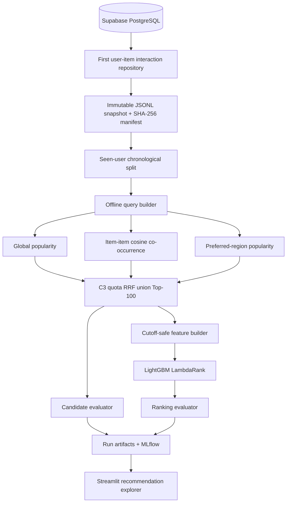

# Two-stage Baseline Model

## 1. 목적

이 baseline은 아직 방문하지 않은 식당을 사용자별로 정렬하는 추천 task를
검증한다. 평점 자체를 회귀하는 v1과 달리, 후보 생성과 최종 순위화를 분리해
어느 단계에서 relevant item을 잃거나 순위가 개선되는지 관측하는 것이 목적이다.

초기 비교 대상은 다음과 같다.

| ID | Component | 역할 | 확인할 내용 |
|---|---|---|---|
| C0 | Global popularity | Candidate source | 비개인화 하한선 |
| C1 | Item-item co-occurrence | Candidate source | 개인화 candidate의 단독 기여 |
| C2 | Region popularity | Candidate source | 지역 source의 단독 기여 |
| C3 | Popularity + item-item + region | Candidate fusion | 확장 candidate source 결합 효과 |
| R0 | Candidate source/fusion 순위 | Identity ranker | Candidate 자체의 순위 품질 |
| R1 | LightGBM LambdaRank | Learned ranker | LTR의 순수 재정렬 효과 |

`C`는 Stage 1 candidate 컴포넌트, `R`은 Stage 2 ranker를 뜻한다.
현재 catalog가 약 748개이므로 C0은 전체 catalog를 직접 정렬한다. 2-stage 구조는
당장의 latency 최적화보다는 향후 BPR, two-tower, vector 및 generative retrieval을
같은 ranker 아래에서 비교하기 위한 실험 골격이다.

한 번의 실행에서 C0~C3 후보 품질을 각각 평가하고, C3에서 선택한 후보를 R1이 재정렬한다.

## 2. Architecture



한 실험은 validation과 test 두 phase로 실행된다.

1. Train prefix query로 validation용 LambdaRank를 학습한다.
2. Train history로 validation candidate와 ranking을 평가한다.
3. Train prefix와 validation query를 합쳐 final LambdaRank를 재학습한다.
4. Train+validation history로 test candidate와 ranking을 평가한다.

평가 시 target은 후보에 강제로 넣지 않는다. 학습 시에는 target이 cutoff 이전
catalog에 존재하지만 Top-100에서 누락된 경우에만 positive row를 주입하고
`injected_for_training=true`로 기록한다. Run metric에는 retrieved/injected/
unavailable positive query 수와 injection rate를 함께 남긴다.

Candidate context는 query마다 과거 전체를 다시 계산하지 않는다. Query를 global
cutoff 순으로 처리하면서 interaction count, rating sum, user-item set과 co-occurrence를
증분 갱신한다. 각 interaction은 phase당 한 번만 추가되며 cutoff보다 같거나 늦은
interaction은 포함하지 않는다. Batch context와 incremental context 및 후보 결과의
동일성을 회귀 테스트로 검증한다.

## 3. Dataset

모델링 입력은 legacy CSV가 아니라 `recsys.reviews`와 `recsys.restaurants`에서
조회한 최초 user-item interaction이다. Target review text와 taste/price/service는
입력하지 않는다.

현재 Supabase snapshot 기준:

| 항목 | 값 |
|---|---:|
| 최초 user-item interaction | 23,017 |
| 식당 | 약 748 |
| Primary seen user | 2,396 |
| Train / validation / test | 12,504 / 2,396 / 2,396 |
| Train history 1–2개 사용자 | 1,049 |
| Train history 3개 이상 사용자 | 1,347 |

Primary split은 고유 식당 3개 이상 사용자의 마지막 interaction을 test, 마지막에서
두 번째를 validation, 나머지를 train으로 둔다. 각 query에서 이미 방문한 식당과
target review에서 파생된 정보는 입력에서 제외한다.

평점 relevance는 다음과 같다.

| Rating | Relevance |
|---|---:|
| 4.0 이상 | 2 |
| 3.0 이상 4.0 미만 | 1 |
| 3.0 미만 또는 미관측 candidate | 0 |

Relevance가 모두 0인 query는 ranking accuracy에서 제외하고 비율을 별도 기록한다.
미관측 식당은 실제 dislike가 아니라 노출 여부를 알 수 없는 weak negative라는
한계가 있다.

## 4. Layer별 처리와 Output

### Layer 0. Snapshot과 query

- 입력: DB interaction
- 처리: 결정적 정렬, canonical JSON 직렬화, SHA-256 digest, chronological split
- 출력: `dataset.jsonl`, `dataset_snapshot_id`, train/validation/test query

Query output:

```text
query_id, phase, user_id, cutoff,
history_restaurant_ids, target_restaurant_id,
target_rating, relevance, history_depth
```

각 run에는 config, Git commit/dirty 상태, Python/platform, 전체 package version과
feature schema를 저장한다. 미커밋 변경이 있으면 diff도 run artifact에 보존한다.

### Layer 1-A. Global popularity

- 입력: query cutoff 이전 interaction과 사용자의 방문 이력
- 알고리즘: 식당별 interaction count 내림차순, 동률은 `restaurant_id` 오름차순
- filter: 이미 방문한 식당 제외
- 출력: popularity Top-100과 source score/rank

Cold/few-shot 사용자도 결과를 만들 수 있어 fallback이자 최소 성능 기준이지만,
개인화와 long-tail 발견 능력은 없다.

### Layer 1-B. Item-item co-occurrence

- 입력: cutoff 이전 binary user-item history
- 알고리즘: 두 식당을 함께 방문한 사용자 수를 item frequency로 cosine 정규화

```text
sim(i,j) = cooccurrence(i,j) / sqrt(freq(i) * freq(j))
score(j|u) = sum(sim(i,j) for i in user_history)
```

- 출력: item-item Top-100, sum/max similarity와 source rank

짧고 희소한 history에서도 학습형 embedding 없이 개인화를 확인할 수 있다.
Interaction이 없는 신규 item과 history가 없는 신규 user에는 약하다.

### Layer 1-C. Candidate union

Popularity와 item-item의 score scale이 다르므로 raw score를 직접 더하지 않는다.
각 source rank를 Reciprocal Rank Fusion으로 결합한다. Region source는 사용자의
과거 방문 지역 비율과 해당 지역 내 item interaction count를 곱해 정렬한다.

```text
RRF(item) = sum(1 / (60 + source_rank))
```

C3는 C0+C1 RRF 상위 50개를 우선 보존하고, 나머지를 C2를 포함한 RRF로
채운다. 선택된 C3 후보를 평가·저장하고 동일한 후보를 LambdaRank에 전달한다.

Candidate output:

```text
query_id, user_id, restaurant_id, restaurant_name, region,
candidate_sources, source_scores, source_ranks,
rrf_score, candidate_rank, injected_for_training
```

### Layer 2-A. Feature builder

초기 feature는 candidate 단계에서 설명 가능한 값으로 제한한다.

- popularity score와 item 평균 평점
- item-item sum/max similarity
- source별 포함 여부와 inverse rank
- RRF score와 candidate inverse rank
- 사용자 history 길이와 평균 평점
- 과거 방문 지역 대비 candidate 지역 affinity

시간 감쇠, embedding, review text, target review 속성은 사용하지 않는다.

### Layer 2-B. LightGBM LambdaRank

- group: `query_id`
- label: relevance 0/1/2
- objective: `lambdarank`
- label gain: 0/1/3
- 외부 평가 cutoff: NDCG@5/10
- deterministic seed: 42, single thread, stable item tie-break
- 출력: `ranking_score`, `final_rank`, feature importance와 model file

현재 query당 positive가 하나이므로 전형적인 다중 graded-document LTR보다
하나의 observed positive와 여러 weak negative를 정렬하는 pairwise baseline에
가깝다.

## 5. 최종 Output

사용자에게 전달되는 최종 결과는 R1의 `final_rank <= 10`인 식당 목록이다.

```text
query_id
user_id
restaurant_id
restaurant_name
region
candidate_sources
source_scores / source_ranks
candidate_rank
ranking_score
final_rank
```

`recommendations_*.jsonl`에는 위 serving-shaped 필드만 저장한다. Offline 분석용
`rankings_*.parquet`에는 target id, relevance와 전체 feature를 추가로 보존한다.
대용량 candidate/ranking detail은 Zstandard Parquet, DB snapshot과 serving-shaped
Top-K는 JSONL로 저장한다. 저장 포맷은 DB 조회나 in-memory candidate 계산에
영향을 주지 않는다.

로컬 run artifact:

```text
artifacts/runs/<run_id>/
├── manifest.json
├── config.json
├── environment.json
├── environment.lock.txt
├── conda-environment.lock.txt
├── dataset.jsonl
├── queries.jsonl
├── candidates_validation.parquet
├── candidates_test.parquet
├── rankings_validation.parquet
├── rankings_test.parquet
├── recommendations_validation.jsonl
├── recommendations_test.jsonl
├── metrics.json
├── feature_importance.json
├── validation_lambdarank.txt
└── final_lambdarank.txt
```

아래 표는 이전 C0+C1→R1 정책에서 측정한 과거 처리량 기록이다. 현재 C3→R1
baseline과 지역 제거 실험의 같은 snapshot 비교는
[region ablation 결과](./analysis/region_ablation_2026-09-23.md)에 정리했다.

동일 snapshot의 과거 실측 결과:

| 항목 | 기존 | 개선 | 변화 |
|---|---:|---:|---:|
| 전체 pipeline | 802.6초 | 263.7초 | 67.1% 단축 |
| Candidate 4개 phase 합계 | 647.1초 | 120.0초 | 81.5% 단축 |
| Candidate Recall@100 | 46.72% | 51.53% | +4.81%p |
| LambdaRank Recall@10 | 11.57% | 11.57% | 회귀 없음 |
| 전체 run artifact | 683.7MB | 82.0MB | 88.0% 감소 |
| Candidate/ranking detail | 653.5MB | 49.9MB | 92.4% 감소 |

## 6. 측정 Metric

### Candidate metric

| Metric | 의미 | 해석 |
|---|---|---|
| Recall@20/50/100 | Relevant target이 후보 K개 안에 포함된 query 비율 | Stage 2가 살릴 수 있는 성능 상한 |
| Target availability | Target이 cutoff 이전 catalog에 존재한 비율 | Cold item과 retrieval 실패 분리 |
| Catalog coverage@K | 전체 eligible item 중 한 번 이상 추천된 item 비율 | 인기 item 쏠림 확인 |
| Source contribution | Source별 target 발견 수, 단독 발견 수, candidate 수 | Popularity와 item-item 기여 분리 |
| Retrieval p50/p95 | Query별 후보 생성 지연시간 | Candidate 비용과 tail latency |

현재 query당 target이 하나이므로 Recall@K와 HitRate@K는 동일하다. HitRate는
artifact alias로만 남기고 Recall을 headline metric으로 사용한다.

### Ranking metric

| Metric | 의미 | 해석 |
|---|---|---|
| NDCG@5/10 | Relevant target이 위에 있을수록 높은 discounted gain | C3 순서(R0) 대비 R1 재정렬 개선 지표 |
| Recall@5/10 | 최종 Top-K에 target이 남은 query 비율 | 사용자에게 보이는 목록의 hit 여부 |
| MRR@10 | 첫 relevant target 순위의 역수 평균 | 정답을 얼마나 앞에 배치했는지 |
| Coverage@10 | 최종 노출 item 범위 | LTR의 popularity 쏠림 guardrail |
| Novelty@10 | 추천 item popularity의 self-information 평균 | 덜 알려진 식당 노출 정도 |
| Region diversity@10 | Top-K item pair 중 region이 다른 비율 | 현재 metadata로 계산하는 단순 다양성 proxy |
| Ranking p50/p95 | Query별 LambdaRank inference 시간 | 최종 ranking 비용 |

Leave-one-out에서는 MAP과 MRR이 같고, NDCG도 rating grade보다는 target의 위치에
주로 좌우된다. Multi-positive/impression 데이터가 생기기 전에는 MAP을 핵심
지표로 사용하거나 graded preference 성능을 주장하지 않는다.

## 7. 시간 정보의 범위

현재 날짜는 interaction 정렬, chronological split과 미래 정보 누수 차단에만
사용한다. Recency, time-decay popularity/item-item, 계절성, rolling retraining,
SASRec 같은 sequential model은 baseline에 포함하지 않고 M8 Future Work로 둔다.

## 8. 실행

```bash
cd projects/rating_recsys
conda create --prefix ./.venv python=3.10 pip libgomp -y
conda activate ./.venv
pip install -e '.[experiment,dev]'

rating-recsys-experiment
rating-recsys-dashboard
```

MLflow UI는 별도 터미널에서 실행한다.

```bash
mlflow ui \
  --backend-store-uri sqlite:///artifacts/mlflow.db \
  --host 127.0.0.1 \
  --port 5000
```

### MLflow 관측 구조

각 실행은 하나의 parent run과 다섯 개의 component child run으로 기록한다.

| Run | UI에서 확인할 내용 |
|---|---|
| Parent | 핵심 validation/test metric, dataset lineage, chart, table, trace |
| C0 Popularity | popularity candidate Recall/NDCG/MRR/Coverage@K |
| C1 Item-item CF | collaborative filtering candidate metric@K |
| C2 Region popularity | 지역 candidate metric@K |
| C3 RRF Candidate Union | candidate union metric@K와 source contribution |
| R1 LambdaMART | 최종 top-K Recall/NDCG/MRR/Coverage |

Parent run의 `Datasets`에는 immutable modeling snapshot의 schema, row count와
digest가 기록된다. `tables/stage_metrics.json`은 phase·stage·cutoff별 지표를,
`tables/test_recommendations.json`은 test query별 target과 top-K 추천 결과를
제공한다. `charts/`에는 stage별 test recall과 feature importance를 기록한다.

`Traces`에서는 다음 실제 호출 순서와 각 단계의 요약 입출력·latency·예외를
확인한다.

```text
baseline_pipeline
├── 01_split_dataset
├── 02_build_train_candidates
├── 03_build_validation_candidates
├── 04_build_validation_refit_candidates
├── 05_build_test_candidates
├── 06_train_validation_lambdamart
├── 07_train_final_lambdamart
├── 08_evaluate_offline
├── 09_write_run_artifacts
└── 10_log_mlflow_observability
```

수백 MB인 전체 candidate/ranking JSONL은 `artifacts/runs/<run_id>/`에만 보존해
MLflow artifact store의 중복을 피한다. 세부 사용자별 rank movement는 Streamlit
dashboard를 사용한다.
