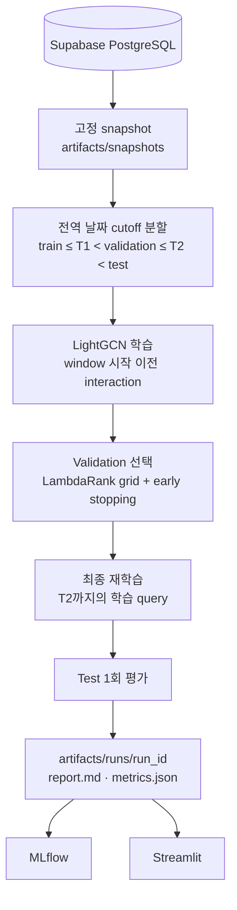

# Two-stage 모델과 평가 방식

## 1. 목적

사용자가 아직 방문하지 않은 식당의 순위를 매긴다. 후보 생성(Stage 1)과
재정렬(Stage 2)을 분리해, 정답을 후보 단계에서 놓쳤는지 재정렬 단계에서 아래로
밀었는지를 따로 측정한다. 새 후보 모델(two-tower, content vector 등)도 같은
ranker 아래에서 비교한다.

| ID | 구성 | 단계 | 역할 |
|---|---|---|---|
| C1 | Item-item co-occurrence | 후보 | 이력 기반 개인화 (학습 없음) |
| C4 | LightGCN | 후보 | 학습형 그래프 협업 필터링 |
| **C5** | **C1·C4 RRF** | **후보 결합** | **Stage 2에 넘기는 Top-100 (현재 기준선)** |
| C0 | 전체 인기 | 참고 | 비개인화 하한선. 결합하지 않고 ranker feature로 사용 |
| C2 | 지역 인기 | 참고 | 결합하지 않고 ranker feature(지역 비율)로 사용 |
| C3 | C0·C1·C2 quota RRF | 참고 | 2026-09-27까지의 Stage 1. 비교용으로 계속 계산 |
| C6 | DeepCoNN | 별도 실험 | 리뷰 텍스트 CNN 후보. 파이프라인에는 넣지 않음 |
| R0 | C5 순서 그대로 | 재정렬 기준선 | 재정렬 없이 자른 Top-10 |
| R1 | LightGBM LambdaRank | 재정렬 | 최종 Top-10 |

2026-09-30에 Stage 1을 C3에서 C5로 바꿨다. 근거는
[LightGCN 비교 run](./artifacts/comparisons/lightgcn/20260928T064358512632Z-e7896add/report.md)이다.
LightGCN 단독과 C0·C1·C2 결합 조합 중 C1+C4가 validation Recall@100이 가장 높았다.
Test에서도 C3보다 +3.50%p [+2.30, +4.70] 높았다. C0·C2를 결합에 넣으면 오히려 낮아졌다.

## 2. 전체 흐름



## 3. 데이터와 분할

입력은 `recsys.reviews`에서 사용자·식당 쌍마다 최초 방문 하나만 남긴 interaction이다.
정답 리뷰의 본문과 세부 점수(맛·가격·서비스)는 파이프라인 입력에 넣지 않는다.
DeepCoNN 실험만 리뷰 본문을 별도 파일(`<snapshot>.reviews.jsonl`)로 읽고, cutoff
이전 리뷰만 쓴다(9절).

분할은 모든 사용자에게 같은 두 날짜를 적용한다. T1, T2는 전체 interaction 날짜의
80%, 90% 지점이다(`--train-fraction`, `--validation-fraction`).

```text
사용자 A:  r1  r2  r3 │ r4  r5 │ r6  r7
                   T1        T2
train  ≤ T1       : r1 r2 r3
validation window : r4 r5   (이력 r1~r3)
test window       : r6 r7   (이력 r1~r5)
```

| Relevance | 조건 |
|---:|---|
| 2 | 평점 4.0 이상 |
| 1 | 평점 3.0 이상 4.0 미만 |
| 0 | 그 외, 또는 방문 기록 없음 |

방문 기록이 없는 식당은 싫어서 안 간 것인지 몰라서 안 간 것인지 알 수 없는 약한
negative다. 평점 4.0 이상이 86.5%라 이 등급은 경험의 질을 거의 구분하지 못한다
(11절).

## 4. Query

Query 하나는 한 사용자가 한 시점에 받는 추천 1회다. 학습과 평가는 query 형태가 다르다.

| | 학습 query | 평가 query |
|---|---|---|
| 만드는 방법 | 이력 prefix: (r1 → r2), (r1, r2 → r3), … | 사용자 1명 × window 1개 |
| 정답 수 | 1개 | window 안의 방문 전부 (평균 약 3.6개) |
| 시점 제한 | 튜닝: 정답 ≤ T1 / 최종: 정답 ≤ T2 | 이력 ≤ window 시작 |
| 대상 | 두 번째 방문부터 | window 시작 전에 이력이 있는 사용자 |

- 후보와 feature는 각 query 시점 이전의 interaction으로만 계산한다. Query를
  시간순으로 처리하면서 인기도·co-occurrence를 증분 갱신한다.
- LightGCN은 query마다 다시 학습할 수 없어 시점별 모델을 따로 둔다.
  - 평가 query: window 시작 이전의 모든 interaction으로 학습한 모델
    (validation은 train, test는 train + validation).
  - 학습 query: 3개월 단위 구간(1·4·7·10월 1일 시작)마다, 그 구간 시작일 **이전**
    interaction으로 다시 학습한 모델(`--lightgcn-checkpoint-months`). 전체 데이터에서
    모델 40개, 학습 약 4분이다. 그 시점 그래프에 없던 사용자(학습 query의 약 16%)는
    LightGCN 후보가 없어 C1 순서만 쓴다.
- 학습 query는 정답이 그 query의 C5 후보 100개 안에 있을 때만 ranker 학습 group이
  된다. 평가 query와 같은 조건이다. 후보 밖 정답을 후보 목록에 끼워 넣지 않는다
  (2026-09-30 이전에는 끼워 넣었다. 11절).
  평가 query에서는 정답이 후보에 없으면 그대로 실패로 센다.
- Window 시작 전 이력이 없는 사용자는 개인화할 수 없어 평가하지 않고 수만 기록한다.

## 5. Stage 1: 후보 생성

- C1: 두 식당을 함께 방문한 사용자 수를 빈도로 cosine 정규화한 유사도를 이력에 대해 합산.

  ```text
  sim(i, j)  = cooccurrence(i, j) / sqrt(freq(i) · freq(j))
  score(j|u) = Σ_{i ∈ history(u)} sim(i, j)
  ```

- C4 LightGCN: 사용자–식당 이분 그래프의 대칭 정규화 인접행렬로 3층 전파하고 0~3층
  embedding을 평균한다. 방문 식당을 균등 샘플 미방문 식당보다 높게 두는 BPR loss,
  batch L2 1e-4, Adam(learning rate 0.005, batch 2048), 64차원, 20 epoch, seed 42.
  NumPy/SciPy 구현이다. 설정은 LightGCN 비교 run의 validation 학습 곡선으로 골랐고
  파이프라인에서는 고정값이다.
- C5: C1 Top-100과 C4 Top-100을 순위로 결합한다(RRF = Σ 1/(60 + rank)). Quota 없이
  상위 100개.
- 참고 C0, C2, C3: 같은 context에서 계산해 표에 남긴다. C3는 C0+C1 RRF 상위 75개를
  먼저 채우고 나머지를 C0+C1+C2 RRF로 채운다(quota 0.75는 2026-09-27 run에서
  validation으로 고른 값, `--legacy-c3-quota`).

모든 후보에서 사용자가 이미 방문한 식당은 뺀다.

## 6. Stage 2: LambdaRank

Feature는 모두 query 시점 이전 데이터로 계산한다.

- 인기도(C0 점수, C0 Top-100 안의 역순위와 포함 여부), 식당 평균 평점
- Item-item 유사도 합·최대, C1 역순위와 포함 여부
- LightGCN 점수(그 query의 후보 100개 안에서 표준화), C4 역순위와 포함 여부
- C5 RRF 점수, C5 안의 역순위
- 사용자 이력 길이와 평균 평점
- 과거 방문 지역 대비 후보 지역 비율 (`--region-mode without_region`이면 제외)

LightGCN 원점수는 시점별 모델마다 척도가 달라 query 안에서 표준화한 값만 쓴다.

학습 설정: group = query, label = relevance 0/1/2, label gain 0/1/3, learning rate
0.05, seed 42, deterministic. Query당 정답이 1개인 학습 query로 학습하므로 실제로는
정답 1개와 C5 오답 약 99개를 구분하는 pairwise 학습에 가깝다.

## 7. 설정 선택 (validation만 사용)

1. LambdaRank: `num_leaves × min_child_samples` 조합마다 validation NDCG@10으로 early
   stopping(50 round)한 모델, 그리고 고정 설정(150 trees, 15 leaves) 중
   validation NDCG@10이 가장 높은 것. 트리 수는 그 모델의 best iteration.
2. 최종 모델: 고른 설정과 트리 수로 T2까지의 학습 query(train + validation window)로
   다시 학습한다.
3. Test window는 이 뒤에 한 번만 평가한다. 결과를 보고 설정을 다시 바꾸지 않는다.

Stage 1 구성과 LightGCN 설정은 별도 비교 run의 validation으로 먼저 정했고, 파이프라인
run 안에서는 고르지 않는다.

테스트로 확인하는 것: test 구간 데이터만 바꿔도 선택 결과, validation 지표, 최종 모델
파일이 바이트 단위로 같다. LightGCN 학습 edge 수가 각 cutoff·구간 시작일 이전
interaction 수와 같다.

## 8. 평가 지표

모든 정확도 지표는 사용자(query)별로 계산해 평균한다. 정답(relevance > 0)이 1개
이상인 사용자만 평균에 넣는다.

후보 생성 (C0~C5, K = 20/50/100):

| 지표 | 정의 |
|---|---|
| Recall@K | 후보 K개 안의 정답 수 / 그 사용자의 전체 정답 수 |

C5 Recall@100이 Stage 2가 도달할 수 있는 상한이다. C5 − C3 차이는 paired bootstrap으로
보고한다.

LTR 재정렬 (R0, R1, K = 5/10):

| 지표 | 정의 |
|---|---|
| Recall@K | Top-K 안의 정답 수 / 전체 정답 수 |
| Precision@K | Top-K 안의 정답 수 / K |
| NDCG@K | gain 2^rel − 1, 할인 1/log2(rank+1), 사용자 정답으로 만든 ideal DCG로 정규화 |
| MAP@K | 정답이 나온 위치마다의 precision 합 / min(K, 정답 수) |
| MRR@K | 첫 정답 순위의 역수 |
| Catalog coverage@K | 전체 후보 catalog 중 한 번 이상 추천된 식당 비율 |
| Novelty@K | 추천 식당 인기 비율의 −log2 평균 |
| 지역 다양성@K | 한 목록 안에서 지역이 다른 식당 쌍의 비율 |

R1 − R0 차이는 같은 사용자끼리 짝지은 paired bootstrap(2,000회) 95% 신뢰구간으로
보고한다. 신뢰구간이 0을 포함하면 차이가 없다고 해석한다.

## 9. 별도 후보 실험

파이프라인과 같은 split·평가 query·C0~C5로 새 후보 소스를 C5와 비교한다. Ranker는 다시
학습하지 않는다. 모든 모델이 같은 절차를 쓴다: validation 학습 곡선으로 grid와 epoch
수를 고르고, 결합 방식(단독, C1과 RRF, C1+C4와 RRF)을 validation Recall@100으로 고른
뒤, T2까지 다시 학습해 test를 한 번 평가한다. 명령은 `rating-recsys-compare <model>`,
결과는 `artifacts/comparisons/<model>/<run_id>/report.md`.

| 모델 | 비교 대상 | 결과 |
|---|---|---|
| LightGCN | 당시 기준선 C3 (C5를 고른 실험) | C1+LightGCN RRF가 C3보다 +3.50%p → C5 |
| DeepCoNN | 현재 기준선 C5 | 결합해도 C5보다 −1.72%p [−2.65, −0.86] → 채택 안 함 |

DeepCoNN은 사용자 문서(본인의 과거 리뷰)와 식당 문서(그 식당의 과거 리뷰)를 각각
글자 embedding → 1D CNN → max-over-time → FC로 읽고 FM으로 점수를 낸다. 문서에는
cutoff 이전 리뷰만 들어가고, 학습 visit의 리뷰는 두 문서에서 모두 뺀다. 논문의
평점 회귀(MSE)와 순위 학습(BPR)을 모두 grid에 넣었다. 점수의 대부분이 식당 항에서
나오고 그 항이 방문 수와 Spearman 0.90이라, 리뷰에서 사실상 인기도를 배웠다
([보고서](./artifacts/comparisons/deepconn/20260930T111734850000Z-e7896add/report.md) 7절).

새 모델은 `retrieval/`에 구현하고 `experiments/candidate_models.py`에 설정 하나만
추가하면 같은 CLI·보고서로 비교된다([README](./README.md#후보-모델-비교-실험)).

## 10. 출력

`artifacts/runs/<run_id>/` 폴더 하나에 모든 결과가 있다.

| 파일 | 내용 |
|---|---|
| `report.md` | 결과 보고서: 요약, 데이터와 조건, 설정 선택, 후보 지표, LTR 지표, 해석(직접 기입), 재현 |
| `manifest.json` | 조건, snapshot, 구간 경계, 누수 경계, commit·환경, 단계별 시간 |
| `metrics.json` | validation/test 단계별 지표, bootstrap, 선택 grid, LightGCN checkpoint, 학습 데이터 요약, feature importance |
| `queries_*.jsonl` | 사용자별 이력과 window 정답 |
| `recommendations_*.jsonl` | 사용자별 Top-10 (점수, C5 내 순위 포함) |
| `model.txt` | 최종 LambdaRank |

MLflow(experiment `rating-recsys`)에는 지표·파라미터·tag만 기록하고 파일은 복사하지
않는다. 폴더 구조와 정리 기준은 [artifacts/README.md](./artifacts/README.md)에 있다.

## 11. 현재 결과와 한계

[2026-09-30 C5 기준선](./artifacts/runs/20260930T135424227862Z-e7896add/report.md), test 1,573명:

| | 이전 (C3 후보) | C5 후보 + 정답 끼워넣기 | **현재 (C5 후보)** |
|---|---:|---:|---:|
| Stage 1 Recall@100 | 16.66% | 20.16% | **20.16%** (C3 대비 +3.50%p [+2.30, +4.70]) |
| R0 NDCG@10 | 0.0174 | 0.0276 | 0.0276 |
| R1 NDCG@10 | 0.0268 | 0.0253 | 0.0276 |
| R1 − R0 NDCG@10 | +0.0094 [+0.0043, +0.0144] | −0.0023 [−0.0067, +0.0020] | −0.0000 [−0.0046, +0.0044] |
| 최종 ranker 트리 수 | 83 | 54 | 1 |

후보 품질은 올랐지만 R1은 C5 순서를 넘지 못한다.

- 2026-09-30 앞선 run과 그 전 C3 run은 후보 밖 학습 정답을 후보 목록 끝(순위 101)에 끼워
  넣었다. 끼워 넣은 행만 그 순위를 가져서, 두 run의 최종 모델은 모든 트리의 첫 분기로
  이 행을 골라냈다(C3 run은 `rrf_score = 0`, C5 run은 `candidate_rank_inverse < 1/100`).
  C3 run의 R1 − R0 +0.0094에는 이 효과가 섞여 있을 수 있다. 지금은 정답이 후보 안에 있는
  학습 query(약 24%)만 쓴다.
- 그러자 validation early stopping이 트리 1개에서 멈춘다. 지금 feature와 정답 1개짜리 학습
  query로는 C5 순서보다 나은 재정렬을 배우지 못한다. 트리 1개라 점수 동점이 많고, 동점은
  식당 id 순으로 놓인다.
- 학습 query의 LightGCN 점수는 최대 3개월 전 그래프, 평가 query는 cutoff 직전
  그래프에서 나온다.
- 관측된 리뷰만 정답으로 쓰는 오프라인 평가다. 추천했지만 방문 기록이 없는 식당을
  실제 dislike로 해석할 수 없다. 평점 4.0 이상이 86.5%라 relevance 등급이 경험의
  질을 거의 구분하지 못한다. 리뷰 기반 경험 라벨은 다음 단계다.
- 날짜의 약 20%는 연도를 추론한 값이라 window 경계가 부정확할 수 있다.
- 기본 실행은 seed 1개다. 작은 차이는 seed를 바꿔 반복하기 전에는 확정하지 않는다.
- 날짜는 분할과 누수 차단에만 쓰고 모델 feature로는 쓰지 않는다(time-aware 모델은
  계획서 M8).

## 12. 이전 평가 방식

2026-09-27까지 쓴 사용자별 leave-last-two-out 평가와 그 결과(지역 제거, LightGCN
후보 실험 포함)는 [analysis/archive/primary/](./analysis/archive/primary/README.md)에
보관했다.
