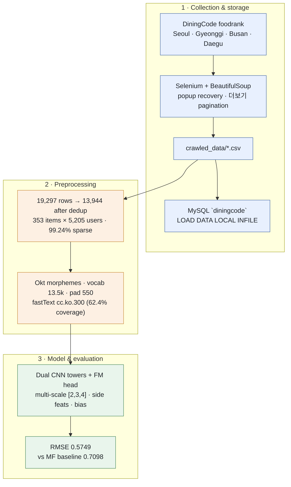

# Text-Embedded Hybrid Recommender for Korean Restaurants (2025.12.01 ~ ongoing)

[Korean](./README_KOR.md)

Personal project. Review text crawled from **DiningCode** is fused with a rating model so predictions reflect *what users write*, not only a 99%-sparse rating matrix. Based on [DeepCoNN (WSDM'17)](https://arxiv.org/pdf/1701.04783).



> Review text → rating prediction, **19% lower RMSE than a rating-only baseline**

## Summary

- Built a Selenium crawler for DiningCode across 5 Korean metro regions, collecting rating, review text, and side features
- Bulk-loaded cleaned CSVs into local **MySQL** via `pymysql` + `LOAD DATA LOCAL INFILE`, with Korean labels mapped to ordinals at load time
- Implemented **Matrix Factorization** from scratch as baseline, then **DeepCoNN** (dual CNN towers over fastText embeddings + FM head)
- Five targeted improvements took RMSE from **0.8045 → 0.5749**, beating the MF baseline of **0.7098**
- All runs tracked in **MLflow** (params, metrics, tags, checkpoints) with a `compare_runs()` helper

## Goal

Rating-only recommenders cannot capture *why* a user rated a restaurant as they did, and the user–item matrix here is **99.24% sparse** — collaborative signal alone is thin. Aggregating every review a user wrote (and every review an item received) into a document gives even one-interaction users a dense representation.

## Dataset

- **Source**: [DiningCode](https://www.diningcode.com) regional `foodrank` pages — Seoul, Gyeonggi, Busan, Daegu, plus an earlier nationwide pull
- **Fields**: `item_name`, `item_area`, `item_avg_rating`, `user_name`, `user_tot_follow_num`, `user_rating`, `user_query` (review), `taste`, `price`, `service`, `menu`, `date`
- **Collection hazards**: ads/popups interrupt clicking (handled with `ActionChains` fallback + retry); Selenium timing latency duplicates review blocks (removed downstream — **27.7% of collected rows**)
- **Preprocessing**: strip the `다코미식가` badge into a binary flag so one person isn't split into two IDs · parse `"4.5점"` → float · remove the `...더보기` marker · map `taste`/`service`/`price` to ordinals · `LabelEncoder` IDs with `i2n`/`n2i` maps kept for readable output
- **Modeling set**: Seoul + Gyeonggi, **19,297 → 13,944 rows** after dedup, 353 items × 5,205 users, per-user 80/20 split (seed 42). Other regions are crawled and stored but held out.

## Model & Training

- **Baseline**: from-scratch Matrix Factorization with user/item biases (`k=10`, lr 0.001, reg 0.02, 50 epochs)
- **Text pipeline**: KoNLPy **Okt** morphemes (`stem=True`) → top-20k vocab (13,548 observed) → pad/truncate to 550 tokens → Meta **fastText `cc.ko.300`**, fine-tuned during training. Coverage **62.4%** (OOV init `N(0, 0.6)`), test `<UNK>` rate 1.24%.
- **Architecture**: user doc and item doc each pass through `Embedding(300) → Conv1d → pool → FC(32)`; the concatenation `z` feeds a Factorization Machine head

  ```
  rating = global_bias + W·z + ½ Σ[(z·V)² − (z²·V²)] + b_user + b_item
  ```

- **Five improvements** over the v1 implementation:

  | # | Change | Rationale |
  |---|---|---|
  | 1 | Multi-scale CNN, kernels `[2,3,4]` | One kernel sees one n-gram width; parallel kernels catch bigram–4-gram sentiment patterns at once |
  | 2 | Attention pooling | Max-pool keeps only the strongest activation; softmax weighting preserves context across 550 tokens |
  | 3 | Side-feature fusion | `taste`/`service`/`price` concatenated into `z`, joining structured signal to text |
  | 4 | User/item bias embeddings | Separates "this user rates high" from "this text is positive" |
  | 5 | Rating normalization + clipping | MSE alone happily predicts outside the valid rating range |

- **Training setup**: MSE loss, RMSprop (`alpha=0.9`, lr 1e-3, `weight_decay=1e-4`), dropout 0.2, batch 64, gradient clipping at 1.0, 15 epochs with early stopping (`patience=3`), best checkpoint to `best_model.pt`
- **Tracking**: MLflow at `localhost:5000`, experiment `deepconn_improved` — step/epoch losses, val RMSE, an `improvements` tag marking which of the five are active, and the checkpoint as an artifact

## Evaluation Results

| Model | RMSE | Precision@3 | Recall@3 | NDCG@3 |
|---|---|---|---|---|
| Matrix Factorization (baseline) | 0.7098 | 0.4301 | 0.9901 | 0.9870 |
| DeepCoNN v1 | 0.8045 | 0.4301 | 0.9901 | 0.9873 |
| **DeepCoNN Improved** | **0.5749** | 0.4301 | 0.9901 | 0.9918 |
| DeepCoNN Improved (no normalization) | 0.5780 | 0.4301 | 0.9901 | 0.9929 |

Only **RMSE** is discriminative here — Precision@3 and Recall@3 are identical across all four models because each user's test set is too small for a top-3 slice to be informative.

## Storage

Crawled CSVs land in a local MySQL database, one table per region, with credentials read from `.env` via `python-dotenv`.

```sql
CREATE TABLE IF NOT EXISTS diningcode_busan (
    item_name VARCHAR(100), item_area VARCHAR(50), item_avg_rating FLOAT,
    user_name VARCHAR(100), user_tot_follow_num INT, user_rating FLOAT,
    user_query TEXT,
    taste TINYINT COMMENT '0부족 1보통 2좋음',
    price TINYINT COMMENT '0불만 1보통 2만족',
    service TINYINT COMMENT '0나쁨 1보통 2좋음',
    menu TEXT, reviewed_at DATE
) ENGINE=InnoDB DEFAULT CHARSET=utf8mb4;
```

Loading uses bulk `LOAD DATA LOCAL INFILE` rather than row-wise `INSERT`, with transformation pushed into the `SET` clause so raw Korean strings need no second pass in Python — `REGEXP_REPLACE` strips the `점` suffix, `CASE` maps `맛: 좋음/보통/부족` to `2/1/0`, and `STR_TO_DATE` parses `2025년 3월 21일`. Encoding is pinned to `utf8mb4` end to end, and newlines inside reviews are collapsed first since `LINES TERMINATED BY '\n'` would otherwise split one review across rows.

The database is the durable landing zone; the modeling notebooks still read CSVs directly.

## Takeaways

- **The FM head, not the CNN, was the bottleneck.** DeepCoNN v1 lost to plain MF (0.8045 vs 0.7098) despite far more capacity. The gain came from stabilizing the prediction head — bias terms, output range control, gradient clipping — not from a bigger text encoder.
- **Unbounded regression on a bounded target is a real failure mode.** `torch.rand` init on `fm_V` plus an unconstrained FM quadratic term drove predictions negative early in training. Normalizing targets to `[0,1]` and clamping made first-epoch loss ~0.08 instead of ~1294.
- **Multi-scale kernels + attention pooling were the largest single quality change** (~0.80 → ~0.57). Max-pooling a 550-token document to one activation per filter discards most of a review.
- **Pick metrics that can separate models.** Identical Precision@3/Recall@3 across every variant means the current ranking protocol proves nothing; leave-one-out with sampled negatives is needed before any ranking claim.
- **Crawler robustness is most of the data work** — popup interception, tab handling, and retries account for more code than the parsing itself.

## Limitations & Next Steps

- **37.6% of the vocabulary has no fastText vector**, concentrated in exactly the review slang that carries sentiment (e.g. `존맛`) — a subword or KoBERT/Gemma encoder is the intended next arm of the comparison
- Only Seoul + Gyeonggi are used for training; Busan, Daegu, and the nationwide pull are collected but unused
- Vocabulary and fitted `LabelEncoder` are not persisted alongside the checkpoint, so inference requires rerunning preprocessing

## Repository Contents

| File | Description |
|---|---|
| [rating_extraction.ipynb](./rating_extraction.ipynb) | Selenium/BeautifulSoup crawler for DiningCode ranking and detail pages |
| [sql_sending.ipynb](./sql_sending.ipynb) | Text cleaning, MySQL DDL, and bulk load of a regional CSV |
| [diningcode_analysis.ipynb](./diningcode_analysis.ipynb) | Preprocessing, MF baseline, and the first DeepCoNN implementation |
| [diningcode_analysis_improved.ipynb](./diningcode_analysis_improved.ipynb) | The five improvements, MLflow training loop, early stopping, evaluation |
| [diningcode_no_norm.ipynb](./diningcode_no_norm.ipynb) | Ablation: identical model without rating normalization/clipping |
| [development.md](./development.md) | Running experiment log |
| [crawled_data/](./crawled_data/) | Raw crawl output, one CSV per region |
| `best_model.pt` | Best checkpoint by validation RMSE |
| [predict_result.csv](./predict_result.csv) | Test predictions joined to actual ratings and source review text |
