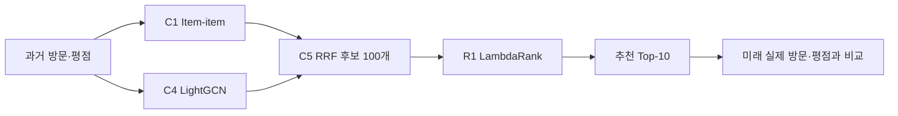

# Rating Recommender System V2

DiningCode의 방문·평점·리뷰로 **사용자가 만족할 식당을 추천하는 방법**을 비교한다. 현재 기준 모델은 방문·평점 이력만 사용하는 Two-stage 추천 시스템이다.

## 연구 질문

| 질문 | 확인할 내용 |
|---|---|
| **RQ1** | 과거 리뷰와 식당 정보를 더하면 방문·평점 이력 baseline보다 만족할 식당을 더 잘 추천하는가? |
| **RQ2** | 같은 추천 과제와 평가 기준에서 어떤 모델 구성이 더 효과적인가? |

성능 향상은 가정하지 않는다. 입력 정보의 효과와 모델 구조의 효과를 나눠 비교한다.

## 현재 시스템

| 단계 | 현재 구성 | 역할 |
|---|---|---|
| 후보 검색 | C1 Item-item + C4 LightGCN → C5 RRF | 사용자별 식당 후보 100개 생성 |
| 재정렬 | R1 LightGBM LambdaRank | 후보를 다시 정렬해 Top-10 추천 |
| 텍스트·식당 정보 | 미사용 | 후속 실험에서 추가 |
| 별점 예측 | 미지원 | 현재 ranker는 별점이 아닌 순위 점수를 출력 |


```mermaid
flowchart LR
    A[과거 방문·평점] --> B[C1 Item-item]
    A --> C[C4 LightGCN]
    B --> D[C5 RRF 후보 100개]
    C --> D
    D --> E[R1 LambdaRank]
    E --> F[추천 Top-10]
    F --> G[미래 실제 방문·평점과 비교]
```

후보와 feature는 추천 시점 이전 정보만 사용한다. 미래 방문·평점은 평가 정답으로만 사용하며, 정답 식당을 후보에 강제로 추가하지 않는다.

## 데이터와 시간 분할

DiningCode 리뷰를 고정 interaction snapshot으로 만들어 실험에 사용한다. snapshot을 사용하면 반복 실험마다 크롤링이나 DB 적재를 다시 하지 않아도 된다.

| 항목 | 현재 기준 |
|---|---|
| Snapshot | `e7896add5b4b5939` |
| 규모 | 88,554 interactions · 사용자 14,008명 · 식당 4,587개 |
| Train cutoff (T1) | 2025-12-19 |
| Validation cutoff (T2) | 2026-05-04 |
| Train / validation / test | 70,883 / 8,934 / 8,737 interactions |
| Test 사용자 | cutoff 이전 이력이 있는 1,580명 |
| Prepared 데이터 | 이번 Window 실행의 4개 배열 파일 약 45 MB · 같은 조건에서 자동 재사용 |

Test는 T2 이후 약 145일 동안의 여러 실제 방문으로 구성된다. 바로 다음 방문 하나만을 맞히는 평가는 아니다.

- test 방문은 평점과 관계없이 모두 보존한다.
- 개인화 순위 평가는 cutoff 이전 방문 이력이 있는 사용자를 대상으로 한다.
- test 기간에 방문·평점이 기록되지 않은 식당은 미관측 항목이다. 낮은 평점으로 간주하지 않는다.
- 사용자 데모그래픽 정보는 없다. 사용자 취향은 과거 리뷰·평점에서, 식당 특성은 cutoff 당시 이용 가능한 리뷰·메뉴·속성에서 추출하는 것을 계획한다.
- 과거 시점의 실험에는 그 시점 이후 수집한 리뷰·메뉴·속성을 사용하지 않는다.

## 학습과 평가

### 현재 학습 방식

1. Train 기간을 기본 3개월 Window로 나눈다.
2. 각 기간 시작 전 이력으로 C5가 후보를 검색하고, 후보별 feature를 만든다.
3. 기간 내 모든 방문을 개인별 만족도 정답으로 묶고, 정답이 실제 후보에 검색된 query로 LambdaRank를 학습한다.
4. Validation의 Graded NDCG@10으로 ranker 설정과 트리 수를 선택한다.
5. 선택한 설정으로 T2까지 다시 학습한 뒤, test에서 최종 평가한다.

현재 기준 학습은 **기준 날짜까지의 이력으로 후보를 만들고, 이후 일정 기간의 모든 방문을
한 정답 목록으로 묶는 Window 방식**으로 진행한다. 같은 날 방문도 목록에 함께 보존한다.
과거 CLI 기본값은 Prefix/absolute로 유지하며, 새 baseline은 Window/history-aware 옵션을 명시한다.
학습 3개월과 test 약 145일의 기간 차이는 남아 있다.
자세한 차이는 [PLAN의 날짜 경계 설명](./PLAN.md#같은-날짜-방문-처리의-의미)에 있다.

### 현재 구현의 평점 기준과 지표

강한 만족 경계 h는 과거 이력 10건 미만에서 4점, 10건 이상에서
`clip(4 + 0.5 × (과거 사용자 평균 − 4), 3.5, 4.5)`다.

| 실제 test 평점 | Graded relevance | 해석 |
|---|---:|---|
| h 이상 | 2 | 강한 만족 |
| 3점 이상 h 미만 | 1 | 약한 만족 |
| 3점 미만 | 0 | 만족 정답 아님; test 행은 유지 |

| 평가 단계 | 지표 | 답하는 질문 |
|---|---|---|
| 후보 검색 | Recall@100, 4점 이상 Recall@100 | 만족한 식당을 재정렬 전에 찾았는가? |
| 최종 추천 · 주 비교 | **Graded NDCG@10** | 만족한 식당을 추천 상위에 배치했는가? |
| 고평점 추천 진단 | 4점 이상 Recall@10 | 실제 고평점 식당이 Top-10에 포함됐는가? |
| 별점 예측 모델만 해당 | 모든 test 평점의 MAE/RMSE | 방문한 식당에 줄 평점을 얼마나 정확히 예측했는가? |
| 저평점 진단 | 실제 3점 미만 방문의 Top-K 포함 수·비율 | 나중에 낮은 점수를 준 식당을 상위에 둔 사례는 얼마인가? |

Validation Graded NDCG@10으로 설정을 고르고, test Graded NDCG@10은 최종 비교에 한 번 사용한다. MAE/RMSE는 별점 예측값을 출력하는 모델에만 적용한다. 낮은 MAE가 좋은 추천 순위를 보장하지 않으므로 순위 지표와 따로 해석한다.

선택한 공통 만족도 기준은 **이력이 적으면 기존 기준을 유지하고, 충분하면 사용자의 과거 평균
평점도 활용하는 것**이다. 이 기준은 구현·검증됐으며 Window baseline과 후속 모델을 모두
같은 기준으로 평가한다. 최소 이력 10건의 train 분석 근거와 적용 예시는
[SATISFACTION_BASELINE.md](./SATISFACTION_BASELINE.md)에 정리했다.

## 현재 측정 결과

아래 값은 **2026-10-04 Window + 개인별 만족도 기준**의 전체 실행 결과다.

| 지표 | 현재 결과 | 기준 |
|---|---:|---|
| C5 후보 Recall@100 | 20.1626% | 등급 > 0 test 식당; 3점 이상 |
| 최종 Graded NDCG@10 | 0.025467 | 개인별 만족도 등급 |
| 최종 Recall@10 | 3.6502% | 등급 > 0 test 식당 |
| 4점 이상 Recall@10 | 3.5105% | 4점 이상 방문이 있는 사용자 |
| 실제 3점 미만 방문의 Top-10 포함 | 3 / 43 (6.98%) | 관측된 저평점 방문 |

선택된 ranker는 leaves 63 / min_child_samples 100 / trees 76이다. Test 이력 사용자
1,580명 중 862명에게 개인 기준을 적용했다. R0 후보 순서의 NDCG@10은 0.026590이며,
R1 − R0의 95% CI가 0을 포함해 이번 실행에서는 재정렬의 이득을 확인하지 못했다.
현재 ranker는 별점을 출력하지 않아 MAE/RMSE는 없다. 과거 2026-10-02 수치는
평가 등급·학습 방식이 달라 직접 비교하지 않는다.
출처: [실행 보고서](./artifacts/runs/20261004T125314601899Z-e7896add/report.md).

## 실험 비교 범위

| 비교 축 | 후보 구성 |
|---|---|
| 입력 정보 (RQ1) | 방문·평점 이력 / 사용자 리뷰 / 식당 정보 / 리뷰와 식당 정보 모두 |
| 후보 검색 | Item-item, MF, LightGCN, BM25, 리뷰 임베딩, Two-Tower |
| 재정렬 | R0 기준 순서, LambdaRank, Jev decision model |
| 추천 구조 (RQ2) | Two-stage, Two-Tower, Generative Retrieval, 리스트 생성형 추천 |

현재 구현은 C5 + LambdaRank다. BM25·임베딩·Two-Tower·Jev·생성형 추천은 비교 계획이며, 상태와 실험 순서는 [PLAN.md](./PLAN.md)에 정리한다. baseline의 feature·label·설정·평가 절차는 [BASELINE_MODEL.md](./BASELINE_MODEL.md)에서 확인할 수 있다.

## 제한 사항

- 추천 노출 기록이 없어 오프라인 평가는 실제 추천이 방문이나 만족을 유발했다는 인과 효과를 검증하지 않는다.
- 현재 baseline은 리뷰 텍스트와 식당 콘텐츠를 사용하지 않는다.
- 기존 test 결과는 한 snapshot과 한 미래 기간에 대한 측정이다. 일반화를 확인하려면 추가 seed와 새로운 미래 holdout이 필요하다.
- 신규 사용자 1,214명은 cutoff 이전 이력이 없어 개인화 순위 평가에서 제외되며, 별도 cold-start 평가가 필요하다.

## 저장소 안내

| 경로 | 내용 |
|---|---|
| [BASELINE_MODEL.md](./BASELINE_MODEL.md) | 현재 baseline 구조·학습·평가·결과 상세 |
| [SATISFACTION_BASELINE.md](./SATISFACTION_BASELINE.md) | 개인별 만족도 기준·10건 선택 근거·Window 실행 |
| [PLAN.md](./PLAN.md) | 연구 질문·평가 기준·실험 로드맵·실행 안내 |
| [AGENTS.md](./AGENTS.md) · [docs_style.md](./docs_style.md) | 프로젝트 지침·문서 작성 기준 |
| [`src/rating_recsys/`](./src/rating_recsys/) | 데이터·후보 검색·순위 학습·평가 코드 |
| [`artifacts/snapshots/`](./artifacts/snapshots/) | 고정 interaction·리뷰 입력 |
| [`artifacts/prepared/`](./artifacts/prepared/) | 재사용 학습 feature·label·group·후보 자료 |
| [`artifacts/runs/`](./artifacts/runs/) · [`artifacts/comparisons/`](./artifacts/comparisons/) | 실행·비교 결과와 추천 목록 |
| [`migrations/`](./migrations/) · [`queries/`](./queries/) | DB schema 변경과 데이터 검증 SQL |
| [`crawler/`](./crawler/) | 데이터 수집 코드·수집 상태 |
| [Legacy V1 README](./legacy/v1_rating_prediction/README.md) | 이전 평점 예측 프로젝트 |

## 실행

명령은 `projects/rating_recsys`에서 실행한다. 고정 snapshot을 사용하므로 실험 실행에는 DB 연결이 필요 없다.

```bash
# 개인별 만족도 기준의 Window baseline; 같은 조건의 prepared 데이터 재사용
rating-recsys-experiment --snapshot artifacts/snapshots/e7896add5b4b5939.jsonl \
  --ranker-training-mode window --satisfaction-mode history-aware \
  --label window-personal-satisfaction-n10

# 기존 표준 실행 결과 조회
rating-recsys-dashboard --address 127.0.0.1
mlflow ui --backend-store-uri sqlite:///artifacts/mlflow.db --host 127.0.0.1 --port 5000
```

새 환경에서는 Python 3.10 환경에서 `pip install -e '.[experiment,dev]'`로 설치한다. DB를 쓸 때는 `.env.example`을 `.env`로 복사하고 접속 정보를 설정한다. 추가 실행 명령과 환경 준비는 [PLAN.md](./PLAN.md#실행-방법)를 참고한다.
