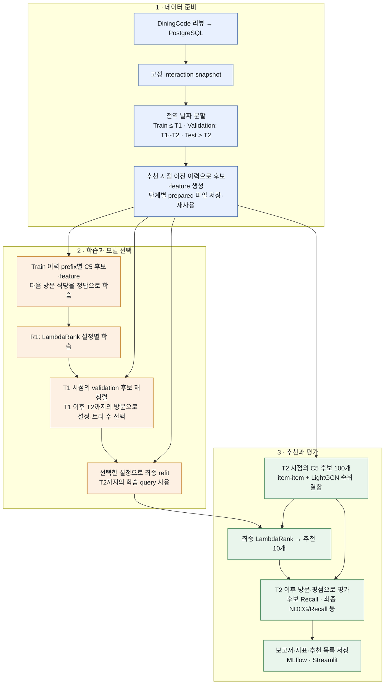

# Rating Recommender System V2

DiningCode의 방문·평점 이력으로 미방문 식당을 추천하는 2-stage 추천 시스템이다.
후보 식당 검색과 최종 순위 학습을 분리하고, 고정 데이터에서 시간 순서에 따라 평가한다.

## Architecture


```mermaid
flowchart TB
    subgraph DATA["1 · 데이터 준비"]
        DB["DiningCode 리뷰 → PostgreSQL"] --> S["고정 interaction snapshot"]
        S --> D["전역 날짜 분할<br/>Train ≤ T1 · Validation: T1~T2 · Test > T2"]
        D --> P["추천 시점 이전 이력으로 후보·feature 생성<br/>단계별 prepared 파일 저장·재사용"]
    end

    subgraph TRAIN["2 · 학습과 모델 선택"]
        X["Train 이력 prefix별 C5 후보·feature<br/>다음 방문 식당을 정답으로 학습"] --> L["R1: LambdaRank 설정별 학습"]
        L --> V["T1 시점의 validation 후보 재정렬<br/>T1 이후 T2까지의 방문으로 설정·트리 수 선택"]
        V --> F["선택한 설정으로 최종 refit<br/>T2까지의 학습 query 사용"]
    end

    subgraph EVAL["3 · 추천과 평가"]
        C["T2 시점의 C5 후보 100개<br/>item-item + LightGCN 순위 결합"] --> R["최종 LambdaRank → 추천 10개"]
        R --> E["T2 이후 방문·평점으로 평가<br/>후보 Recall · 최종 NDCG/Recall 등"]
        C --> E
        E --> A["보고서·지표·추천 목록 저장<br/>MLflow · Streamlit"]
    end

    P --> X
    P --> V
    P --> F
    P --> C
    F --> R

    classDef data fill:#e8f0fe,stroke:#4a6da7,color:#1f2328
    classDef train fill:#fdf0e3,stroke:#c98b3a,color:#1f2328
    classDef eval fill:#e9f5ec,stroke:#4a8a5f,color:#1f2328
    class DB,S,D,P data
    class X,L,V,F train
    class C,R,E,A eval
```

후보·feature는 각 추천 시점 이전 정보로 만들고, 이후 방문·평점은 정답에만 사용한다.
Validation/test의 정답 식당을 후보에 추가하지 않으며 test로 모델 설정을 선택하지 않는다.
구체적인 데이터 경로는 [baseline의 훈련부터 평가까지의 흐름](./BASELINE_MODEL.md#훈련부터-평가까지의-전체-흐름)에 정리했다.

## Goal

사용자의 과거 방문을 바탕으로 취향에 맞는 새로운 식당을 찾는 것이 목표다.
먼저 **후보 검색이 미래 방문 식당을 얼마나 찾는지**, 다음으로 **찾은 후보를 얼마나
좋은 순서로 추천하는지**를 구분해서 개선한다. 현재는 로컬 오프라인 실험 단계이며,
추천 API와 실제 노출·클릭 기반 검증은 후속 과제다.

## Dataset

수집한 DiningCode 리뷰를 PostgreSQL에 적재하고, 사용자·식당 쌍의 최초 interaction을
추출한 snapshot을 실험 입력으로 고정했다. 반복 실험에는 크롤링·DB 적재가 필요 없다.

| 항목 | 현재 평가 데이터 |
|---|---|
| Snapshot | `e7896add5b4b5939` |
| 규모 | Interaction 88,554개 · 사용자 14,008명 · 식당 4,587개 |
| 전역 cutoff | T1: 2025-12-19 · T2: 2026-05-04 |
| Train / validation / test | 70,883 / 8,934 / 8,737 interactions |
| Test 사용자 | 과거 이력이 있는 1,580명, positive 정답이 있는 평가 사용자 1,573명 |

Positive 정답은 평가 기간에 방문하고 평점 3점 이상을 준 식당이다.

같은 snapshot·생성 조건의 학습 feature·label·group과 평가 후보는
`artifacts/prepared/`의 압축 배열과 manifest에서 자동 재사용한다. Ranker 설정만
바꾸면 이 데이터를 다시 만들지 않는다. 새 후보 모델의 학습·후보는 별도로 계산한다.
현재 baseline 준비 자료는 약 77MB이며, 이 컴퓨터에서 최초 준비 21.3분 → 재사용
7.2초였다. **데이터 준비·읽기 시간이며 ranker 학습 시간은 포함하지 않는다.**

## Model & Training

현재 baseline은 **C5 후보 검색 + R1 순위 학습**이다. 코드의 C/R 이름은 각각
candidate retrieval과 ranking 단계의 식별자다.

| 단계 | 모델 | 역할·설정 |
|---|---|---|
| C1 | Item-item 협업 필터링 | 함께 방문된 식당의 유사도로 미방문 식당 검색 |
| C4 | LightGCN | 사용자–식당 방문 그래프 학습, 3 layers · 64 dimensions · 20 epochs |
| C5 | Reciprocal Rank Fusion (RRF) | C1·C4의 순위를 결합, 상수 60 · 후보 100개 · 방문 식당 제외 |
| R1 | LightGBM LambdaRank | 16개 feature로 후보 재정렬, learning rate 0.05 · seed 42 · 추천 10개 |

Feature는 후보 모델의 점수·순위, 인기도, 과거 사용자·식당 평균 평점, 이력 길이,
지역 비율 등이다. 현재 baseline은 리뷰 텍스트를 입력으로 사용하지 않는다.
사용자·식당 평균 평점은 단순 평균이며 shrinkage 강도는 λ=0이다.

학습은 과거 이력에서 **다음 방문 하나를 정답으로 삼는 prefix 방식**이다.
평점 4 이상은 relevance 2, 3 이상 4 미만은 1, 나머지와 미관측 후보는 0으로 두고
순위를 학습한다. 이는 평점을 정규화해서 예측하는 회귀 모델과는 다르다.
평가에서는 이후 기간의 **여러 방문 식당**을 정답으로 사용한다.

Validation NDCG@10으로 7개 ranker 설정과 트리 수를 선택하고, T2까지 다시 학습해
test를 평가한다. 현재 측정에서 선택된 설정은 leaves 15 · min child 10 · 1 tree다.
상세 feature·label·탐색 규칙은 [BASELINE_MODEL.md](./BASELINE_MODEL.md)에 있다.

## Evaluation Results

2026-10-02 현재 코드로 다시 학습한 baseline의 test 결과다. 후보 Recall과 최종
순위 정확도는 positive 정답이 있는 사용자 1,573명을 대상으로 계산한다.

| 지표 | 현재 baseline | 의미 |
|---|---:|---|
| 후보 Recall@100 | 20.1626% | 미래 positive 식당 중 후보 100개에 포함된 비율의 사용자별 평균 |
| 최종 NDCG@10 | 0.029360 | 추천 순위와 평점에 따른 relevance를 함께 반영한 점수 |
| 최종 Recall@10 | 4.1284% | 미래 positive 식당 중 추천 10개에 포함된 비율의 사용자별 평균 |
| 최종 Precision@10 | 1.5639% | 추천 10개 중 미래 positive 식당의 비율의 사용자별 평균 |

평균 평점 shrinkage λ=10은 test NDCG@10 0.028207이었다. Baseline 대비 차이의
95% 신뢰구간이 0을 포함해 개선을 확인하지 못했고, 기본값 λ=0을 유지한다.
[측정 원본과 비교 조건](./artifacts/comparisons/shrinkage/20261002T062004863532Z-e7896add/report.md)을 함께 보관한다.
이 수치는 이전 run의 결과나 V1의 평점 예측 RMSE와 섞어 비교하지 않는다.

## Limitations

- 후보 Recall@100이 약 20.2%여서 검색 단계에서 빠진 정답은 재정렬로 복구할 수 없다.
- 기본 학습의 다음 방문 정답과 평가의 여러 미래 방문 정답 사이에 구조 차이가 있다.
- 미관측 식당이 싫어하는 식당이라는 뜻은 아니다. 오프라인 방문 기록에는 노출 정보가 없다.
- 현재 결과는 고정 기간의 실험이다. 새 방법의 일반화 확인에는 추가 seed와 새 미래 holdout이 필요하다.

실험 후보군, 지난 실험의 판단, 학습 label 변경 계획은 [PLAN.md](./PLAN.md)에 모은다.

## Code Architecture

모델 실행 코드는 [`src/rating_recsys/`](./src/rating_recsys/) 아래에 단계별로 나뉜다.

| 모듈 | 역할 |
|---|---|
| [`ingestion/`](./src/rating_recsys/ingestion/) · [`db/`](./src/rating_recsys/db/) | 리뷰 변환·중복 제거·적재, DB 연결과 migration 실행 |
| [`datasets/`](./src/rating_recsys/datasets/) | Interaction 조회와 전역 날짜 분할 |
| [`retrieval/`](./src/rating_recsys/retrieval/) | 후보 모델, LightGCN, RRF 결합 |
| [`ranking/`](./src/rating_recsys/ranking/) | Feature 생성과 LambdaRank 학습·예측 |
| [`experiments/`](./src/rating_recsys/experiments/) | Snapshot·prepared 데이터, 전체 파이프라인과 비교 실험 실행 |
| [`evaluation/`](./src/rating_recsys/evaluation/) | 후보·최종 추천 지표와 보고서 생성 |
| [`observability/`](./src/rating_recsys/observability/) | MLflow 기록과 Streamlit 결과 조회 |
| [`tests/`](./tests/) | 데이터·후보·순위·파이프라인·비교·조회 기능 검증 |

## Resources & Repository Contents

직접 관리하는 V2 문서는 아래 세 개다. 실행 시 생성되는 보고서는 해당 결과 폴더에 둔다.
로컬 데이터·모델 등 일부 artifact는 Git에 포함되지 않으므로 새 checkout에서는 준비가 필요하다.

| 경로 | 내용 |
|---|---|
| [README.md](./README.md) | 프로젝트 목표·아키텍처·현재 결과와 시작 방법 |
| [BASELINE_MODEL.md](./BASELINE_MODEL.md) | 현재 baseline의 구조·훈련/평가 규칙·설정·수치 |
| [PLAN.md](./PLAN.md) | 앞으로의 실험, 지난 결과와 판단, 상세 실행·환경·데이터 관리 방법 |
| [`artifacts/snapshots/`](./artifacts/snapshots/) | 고정 interaction·리뷰 입력과 적재 원본 |
| [`artifacts/prepared/`](./artifacts/prepared/) | 반복 학습에 재사용하는 feature·label·group·후보 자료 |
| [`artifacts/runs/`](./artifacts/runs/) · [`artifacts/comparisons/`](./artifacts/comparisons/) | 표준 실행과 방법별 비교의 보고서·지표·모델·추천 목록 |
| [`migrations/`](./migrations/) · [`queries/`](./queries/) | DB 스키마와 데이터 검증 SQL |
| [`crawler/`](./crawler/) | 데이터 수집 코드·수집 상태 |
| [Legacy V1 README](./legacy/v1_rating_prediction/README.md) | 과거 평점 예측 프로젝트의 설명·재실험·archive 안내 |
| [pyproject.toml](./pyproject.toml) · [.env.example](./.env.example) | 패키지·실행 명령·의존성과 환경 변수 예시 |

## Setup

Baseline은 CPU에서 실행하며 Python 3.10 환경에서 확인했다. 현재 컴퓨터에는 프로젝트
내부 `.venv`에 필요한 패키지가 설치되어 있고, 주요 실행 명령도 사용자 PATH에 등록되어 있다.
아래 명령은 `projects/rating_recsys` 디렉터리에서 실행한다.

```bash
# 같은 조건의 prepared 파일이 있으면 자동 재사용하여 학습·평가
rating-recsys-experiment --snapshot artifacts/snapshots/e7896add5b4b5939.jsonl

# 기존 표준 run의 지표·추천 조회
rating-recsys-dashboard --address 127.0.0.1
mlflow ui --backend-store-uri sqlite:///artifacts/mlflow.db --host 127.0.0.1 --port 5000
```

Snapshot 실험에는 DB 접속이 필요 없다. 새 환경에서는 프로젝트 환경을 활성화한 뒤
`pip install -e '.[experiment,dev]'`로 설치한다. DB를 사용할 때는 `.env.example`을
`.env`로 복사해 접속 정보를 설정한다. 환경 생성·PATH 등록·데이터 사전 준비·비교 명령은
[PLAN의 실행 안내](./PLAN.md#실행-방법)에 정리했다. Shrinkage 비교 결과는 별도 보고서로 조회한다.
