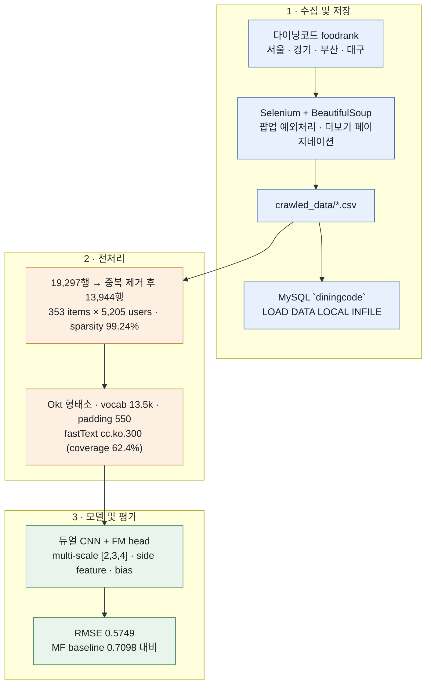

# 리뷰 텍스트 결합 한국 식당 추천 모델 (2025.12.01 ~ 진행중)

[English](./README.md)

개인 프로젝트. **다이닝코드**에서 수집한 리뷰 텍스트를 rating 모델에 결합하여, 99% 이상 희소한 rating matrix가 아니라 *유저가 실제로 쓴 내용*을 반영하는 예측을 수행한다. [DeepCoNN (WSDM'17)](https://arxiv.org/pdf/1701.04783) 구조를 기반으로 한다.



> 리뷰 텍스트 → 평점 예측, rating만 사용한 baseline 대비 **RMSE 약 19% 감소**

## 요약

- 국내 5개 대도시권을 대상으로 다이닝코드 Selenium crawler를 구축하여 평점, 리뷰 텍스트, side feature를 수집하였다
- 정제한 CSV를 `pymysql` + `LOAD DATA LOCAL INFILE`로 local MySQL에 적재하였으며, 한글 범주값은 적재 시점에 ordinal로 변환하였다
- **Matrix Factorization**을 직접 구현하여 baseline으로 삼고, **DeepCoNN**(fastText 임베딩 기반 듀얼 CNN + FM head)을 구축하였다
- 5가지 개선안을 적용하여 RMSE를 **0.8045 → 0.5749**로 낮추었고, MF baseline인 **0.7098**보다 우수한 성능을 확보하였다
- 모든 run은 **MLflow**에 params/metrics/tags/checkpoint 형태로 기록하였으며, `compare_runs()` helper로 비교한다

## 목표

Rating만 사용하는 추천 모델은 유저가 *왜* 그런 평점을 주었는지를 반영하지 못한다. 또한 본 데이터의 user–item matrix는 sparsity가 **99.24%**로, collaborative signal만으로는 정보량이 부족하다. 유저가 작성한 모든 리뷰(그리고 item이 받은 모든 리뷰)를 하나의 document로 통합하면, 상호작용이 1~2건에 불과한 유저에게도 dense한 표현을 부여할 수 있다.

## 데이터

- **출처**: [다이닝코드](https://www.diningcode.com) 지역별 `foodrank` 페이지 — 서울, 경기, 부산, 대구 및 이전 시점의 전국 단위 수집분
- **수집 Feature**: `item_name`, `item_area`, `item_avg_rating`, `user_name`, `user_tot_follow_num`, `user_rating`, `user_query`(리뷰), `taste`, `price`, `service`, `menu`, `date`
- **수집 과정의 문제**: 광고/팝업이 클릭을 가로채는 문제는 `ActionChains` fallback과 재시도로 처리하였다. Selenium의 time latency로 인해 동일 리뷰 블록이 중복 수집되며, 이는 후처리에서 제거하였다 (전체 수집분의 **27.7%**)
- **전처리**: `다코미식가` 뱃지를 binary flag로 분리하여 동일 인물이 두 개의 ID로 분리되지 않도록 하였다 · `"4.5점"`을 float로 변환하였다 · `...더보기` 마커를 제거하였다 · `taste`/`service`/`price`를 ordinal로 mapping하였다 · `LabelEncoder`로 ID를 부여하고 `i2n`/`n2i` dict를 보존하여 결과를 실제 이름으로 출력한다
- **모델링 데이터**: 서울 + 경기 기준 **19,297행 → 중복 제거 후 13,944행**, 353 items × 5,205 users, user 단위 80/20 split(seed 42). 나머지 지역은 수집·저장은 완료하였으나 학습에는 사용하지 않았다

## 모델 및 학습

- **Baseline**: user/item bias를 포함한 Matrix Factorization 직접 구현 (`k=10`, lr 0.001, reg 0.02, 50 epochs)
- **Text pipeline**: KoNLPy **Okt** 형태소 분석(`stem=True`) → 상위 20,000개 vocab(실제 관측 13,548개) → 550 token으로 padding/truncation → Meta **fastText `cc.ko.300`** 적용 후 학습 중 fine-tuning. Coverage는 **62.4%**이며 OOV는 `N(0, 0.6)`으로 초기화하였다. Test의 `<UNK>` 비율은 1.24%이다
- **구조**: user document와 item document가 각각 `Embedding(300) → Conv1d → pooling → FC(32)`를 통과하고, 두 결과를 concat한 `z`가 Factorization Machine head로 입력된다

  ```
  rating = global_bias + W·z + ½ Σ[(z·V)² − (z²·V²)] + b_user + b_item
  ```

- **v1 대비 5가지 개선안**

  | # | 개선안 | 핵심 아이디어 |
  |---|---|---|
  | 1 | Multi-scale CNN, kernel `[2,3,4]` | 단일 kernel은 하나의 n-gram 폭만 포착한다. 다중 kernel로 bigram~4-gram 수준의 패턴을 동시에 학습한다 |
  | 2 | Attention pooling | Max-pool은 가장 강한 activation 하나만 남긴다. Softmax 가중합으로 550 token 전체의 맥락을 보존한다 |
  | 3 | Side feature 통합 | `taste`/`service`/`price`를 `z`에 concat하여 구조적 정보를 텍스트 정보와 결합한다 |
  | 4 | User/item bias embedding | "이 유저가 평점을 후하게 준다"와 "이 텍스트가 긍정적이다"를 분리한다 |
  | 5 | Rating 정규화 + 출력 clipping | MSE만으로는 유효 평점 범위 밖의 값도 그대로 예측한다 |

- **학습 설정**: MSE loss, RMSprop(`alpha=0.9`, lr 1e-3, `weight_decay=1e-4`), dropout 0.2, batch 64, gradient clipping 1.0, 15 epochs 및 early stopping(`patience=3`), best checkpoint는 `best_model.pt`로 저장한다
- **Tracking**: `localhost:5000`의 MLflow, experiment명 `deepconn_improved`. Step/epoch loss, val RMSE, 5가지 개선안 중 적용된 항목을 표시하는 `improvements` tag, checkpoint artifact를 기록한다

## 평가 결과

| Model | RMSE | Precision@3 | Recall@3 | NDCG@3 |
|---|---|---|---|---|
| Matrix Factorization (baseline) | 0.7098 | 0.4301 | 0.9901 | 0.9870 |
| DeepCoNN v1 | 0.8045 | 0.4301 | 0.9901 | 0.9873 |
| **DeepCoNN Improved** | **0.5749** | 0.4301 | 0.9901 | 0.9918 |
| DeepCoNN Improved (정규화 제거) | 0.5780 | 0.4301 | 0.9901 | 0.9929 |

여기서 변별력을 갖는 지표는 **RMSE**뿐이다. Precision@3과 Recall@3이 4개 모델에서 동일하게 나타나는 이유는, user별 test set의 크기가 작아 top-3 구간이 후보 전체와 사실상 다르지 않기 때문으로 파악된다.

## 저장 구조

수집한 CSV는 지역별로 하나의 table을 이루며 local MySQL에 적재된다. 접속 정보는 `python-dotenv`를 통해 `.env`에서 읽어온다.

```sql
CREATE TABLE IF NOT EXISTS diningcode_busan (
    item_name VARCHAR(100), item_area VARCHAR(50), item_avg_rating FLOAT,
    user_name VARCHAR(100), user_tot_follow_num INT, user_rating FLOAT,
    user_query TEXT,
    taste TINYINT COMMENT '0부족 1보통 2좋음',
    price TINYINT COMMENT '0불만 1보통 2만족',
    service TINYINT COMMENT '0나쁨 1보통 2좋음',
    menu TEXT, reviewed_at DATE
) ENGINE=InnoDB DEFAULT CHARSET=utf8mb4;
```

행 단위 `INSERT` 대신 `LOAD DATA LOCAL INFILE`로 bulk 적재하며, 변환 로직을 `SET` 절에 밀어넣어 원본 한글 문자열을 Python에서 다시 순회하지 않도록 하였다. `REGEXP_REPLACE`로 `점` 접미사를 제거하고, `CASE`로 `맛: 좋음/보통/부족`을 `2/1/0`으로 mapping하며, `STR_TO_DATE`로 `2025년 3월 21일` 형식을 파싱한다. 인코딩은 전 구간에서 `utf8mb4`로 고정하였다. 리뷰 내부의 개행은 사전에 제거하는데, 그렇지 않으면 `LINES TERMINATED BY '\n'`이 하나의 리뷰를 여러 행으로 분리하기 때문이다.

DB는 영속적인 landing zone 역할을 하며, 모델링 notebook은 아직 CSV를 직접 읽는다.

## Takeaways

- **병목은 CNN이 아니라 FM head였다.** DeepCoNN v1은 훨씬 큰 capacity에도 불구하고 MF baseline보다 낮은 성능을 보였다(0.8045 vs 0.7098). 성능 향상은 텍스트 encoder의 확장이 아니라 bias term, 출력 범위 제어, gradient clipping 등 예측 head의 안정화에서 발생하였다
- **범위가 정해진 target에 대한 무제한 regression은 실질적인 실패 요인이다.** `fm_V`의 `torch.rand` 초기화와 제약 없는 FM quadratic term이 결합되어 학습 초기에 음수 평점이 예측되었다. Target을 `[0,1]`로 정규화하고 clipping을 적용한 결과, 첫 epoch의 loss가 약 1294에서 약 0.08 수준으로 낮아졌다
- **Multi-scale kernel과 attention pooling이 단일 개선안 중 가장 큰 효과를 보였다**(약 0.80 → 약 0.57). 550 token 문서를 filter당 activation 하나로 max-pooling하면 리뷰의 대부분이 버려진다
- **모델을 구분할 수 있는 지표를 선택해야 한다.** 모든 변형에서 Precision@3, Recall@3이 동일하다는 것은 현재의 ranking 평가 방식이 아무것도 입증하지 못한다는 의미이다. Ranking 성능을 주장하기 위해서는 negative sampling을 동반한 leave-one-out 방식이 필요하다
- **Crawler의 안정성 확보가 데이터 작업의 대부분을 차지한다.** 팝업 처리, tab 관리, 재시도 로직이 파싱 코드보다 많은 분량을 차지하였다

## 한계 및 향후 과제

- **Vocab의 37.6%가 fastText vector를 갖지 못하며**, 이는 감성을 담고 있는 리뷰 슬랭(예: `존맛`)에 집중되어 있다. Subword 기반 혹은 KoBERT/Gemma encoder를 다음 비교 대상으로 도입하고자 한다
- 학습에는 서울 + 경기만 사용하였다. 부산, 대구, 전국 단위 수집분은 확보되어 있으나 미사용 상태이다
- Vocab과 학습된 `LabelEncoder`를 checkpoint와 함께 저장하지 않아, 추론 시 전처리를 다시 수행해야 한다

## 파일 구성

| File | 설명 |
|---|---|
| [rating_extraction.ipynb](./rating_extraction.ipynb) | 다이닝코드 순위/상세 페이지 Selenium·BeautifulSoup crawler |
| [sql_sending.ipynb](./sql_sending.ipynb) | 텍스트 정제, MySQL DDL, 지역별 CSV bulk 적재 |
| [diningcode_analysis.ipynb](./diningcode_analysis.ipynb) | 전처리, MF baseline, DeepCoNN 최초 구현 |
| [diningcode_analysis_improved.ipynb](./diningcode_analysis_improved.ipynb) | 5가지 개선안, MLflow 학습 loop, early stopping, 평가 |
| [diningcode_no_norm.ipynb](./diningcode_no_norm.ipynb) | Ablation: 정규화/clipping을 제거한 동일 모델 |
| [development.md](./development.md) | 실험 기록 |
| [crawled_data/](./crawled_data/) | 지역별 원본 수집 CSV |
| `best_model.pt` | Validation RMSE 기준 best checkpoint |
| [predict_result.csv](./predict_result.csv) | 실제 평점 및 원본 리뷰가 결합된 test 예측 결과 |
