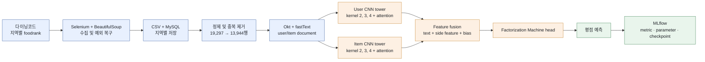

# 리뷰 텍스트 결합 한국 식당 추천 모델

> 리뷰 텍스트 → 평점 예측, 평점만 사용한 baseline 대비 **RMSE 19% 감소**

개인 프로젝트 · 2025.12.01–진행 중 · [English](./README.md)

다이닝코드 리뷰 텍스트에 협업 신호와 정형 feature를 결합하여 식당 평점을
예측하는 프로젝트다. [DeepCoNN (WSDM '17)](https://arxiv.org/pdf/1701.04783)의
듀얼 CNN 구조를 기반으로 side feature, user/item bias, Factorization Machine
head를 추가하였다.

## 1. Goal

평점만 사용하는 추천 모델은 사용자가 **몇 점을 주었는지**는 알지만 **왜 그
점수를 주었는지**는 알 수 없다. 특히 이 데이터의 user–item matrix는
**99.24%가 비어 있어**, 협업 신호만으로는 충분한 정보를 얻기 어렵다.

이 프로젝트의 목표는 다음 세 종류의 신호를 함께 학습하여 평점 예측을
개선하는 것이다.

- 한 사용자가 작성한 모든 리뷰의 언어적 특징
- 한 식당이 받은 모든 리뷰의 언어적 특징
- 맛·가격·서비스 평가와 user/item별 평점 성향

리뷰를 user document와 item document로 통합하면 활동이 적은 사용자에게도
밀도 높은 텍스트 표현을 부여할 수 있다. 평점만 사용하는 Matrix
Factorization을 baseline으로 두고, 리뷰 내용이 실제 예측력 향상에
기여하는지를 검증한다.

## 2. Architecture


```mermaid
flowchart LR
    A["다이닝코드<br/>지역별 foodrank"] --> B["Selenium + BeautifulSoup<br/>수집 및 예외 복구"]
    B --> C["CSV + MySQL<br/>지역별 저장"]
    C --> D["정제 및 중복 제거<br/>19,297 → 13,944행"]
    D --> E["Okt + fastText<br/>user/item document"]

    E --> U["User CNN tower<br/>kernel 2, 3, 4 + attention"]
    E --> I["Item CNN tower<br/>kernel 2, 3, 4 + attention"]
    U --> F["Feature fusion<br/>text + side feature + bias"]
    I --> F
    F --> G["Factorization Machine head"]
    G --> H["평점 예측"]
    H --> M["MLflow<br/>metric · parameter · checkpoint"]

    classDef data fill:#e8f0fe,stroke:#4a6da7,color:#1f2328
    classDef model fill:#fdf0e3,stroke:#c98b3a,color:#1f2328
    classDef result fill:#e9f5ec,stroke:#4a8a5f,color:#1f2328
    class A,B,C,D,E data
    class U,I,F,G model
    class H,M result
```

### 데이터 파이프라인

- **출처:** 다이닝코드의 서울·경기·부산·대구 지역 `foodrank` 페이지와
  이전 시점의 전국 단위 수집분
- **수집:** Selenium과 BeautifulSoup으로 평점, 리뷰, 메뉴, user metadata,
  맛·가격·서비스 평가를 수집한다. 팝업 차단, tab 복구, 재시도, `더보기`
  pagination을 처리한다.
- **정제:** Selenium timing으로 중복 수집된 리뷰 블록을 제거한다. 중복은
  전체 수집분의 **27.7%**였다. 평점과 한글 범주값을 변환하고, user ID에서
  badge를 분리하며, 잘린 리뷰의 `더보기` 표시를 제거한다.
- **모델링 데이터:** 서울·경기 데이터 **13,944행**, 353개 식당, 5,205명
  user를 사용한다. User별 80/20 비율과 seed 42로 분할했으며, 나머지 지역은
  수집·저장만 완료한 상태다.

### 텍스트 및 feature 파이프라인

리뷰를 user별, 식당별로 하나의 document로 통합한 뒤 다음 순서로 처리한다.

```text
Okt 형태소 분석 (stem=True)
→ 관측 vocabulary 13,548개
→ 550 token padding/truncation
→ fine-tuned fastText cc.ko.300 embedding
```

Pretrained embedding coverage는 **62.4%**다. OOV vector는 `N(0, 0.6)`으로
초기화했으며, test set의 `<UNK>` 비율은 1.24%다.

### 모델

User document와 item document는 서로 다른 CNN tower를 통과한다. 두 text
embedding을 맛·가격·서비스 feature와 결합하고, user/item bias가 포함된
Factorization Machine으로 평점을 계산한다.

```text
rating = global_bias + W·z + ½ Σ[(z·V)² − (z²·V²)] + b_user + b_item
```

DeepCoNN v1에는 다음 다섯 가지 개선을 적용하였다.

| # | 개선안 | 목적 |
|---|---|---|
| 1 | Multi-scale CNN kernel `[2,3,4]` | 여러 n-gram 폭의 표현을 동시에 포착 |
| 2 | Attention pooling | 가장 강한 activation 외의 문맥도 보존 |
| 3 | 맛·가격·서비스 feature 결합 | 정형 정보와 텍스트 정보를 함께 사용 |
| 4 | User/item bias embedding | 평점 성향과 리뷰 감성을 분리 |
| 5 | 평점 정규화 및 clipping | 예측값을 유효한 평점 범위로 제한 |

학습에는 MSE loss, RMSprop(`alpha=0.9`, learning rate `1e-3`, weight decay
`1e-4`), dropout 0.2, batch size 64, gradient clipping 1.0을 사용하였다.
최대 15 epochs 동안 early stopping(`patience=3`)을 적용하고, validation
RMSE가 가장 낮은 checkpoint를 `best_model.pt`에 저장한다. MLflow의
`deepconn_improved` experiment에는 parameter, metric, 개선안 tag, checkpoint
artifact를 기록한다.

## 3. Results

### 모델 비교

| Model | RMSE ↓ | Precision@3 | Recall@3 | NDCG@3 |
|---|---:|---:|---:|---:|
| Matrix Factorization baseline | 0.7098 | 0.4301 | 0.9901 | 0.9870 |
| DeepCoNN v1 | 0.8045 | 0.4301 | 0.9901 | 0.9873 |
| **DeepCoNN Improved** | **0.5749** | 0.4301 | 0.9901 | 0.9918 |
| 정규화를 제거한 Improved model | 0.5780 | 0.4301 | 0.9901 | 0.9929 |

개선 모델은 DeepCoNN v1 대비 RMSE를 **0.8045에서 0.5749**로 낮췄다.
Matrix Factorization baseline과 비교해도 **0.7098에서 0.5749**로 낮아져,
평점만 사용한 모델 대비 **19% 감소**하였다.

현재 평가에서 실질적인 변별력을 갖는 지표는 **RMSE뿐이다**. User별 test
set이 너무 작아 top-3가 전체 후보와 사실상 다르지 않으므로, Precision@3과
Recall@3이 모든 모델에서 동일하다. Ranking 성능을 주장하려면 sampled
negative를 사용하는 leave-one-out 평가가 추가로 필요하다.

### 성능 개선에서 확인한 점

- **초기 병목은 CNN이 아니라 prediction head였다.** DeepCoNN v1은 더 큰
  capacity에도 MF보다 낮은 성능을 보였다. User/item bias, 출력 범위 제어,
  gradient clipping을 적용하면서 예측이 안정화되었다.
- **범위가 정해진 target에는 출력 제약이 필요했다.** FM의 무작위 초기화와
  제약 없는 quadratic term은 학습 초기에 음수 평점을 만들었다. 정규화와
  clipping 적용 후 첫 epoch loss가 약 1,294에서 0.08로 감소하였다.
- **Multi-scale kernel과 attention pooling의 기여가 가장 컸다.** RMSE가 약
  0.80에서 0.57로 낮아졌다. Filter별 activation 하나만 남기는 max-pooling은
  550-token 리뷰에서 너무 많은 정보를 버렸다.
- **데이터 작업의 핵심은 crawler 안정성이었다.** 팝업 처리, tab 복구,
  재시도 로직이 parsing보다 더 많은 구현 작업을 요구했다.

### 한계 및 향후 과제

- **Vocabulary의 37.6%가 pretrained fastText vector를 갖지 못한다.** 감성이
  강한 리뷰 slang도 포함되어 있어 subword, KoBERT, Gemma encoder를 다음
  비교 대상으로 고려한다.
- 학습에는 서울과 경기만 사용하였다. 부산·대구·전국 수집분은 아직
  활용하지 않았다.
- Vocabulary와 fitted `LabelEncoder`를 checkpoint와 함께 저장하지 않아,
  추론 시 전처리를 다시 수행해야 한다.
- Ranking 성능을 비교하기 전에 평가 protocol을 재설계해야 한다.

## 프로젝트 재현

```bash
pip install -r requirements.txt
cp .env.example .env
```

Python 3.10을 권장한다. Notebook은 Python 3.8.20, 3.9.21, 3.10.18 환경에서
나누어 실행되었으며 dependency version은 고정되어 있지 않다.

추가 실행 요건:

- **KoNLPy/Okt:** JDK
- **Selenium:** 호환되는 Chrome과 ChromeDriver
- **MySQL:** 지역별 bulk load에 사용하며 접속 정보는 이 프로젝트의 `.env`에서 로드
- **MLflow:** `http://localhost:5000`의 tracking server (`mlflow ui`)
- **fastText:** [fasttext.cc](https://fasttext.cc/docs/en/crawl-vectors.html)에서
  별도로 내려받은 `cc.ko.300.bin`

### 저장 구조

지역별 CSV는 행 단위 `INSERT` 대신 `LOAD DATA LOCAL INFILE`로 local MySQL에
bulk load한다. SQL의 `SET` 절에서 평점 접미사 제거, 한글 범주값의 ordinal
변환, 한글 날짜 parsing을 수행한다. Encoding은 `utf8mb4`로 통일하고, 리뷰
내부 개행 때문에 한 리뷰가 여러 행으로 나뉘지 않도록 적재 전에 개행을
제거한다.

MySQL은 영속적인 landing zone으로 사용하며, 모델링 notebook은 현재 CSV를
직접 읽는다.

## 파일 구성

| File | 설명 |
|---|---|
| [rating_extraction.ipynb](./rating_extraction.ipynb) | 다이닝코드 Selenium/BeautifulSoup crawler |
| [sql_sending.ipynb](./sql_sending.ipynb) | 정제, MySQL schema, 지역별 bulk load |
| [diningcode_analysis.ipynb](./diningcode_analysis.ipynb) | 전처리, MF baseline, DeepCoNN v1 |
| [diningcode_analysis_improved.ipynb](./diningcode_analysis_improved.ipynb) | 개선 모델, MLflow 학습, 평가 |
| [diningcode_no_norm.ipynb](./diningcode_no_norm.ipynb) | 정규화·clipping 제거 ablation |
| [development.md](./development.md) | 실험 기록 |
| [crawled_data/](./crawled_data/) | 지역별 수집 원본 |
| `best_model.pt` | Validation RMSE 기준 최적 checkpoint |
| [predict_result.csv](./predict_result.csv) | 실제 평점·리뷰를 결합한 test prediction |
| [requirements.txt](./requirements.txt) | 프로젝트 dependency |
