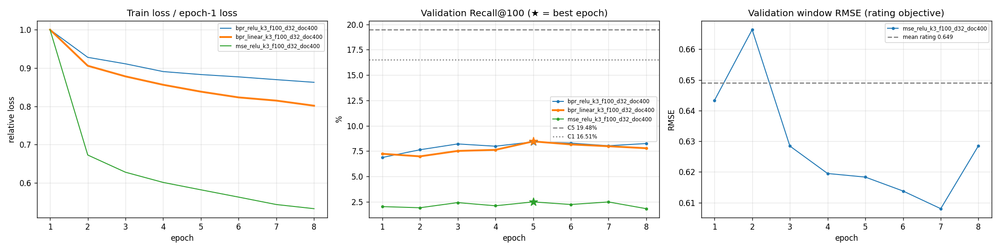

# DeepCoNN 후보 실험 · 20260930T111734850000Z-e7896add

- 실행: 2026-09-30 11:17 UTC
- 데이터: snapshot `e7896add5b4b5939` · 88,554 interactions · 리뷰 본문 `e7896add5b4b5939.reviews.jsonl` (86,271건 비어 있지 않음)
- 코드: commit `1dfeb828a7` (미커밋 변경 포함, `source.diff`)
- 범위: Stage 1 후보 생성만 비교한다. Stage 2 ranker(R1)는 다시 학습하지 않았다.

## 1. 요약

- 학습: `bpr_linear_k3_f100_d32_doc400`, validation 최고 epoch 5 (Recall@100 8.46%, 같은 window의 C5 19.48%). Test용 재학습 79,817 visits · 821s
- Test Recall@100: DeepCoNN 단독 8.69% vs C5 20.16% (-11.47%p [-12.95, -9.84])
- Validation으로 고른 결합: RRF C1+L+D → test Recall@100 18.44% (-1.72%p [-2.65, -0.86] vs C5)
- 평점 예측(MSE objective): validation window RMSE 최저 0.6080 vs 학습 평균 평점 0.6490

## 2. 데이터와 조건

Split, 평가 query, C0~C5는 `rating-recsys-experiment`와 같다(C4 LightGCN은 config 고정 설정).

| 구간 | 리뷰 본문·학습 visit | 평가 사용자 | 사용자당 정답 |
|---|---|---:|---:|
| Validation | ≤ 2025-12-19 (70,883) | 1,639 | 3.79 |
| Test | ≤ 2026-05-04 (79,817) | 1,573 | 3.57 |

- DeepCoNN: 사용자 문서(본인의 과거 리뷰)와 식당 문서(그 식당의 과거 리뷰)를 각각 embedding → 1D CNN → max-over-time → FC로 읽고, 두 벡터를 FM으로 결합한다.
- 토큰은 글자(주로 한글 음절)이고 embedding은 처음부터 학습한다(vocab 1,991). 문서는 최신 리뷰부터 리뷰당 150자, 구분 토큰을 넣어 400자까지 이어 붙인다.
- 누수 차단: 문서에는 cutoff 이전 리뷰만 들어간다. 학습 visit (u, i)의 리뷰는 u와 i의 문서에서 모두 뺀다(평가 때 정답 리뷰는 항상 미래라 문서에 없다). 이미 방문한 식당은 후보에서 뺀다.
- `mse`는 논문의 평점 회귀, `bpr`은 방문 식당을 균등 샘플 미방문 식당보다 높게 두는 순위 학습이다. 후보는 두 경우 모두 FM 점수 순서다.
- 결합: 각 source의 Top-100를 RRF 1/(60 + rank)로 합해 Top-100.
- 선택 기준: 1 epoch마다 validation Recall@100; 3회 연속 개선 없으면 중단, 최고 epoch 사용. 설정은 best validation Recall@100 최대 (동률이면 NDCG@10, 그다음 grid 순서). 결합은 DeepCoNN 단독과 RRF 결합 중 validation Recall@100 최대.

## 3. 학습 곡선 (validation)



선택한 `bpr_linear_k3_f100_d32_doc400`의 평가 지점. Loss는 epoch 평균 학습 loss.

| epoch | loss | Recall@20 | Recall@100 | NDCG@10 | Coverage@100 | Novelty@100 |
|---:|---:|---:|---:|---:|---:|---:|
| 1 | 0.6034 | 1.71% | 7.24% | 0.0071 | 3.18% | 9.85 |
| 2 | 0.5466 | 1.88% | 6.98% | 0.0076 | 3.36% | 9.72 |
| 3 | 0.5298 | 1.99% | 7.52% | 0.0080 | 3.84% | 9.55 |
| 4 | 0.5166 | 2.04% | 7.62% | 0.0078 | 4.77% | 9.57 |
| **5** | 0.5058 | 2.26% | 8.46% | 0.0089 | 7.06% | 9.64 |
| 6 | 0.4967 | 1.72% | 8.16% | 0.0066 | 7.54% | 9.68 |
| 7 | 0.4917 | 2.56% | 7.98% | 0.0099 | 7.81% | 9.74 |
| 8 | 0.4836 | 2.73% | 7.79% | 0.0098 | 7.92% | 9.72 |

## 4. Validation 선택

| 설정 | best epoch | 중단 epoch | Val Recall@20 | Val Recall@100 | Val NDCG@10 | 최저 RMSE | 학습 시간 |
|---|---:|---:|---:|---:|---:|---:|---:|
| bpr_relu_k3_f100_d32_doc400 | 5 | 8 | 2.14% | 8.42% | 0.0059 | – | 1158s |
| **bpr_linear_k3_f100_d32_doc400** | 5 | 8 | 2.26% | 8.46% | 0.0089 | – | 1109s |
| mse_relu_k3_f100_d32_doc400 | 5 | 8 | 0.39% | 2.49% | 0.0011 | 0.6080 | 779s |

평균 평점으로 모두 예측할 때 RMSE: validation 0.6490, test 0.6525.

## 5. 후보 결과

Recall@K = 사용자별 (후보 K개 안의 정답 수 / 전체 정답 수)의 평균. @10는 후보 순서를 그대로 자른 값이다.

| 후보 | Val Recall@100 | Test Recall@10 | Test Recall@20 | Test Recall@50 | Test Recall@100 | Test NDCG@10 | Coverage@100 | Novelty@100 |
|---|---:|---:|---:|---:|---:|---:|---:|---:|
| C5 C1+LightGCN RRF (현재 기준선) | 19.48% | 4.03% | 6.61% | 12.90% | 20.16% | 0.0276 | 99.05% | 11.46 |
| C1 item-item | 16.51% | 3.18% | 5.83% | 11.35% | 17.81% | 0.0248 | 99.31% | 11.93 |
| C4 LightGCN | 19.29% | 3.40% | 5.89% | 11.56% | 18.75% | 0.0225 | 74.38% | 10.99 |
| D DeepCoNN 단독 | 8.46% | 1.52% | 2.60% | 5.71% | 8.69% | 0.0107 | 7.56% | 9.71 |
| RRF C1+D | 14.32% | 2.72% | 4.56% | 9.66% | 15.91% | 0.0191 | 96.84% | 10.76 |
| **RRF C1+L+D** | 17.67% | 4.01% | 6.60% | 12.29% | 18.44% | 0.0252 | 96.79% | 10.72 |
| 참고 · C0 전체 인기 | 8.65% | 1.48% | 2.67% | 5.56% | 9.04% | 0.0108 | 3.14% | 9.46 |
| 참고 · C2 지역 인기 | 12.70% | 2.20% | 4.12% | 7.90% | 14.17% | 0.0151 | 19.57% | 10.19 |
| 참고 · C3 quota RRF | 15.40% | 2.54% | 4.55% | 9.85% | 16.66% | 0.0174 | 94.83% | 10.42 |

## 6. Test 비교 (paired bootstrap)

같은 사용자끼리 짝지은 bootstrap 2,000회, 95% CI. CI가 0을 포함하면 차이가 없다고 본다.

| 후보 − C5 | Recall@20 | Recall@100 | 이긴/진 사용자 (@100) |
|---|---|---|---:|
| D DeepCoNN 단독 | -4.01%p [-4.94, -3.04] | -11.47%p [-12.95, -9.84] | 149 / 522 |
| RRF C1+D | -2.05%p [-2.90, -1.23] | -4.25%p [-5.41, -3.09] | 128 / 286 |
| RRF C1+L+D | -0.01%p [-0.61, +0.55] | -1.72%p [-2.65, -0.86] | 115 / 178 |

정답 방문 5,622건 중 Top-100 포함: 둘 다 223 · DeepCoNN만 282 · C5만 912 · 둘 다 못 찾음 4,205.

기준 run `20260930T043202619555Z-e7896add`의 최종 Top-10와 비교 (같은 snapshot·split·test query):

| 목록 | Recall@10 | NDCG@10 | MRR@10 | Coverage@10 | − R1 NDCG@10 | − R1 Recall@10 |
|---|---:|---:|---:|---:|---|---|
| D DeepCoNN 단독 | 1.52% | 0.0107 | 0.0196 | 0.95% | -0.0146 [-0.0197, -0.0093] | -1.89%p [-2.67, -1.09] |
| R1 LambdaRank (기준 run) | 3.41% | 0.0253 | 0.0454 | 62.88% | – | – |
| RRF C1+L+D | 4.01% | 0.0252 | 0.0385 | 34.91% | -0.0001 [-0.0047, +0.0046] | +0.60%p [-0.11, +1.33] |

## 7. 해석 (작성자 기입)

- 결론: DeepCoNN은 Stage 1 후보로 채택하지 않고 C5를 유지한다. 단독 test Recall@100 8.69%는
  C0 전체 인기(9.04%)보다 낮고, validation으로 고른 결합(C1+L+D)도 C5보다 −1.72%p
  [−2.65, −0.86] 낮다.
- 근거: 선택한 `bpr_linear`(5 epoch)를 같은 설정으로 train에 다시 학습하면 loss와 validation
  Recall@100(8.46%)이 이 run과 똑같이 재현된다. 점수를 나눠 보면 식당 항(item_bias)만으로
  7.95%, 사용자×식당 내적만으로 4.68%이고, 식당 항은 train 방문 수와 Spearman 0.90이다.
  리뷰 본문에서 사실상 인기도를 배웠고 개인화 기여는 +0.5%p 정도다. Test Top-10에는
  1,573명 전체에서 43곳만 나온다. 정답 중 DeepCoNN만 찾은 282건보다 C5만 찾은 912건이 많아,
  RRF로 섞으면 C5 후보가 밀려나 손해가 된다. 구현 점검(문서 누수, FM 분해, padding mask,
  seen 제외, 결정성)에서는 오류를 찾지 못했다.
- 한계: 토큰은 글자 단위이고 embedding은 처음부터 학습했다. 문서는 400자(리뷰 2~6개)이고
  negative는 균등 샘플이다. 논문 설정(ReLU 출력)은 2 epoch부터 사용자 벡터의 약 92%가 0이
  됐다. 학습 visit의 리뷰를 문서에서 빼는 설정이라 논문 수치와 직접 비교할 수 없다.
  6절 마지막 표의 R1은 학습 정답 끼워넣기를 쓰던 기준 run의 것이다. 이를 없앤 현재 기준선
  `20260930T135424227862Z-e7896add`의 R1 NDCG@10은 0.0276으로, 결합 후보(0.0252)보다 높다.
- 다음 실험: 텍스트는 후보 소스보다 ranker feature(사전학습 문장 임베딩 유사도 등)로 먼저
  시험한다. 후보 소스로 다시 볼 경우 인기 비례 negative sampling으로 인기 편향을 줄인다.

## 8. 재현

```bash
python -m rating_recsys.experiments.deepconn_cli \
  --snapshot artifacts/snapshots/e7896add5b4b5939.jsonl \
  --baseline-run artifacts/runs/20260930T043202619555Z-e7896add
```

같은 폴더의 `manifest.json`(조건·grid·리뷰 본문 파일 hash·환경), `metrics.json`(학습 곡선과 모든 수치), `candidates_test.jsonl`(사용자별 DeepCoNN·선택 결합·C5 후보)이 이 보고서의 원본이다. MLflow에는 기록하지 않는다.
