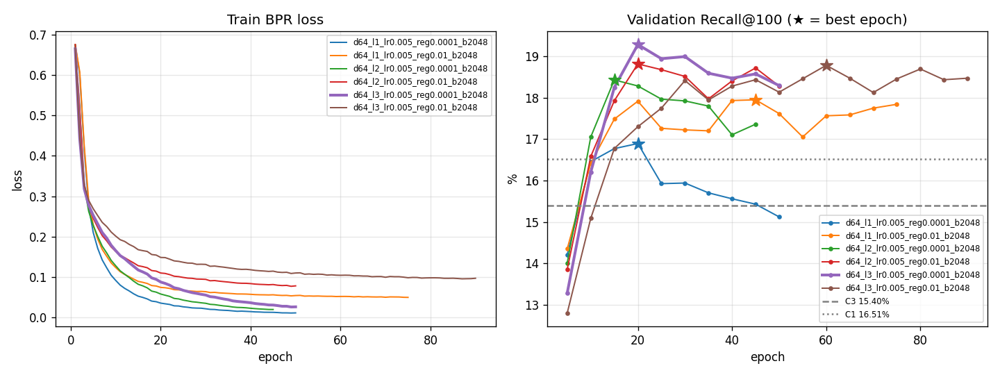

# LightGCN 후보 실험 · 20260928T064358512632Z-e7896add

- 실행: 2026-09-28 06:43 UTC · label `lightgcn-grid`
- 데이터: snapshot `e7896add5b4b5939` · 88,554 interactions · 사용자 14,008 · 식당 4,587
- 코드: commit `1dfeb828a7` + 미커밋 새 파일(`retrieval/lightgcn.py`, `experiments/lightgcn.py` 등. 실행 당시 untracked라 `source.diff`에 없음, 목록은 manifest.json `code.git_status`)
- 범위: Stage 1 후보 생성만 비교한다. Stage 2 ranker(R1)는 LightGCN 후보·feature로 다시 학습하지 않았다.
- 후속: 이 결과로 2026-09-30부터 Stage 1 기준선을 C1+L RRF(C5)로 바꿨다. 본문의 "현재 기준선"은 실행 당시의 C3를 말한다. R1 재학습 결과는 [C5 기준선 보고서](../../../runs/20260930T043202619555Z-e7896add/report.md)에 있다.

## 1. 요약

- 학습: `d64_l3_lr0.005_reg0.0001_b2048`, validation 최고 epoch 20 (Recall@100 19.29%, 같은 window의 C3 15.40%). Test용 재학습 79,817 edges · 34s
- Test Recall@100: LightGCN 단독 18.75% vs C3 16.66% (+2.09%p [+0.57, +3.57])
- Validation으로 고른 결합: RRF C1+L → test Recall@100 20.16% (+3.50%p [+2.30, +4.70] vs C3)
- Top-10: LightGCN 단독 NDCG@10 0.0225 vs 기준 run R1 0.0268 (-0.0043 [-0.0101, +0.0016])

## 2. 데이터와 조건

Split, 평가 query, C0~C3, C3 quota 선택 규칙은 `rating-recsys-experiment`와 같다.

| 구간 | 이력·그래프 | 평가 사용자 | 사용자당 정답 |
|---|---|---:|---:|
| Validation | train ≤ 2025-12-19 (70,883 edges) | 1,639 | 3.79 |
| Test | train + validation ≤ 2026-05-04 (79,817 edges) | 1,573 | 3.57 |

- LightGCN: 사용자–식당 이분 그래프, 정규화 인접행렬로 L층 전파 후 0~L층 평균. BPR loss(방문 식당 vs 균등 샘플 미방문 식당), batch ego embedding L2, Adam. NumPy/SciPy 구현, seed 고정.
- 그래프 edge는 cutoff 이전 방문만 쓴다. 평가 사용자는 모두 cutoff 이전 이력이 있으므로 그래프에 있다. 이미 방문한 식당은 후보에서 뺀다.
- 결합: 각 source의 Top-100를 RRF 1/(60 + rank)로 합해 Top-100. Quota 없음.
- 선택 기준: 5 epoch마다 validation Recall@100; 6회 연속 개선 없으면 중단, 최고 epoch 사용. 설정은 best validation Recall@100 최대 (동률이면 NDCG@10, 그다음 grid 순서). 결합은 LightGCN 단독과 RRF 결합 중 validation Recall@100 최대.

## 3. 학습 곡선 (validation)



선택한 `d64_l3_lr0.005_reg0.0001_b2048`의 평가 지점. Loss는 epoch 평균 BPR loss(정규화 항 제외).

| epoch | BPR loss | Recall@20 | Recall@100 | NDCG@10 | Coverage@100 | Novelty@100 |
|---:|---:|---:|---:|---:|---:|---:|
| 5 | 0.2525 | 4.41% | 13.28% | 0.0184 | 33.17% | 10.27 |
| 10 | 0.1653 | 5.18% | 16.21% | 0.0199 | 47.71% | 10.57 |
| 15 | 0.1174 | 5.28% | 18.25% | 0.0211 | 60.69% | 10.75 |
| **20** | 0.0877 | 5.51% | 19.29% | 0.0208 | 70.05% | 10.87 |
| 25 | 0.0672 | 5.55% | 18.94% | 0.0202 | 76.27% | 10.95 |
| 30 | 0.0555 | 5.74% | 19.00% | 0.0218 | 81.29% | 11.03 |
| 35 | 0.0441 | 6.10% | 18.59% | 0.0201 | 85.15% | 11.08 |
| 40 | 0.0365 | 6.15% | 18.47% | 0.0196 | 87.22% | 11.12 |
| 45 | 0.0308 | 5.80% | 18.58% | 0.0205 | 89.03% | 11.15 |
| 50 | 0.0263 | 5.80% | 18.30% | 0.0211 | 90.12% | 11.18 |

## 4. Validation 선택

| 설정 | best epoch | 중단 epoch | Val Recall@20 | Val Recall@100 | Val NDCG@10 | 학습 시간 |
|---|---:|---:|---:|---:|---:|---:|
| d64_l1_lr0.005_reg0.0001_b2048 | 20 | 50 | 5.38% | 16.90% | 0.0195 | 49s |
| d64_l1_lr0.005_reg0.01_b2048 | 45 | 75 | 4.90% | 17.95% | 0.0197 | 77s |
| d64_l2_lr0.005_reg0.0001_b2048 | 15 | 45 | 5.67% | 18.43% | 0.0201 | 57s |
| d64_l2_lr0.005_reg0.01_b2048 | 20 | 50 | 5.51% | 18.82% | 0.0207 | 75s |
| **d64_l3_lr0.005_reg0.0001_b2048** | 20 | 50 | 5.51% | 19.29% | 0.0208 | 81s |
| d64_l3_lr0.005_reg0.01_b2048 | 60 | 90 | 5.44% | 18.78% | 0.0215 | 142s |

C3 quota: 0.75 (validation C3 Recall@100 최대). 결합 후보의 validation 결과는 5절 표의 Validation 열.

## 5. 후보 결과

Recall@K = 사용자별 (후보 K개 안의 정답 수 / 전체 정답 수)의 평균. @10는 후보 순서를 그대로 자른 값이며, C3@10가 기준 run의 R0다.

| 후보 | Val Recall@100 | Test Recall@10 | Test Recall@20 | Test Recall@50 | Test Recall@100 | Test NDCG@10 | Coverage@100 | Novelty@100 |
|---|---:|---:|---:|---:|---:|---:|---:|---:|
| C0 전체 인기 | 8.65% | 1.48% | 2.67% | 5.56% | 9.04% | 0.0108 | 3.14% | 9.46 |
| C1 item-item | 16.51% | 3.18% | 5.83% | 11.35% | 17.81% | 0.0248 | 99.31% | 11.93 |
| C2 지역 인기 | 12.70% | 2.20% | 4.12% | 7.90% | 14.17% | 0.0151 | 19.57% | 10.19 |
| C3 quota RRF (현재 기준선) | 15.40% | 2.54% | 4.55% | 9.85% | 16.66% | 0.0174 | 94.83% | 10.42 |
| L LightGCN 단독 | 19.29% | 3.40% | 5.89% | 11.56% | 18.75% | 0.0225 | 74.38% | 10.99 |
| **RRF C1+L** | 19.48% | 4.03% | 6.61% | 12.90% | 20.16% | 0.0276 | 99.05% | 11.46 |
| RRF C0+C1+L | 17.89% | 3.91% | 6.50% | 12.54% | 18.58% | 0.0253 | 96.68% | 10.64 |
| RRF C0+C1+C2+L | 16.66% | 3.59% | 5.75% | 11.83% | 18.56% | 0.0230 | 89.59% | 10.37 |

## 6. Test 비교 (paired bootstrap)

같은 사용자끼리 짝지은 bootstrap 2,000회, 95% CI. CI가 0을 포함하면 차이가 없다고 본다.

| 후보 − C3 | Recall@20 | Recall@100 | 이긴/진 사용자 (@100) |
|---|---|---|---:|
| L LightGCN 단독 | +1.35%p [+0.45, +2.26] | +2.09%p [+0.57, +3.57] | 299 / 247 |
| RRF C0+C1+C2+L | +1.21%p [+0.49, +1.92] | +1.89%p [+0.91, +2.89] | 196 / 104 |
| RRF C0+C1+L | +1.95%p [+1.23, +2.68] | +1.92%p [+0.97, +2.91] | 184 / 79 |
| RRF C1+L | +2.06%p [+1.25, +2.87] | +3.50%p [+2.30, +4.70] | 296 / 148 |

정답 방문 5,622건 중 Top-100 포함: 둘 다 513 · LightGCN만 517 · C3만 432 · 둘 다 못 찾음 4,160.

기준 run `20260927T145211306367Z-e7896add`의 최종 Top-10와 비교 (같은 snapshot·split·test query):

| 목록 | Recall@10 | NDCG@10 | MRR@10 | Coverage@10 | − R1 NDCG@10 | − R1 Recall@10 |
|---|---:|---:|---:|---:|---|---|
| L LightGCN 단독 | 3.40% | 0.0225 | 0.0359 | 25.34% | -0.0043 [-0.0101, +0.0016] | -0.38%p [-1.18, +0.48] |
| R1 LambdaRank (기준 run) | 3.78% | 0.0268 | 0.0426 | 63.28% | – | – |
| RRF C1+L | 4.03% | 0.0276 | 0.0463 | 46.72% | +0.0008 [-0.0041, +0.0056] | +0.25%p [-0.46, +0.95] |

## 7. 해석 (작성자 기입)

- 결론: LightGCN은 이 데이터에서 잘 학습된다. 단독 후보로도 test Recall@100이 C3보다
  높고(18.75% vs 16.66%, +2.09%p [+0.57, +3.57]) C1 단독 17.81%보다도 높다(C1 대비 CI는
  계산하지 않음). C1과 RRF로 결합하면 20.16%로 C3 대비 +3.50%p [+2.30, +4.70]다. 재정렬
  없이 후보 순서만 자른 C1+L Top-10이 현재 R1과 NDCG@10이 같은 수준이다(+0.0008
  [−0.0041, +0.0056]). Stage 1 기준선을 C3에서 C1+L RRF로 바꿀 근거가 된다.
- 근거: train BPR loss는 모든 설정에서 계속 내려가지만, validation Recall@100은 15~20
  epoch 부근에서 정점을 찍은 뒤 L2가 약하면 떨어진다(정점 대비 −1.0~−1.8%p, 1층은 20
  epoch 16.90% → 50 epoch 15.12%). L2 0.01은 정점 뒤 하락이 작다(−0.1~−0.5%p). 층이
  많을수록 최고값이 높다(1층 17.95%, 2층 18.82%, 3층 19.29%). Epoch이 늘수록
  coverage@100이 33%에서 90%로, novelty@100이 10.3에서 11.2로 올라 초기의 인기 식당
  위주 추천이 롱테일로 퍼진다. Test 정답 5,622건 중 LightGCN만 찾은 것이 517건, C3만
  찾은 것이 432건으로 두 방식이 찾는 정답이 많이 다르고, 결합 효과가 여기서 나온다.
  C0·C2까지 결합에 넣으면 오히려 낮아진다(18.58%, 18.56%). 기준 run에서 C3가 C1
  단독보다 낮았던 것과 같은 방향이다.
- 한계: seed 1회. 6개 설정의 차이(19.29% vs 18.82%)는 validation 한 번으로 골랐고 CI가
  없다. Test용 재학습은 edge가 13% 많지만 validation에서 고른 epoch 수(20)를 그대로
  썼다. R1을 새 후보로 다시 학습하지 않았으므로 최종 two-stage 효과는 아직 모른다.
  이력 없는 사용자(test 1,214명)는 LightGCN도 추천할 수 없다. 정답의 74%(4,160건)는
  두 방식 모두 Top-100에서 놓친다. 이전 leave-last-two-out 실험(C3 대비 −3.28%p)과는
  snapshot·프로토콜이 달라 직접 비교하지 않는다.
- 다음 실험: ① pipeline 후보를 C1+L RRF로 바꾸고 LightGCN 점수·순위를 feature로 넣어 R1
  재학습, ② seed 3~5회 반복, ③ `--candidate-k` 200, ④ 최근 interaction에 가중치를 주는
  edge(시간 감쇠).

## 8. 재현

```bash
python -m rating_recsys.experiments.lightgcn_cli \
  --snapshot artifacts/snapshots/e7896add5b4b5939.jsonl \
  --baseline-run artifacts/runs/20260927T145211306367Z-e7896add
```

같은 폴더의 `manifest.json`(조건·grid·환경), `metrics.json`(학습 곡선과 모든 수치), `candidates_test.jsonl`(사용자별 LightGCN·선택 결합·C3 후보)이 이 보고서의 원본이다. MLflow에는 기록하지 않는다.
