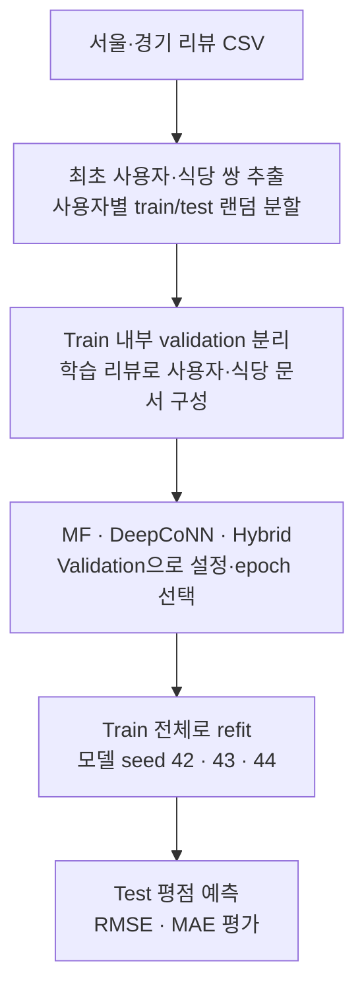

# 식당 평점 예측 V1 (Legacy)

DiningCode의 리뷰 텍스트와 평점을 이용한 MF·DeepCoNN·Hybrid 평점 예측 실험을 보존한다.
현재 개발은 [V2 2-stage 추천 시스템](../../README.md)에서 진행한다. V1의 RMSE와
V2의 후보 Recall·추천 NDCG는 목표와 평가 조건이 달라 직접 비교하지 않는다.

이 README가 V1의 통합 안내 문서다. 이전 바깥 안내문, 한·영 README와 archive 안내를
한곳에 모았으며, notebook·데이터·모델·예측 결과·개발 기록은 보존한다.

## Goal & Architecture

V1은 사용자와 식당에 대해 **1~5점 평점을 예측**하는 프로젝트다. MF는 사용자·식당
ID를, DeepCoNN은 과거 리뷰 문서를, Hybrid는 텍스트와 ID를 함께 사용한다.
추천 후보를 검색하고 재정렬하는 V2와는 다른 구조다.



위 흐름은 [수정된 비교 notebook](./diningcode_revision.ipynb) 기준이다.
원본·archive notebook의 평가는 아래의 알려진 문제 때문에 구분해 읽어야 한다.

## Dataset & Training

MF·DeepCoNN·텍스트+ID Hybrid를 같은 입력·분할·validation 선택 규칙으로 비교했다.

- 서울·경기 원본 19,297행 → 최초 사용자·식당 쌍 13,934행, 사용자 5,205명·식당 353곳.
- 사용자별 랜덤 80/20, split seed 42. Train 11,841행 중 validation 2,392행을 분리한다.
  Test는 리뷰 2건 이상이며 train에 있는 식당을 평가한 사용자 1,557명·2,093행이다.
- 설정·epoch는 validation으로만 고르고 train 전체로 모델 seed 42·43·44를 재학습한다.
  예측은 [1, 5]로 clip한다.
- 문서에는 학습 이력 리뷰만 넣는다. 학습 행 자신의 리뷰는 사용자·식당 문서 양쪽에서
  빼고, 맛·가격·응대 평가를 입력에 넣지 않는다.

## Evaluation Results

| 모델 | Test RMSE (seed 평균 ± 표준편차) | MF 대비 ΔRMSE [95% paired bootstrap CI] |
|---|---:|---:|
| Global mean | 0.7422 | +0.0615 [+0.0469, +0.0765] |
| User + item bias | 0.6772 | −0.0035 [−0.0068, −0.0002] |
| MF | 0.6807 ± 0.0003 | – |
| DeepCoNN | 0.6949 ± 0.0021 | +0.0142 [+0.0053, +0.0230] |
| Hybrid | 0.6946 ± 0.0016 | +0.0139 [+0.0053, +0.0222] |

RMSE는 낮을수록 좋다. 이 조건에서는 DeepCoNN·Hybrid가 MF를 개선하지 못했다.
사용자별 랜덤 분할을 쓰는 V1 평점 비교이며 V2의 전역 날짜 기반 추천 평가와는 다르다.
MAE·사용자 이력별 결과·선택 설정은 [결과 요약](./results/summary.md)에 있다.

## Historical Results & Limitations

원본 notebook의 기록은 MF RMSE 0.7098, DeepCoNN V1 0.8045, Improved 0.5749,
정규화 없는 Improved 0.5780이다. 기존 README의 “RMSE 19% 개선”은 이 기록에서
계산한 값이며 검증된 개선으로 사용하지 않는다. 확인된 문제는 다음과 같다.

- 원본 DeepCoNN은 test 리뷰로 test 문서를 만들었다.
- Improved는 정답 리뷰·맛/가격/응대 평가를 입력에 넣고 test RMSE로 checkpoint를 골랐다.
- 이전 설명과 달리 archive 구현에는 attention이 없으며, 응대·가격 인코딩 순서 문제도 있다.
- 기존 Precision@3·Recall@3은 사용자별 held-out 식당만 정렬한 결과라 후보 검색
  성능을 판단할 수 없다. 수정된 비교에서는 RMSE·MAE만 보고한다.

Archive는 2026-09-27에 이전 실험을 옮겨 보관한 것이다. 현재 비교 기준은
`diningcode_revision.ipynb`이며, archive 수치를 수정된 비교 결과와 섞어 사용하지 않는다.

| Archive 파일 | 내용 |
|---|---|
| [diningcode_analysis_improved.ipynb](./archive/diningcode_analysis_improved.ipynb) | Multi-scale CNN·사용자/식당 bias·세부 평가·정규화, 과거 RMSE 0.5749 |
| [diningcode_no_norm.ipynb](./archive/diningcode_no_norm.ipynb) | Improved에서 정규화·clamp를 뺀 ablation, 과거 RMSE 0.5780 |
| [demo_model.ipynb](./archive/demo_model.ipynb) | 공백 토큰화를 사용한 초기 프로토타입, Python 3.8 |
| [best_model.pt](./archive/best_model.pt) | Test RMSE로 선택했던 Improved checkpoint |
| [predict_result.csv](./archive/predict_result.csv) | Improved test 예측 2,096행 |
| [sql_sending.ipynb](./archive/sql_sending.ipynb) | 과거 MySQL 적재 notebook |

## Resources & Repository Contents

| 경로 | 내용 |
|---|---|
| [diningcode_revision.ipynb](./diningcode_revision.ipynb) | 수정된 MF / DeepCoNN / Hybrid 비교 |
| [results/](./results/) | 요약, 지표, 예측, 입력 hash, 실행 설정 |
| [diningcode_analysis.ipynb](./diningcode_analysis.ipynb) | 원본 전처리·MF·DeepCoNN V1 |
| [rating_extraction.ipynb](./rating_extraction.ipynb) | 원본 Selenium / BeautifulSoup 크롤러 |
| [archive/](./archive/) | 이전 notebook·checkpoint·예측·MySQL 적재 코드 |
| [development.md](./development.md) | 당시 개발 기록 |
| [crawled_data/](./crawled_data/) | 지역별 수집 CSV |
| [requirements.txt](./requirements.txt) · [.env.example](./.env.example) | V1 의존성과 환경 변수 예시 |

## Setup

아래는 보존된 V1을 재현할 때의 안내다. V2를 실행하려면 [V2 README](../../README.md)를 따른다.
수정된 notebook은 이 디렉터리에서 Python 3.10 환경으로 실행한다.

```bash
cd projects/rating_recsys/legacy/v1_rating_prediction
pip install -r requirements.txt
```

Okt에는 JDK가 필요하다. FastText 텍스트 vector를 `.cache/cc.ko.300.vec.gz`에 두거나
`FASTTEXT_PATH`를 `.vec` / `.vec.gz` 파일로 지정한다(`binary=False`로 로드).
원본 notebook의 `.bin` 입력과 달리 수정된 notebook은 텍스트 vector를 사용한다.
기록된 CPU 실행은 약 1.5시간이며 의존성은 lock되어 있지 않다. 기록된 환경과 입력
hash는 [results/run_config.json](./results/run_config.json)에 있다.

원본 크롤러에는 Chrome/ChromeDriver가 추가로 필요하고, archive의 MySQL 적재 코드는
`.env`에서 접속 정보를 읽는다(`cp .env.example .env`). Archive notebook의 상대 경로
(`crawled_data/`, `../..`)는 원래 위치 기준이므로 재실행하려면 경로를 조정해야 한다.
