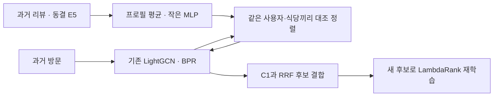

# 리뷰 임베딩: E5, LTR, Two-Tower, 리뷰 Transformer, RLMRec

**현재 판단: 기존 C5 후보 검색과 LambdaRank를 유지한다.** 2026-10-10 RLMRec-Con의 E5 적응판을 기존 LightGCN에 추가해 20epoch·가중치 3개·프로필 shuffle·전체 ranker 재학습까지 비교했다. 최종 NDCG@10은 0.027694→0.028022로 소폭 높았지만 Recall@10은 낮아졌고 paired 구간이 0을 포함해 개선을 확정하지 못했다. E5 캐시는 유지한다. 앞선 E5 피처 LTR·소형 Two-Tower와 리뷰 Transformer 10epoch도 개선 미확인 상태이며, 리뷰·E5·attention 전체가 무효라는 결론은 아니다.

## RLMRec 방식으로 베이스라인에 텍스트를 결합한 비교

2026-10-10 사용자가 요청한 비교는 **기존 LightGCN의 방문 학습을 그대로 유지하고, 같은 사용자·식당의 텍스트 표현을 맞추는 보조 손실만 추가**한다. RLMRec-Con의 식 (16)·(18)과 [공식 LightGCN 구현](https://github.com/HKUDS/RLMRec/blob/main/encoder/models/general_cf/lightgcn_plus.py)을 참고했다. [원 논문](https://arxiv.org/html/2310.15950v5)은 LLM으로 사용자·상품 프로필을 생성하지만, 이번에는 이미 저장한 E5 리뷰 블록을 사용한다. **RLMRec-Con의 E5 평균 프로필 적응판이며 원 논문의 완전 재현은 아니다.**

### 직전 Transformer와 무엇이 다른가

직전 1안은 동결 E5 블록 → 학습형 블록 attention → 리뷰 Transformer → 사용자·후보 cross-attention과 새 ID → 독립 추천 점수였다. 원문을 읽는 E5 자체를 학습한 것은 아니고, 새 ID도 기존 LightGCN 벡터를 이어받지 않았다. 방문 그래프를 학습한 기존 추천기를 바꾸는 비교였다.

이번에는 같은 초기값에서 **기존 LightGCN BPR + λ × 텍스트 정렬 손실**을 함께 학습한다. BPR는 방문 식당 점수를 미방문 식당보다 높이는 기존 목적이고, 정렬 손실은 동일 엔티티의 그래프 벡터와 텍스트 벡터를 가깝게 만드는 목적이다. 추론에서는 원래대로 LightGCN 내적 점수를 사용하고 C1과 RRF로 합친 뒤 LambdaRank로 재정렬한다. 기존 가중치에서 추가 학습하는 warm start가 아니라, 같은 그래프·초기값·표본을 쓰는 통제 재학습이다.



### 이전 임베딩 기반 독립 추천기와 비교

같은 validation의 **각 모델 자체 후보 순위**를 비교한다. RLMRec 그래프 단독은 방문 그래프+E5 정렬로 학습한 모델의 내적 순위이며, 이 표에서는 C1 결합·LambdaRank를 사용하지 않는다.

| 자체 후보 검색 모델 | Recall@100 | NDCG@10 |
|---|---:|---:|
| E5 Two-Tower | 9.4419% | 0.011803 |
| 리뷰 Transformer 검색 head | 9.6714% | 0.010893 |
| 기존 LightGCN | 19.2869% | 0.020708 |
| RLMRec/E5 그래프, λ=0.001 | **19.4880%** | **0.021751** |

앞선 Two-Tower·리뷰 Transformer 검색보다 NDCG가 약 1.8~2배 높다. 리뷰 Transformer는 10epoch 연장에서도 같은 epoch 2를 선택했으므로 이 비교는 초기 3epoch의 낮은 점수만 보고 한 판단이 아니다. **기존 협업 추천의 성능을 유지한 텍스트 결합은 이전 독립 설계보다 높은 점수를 내는 출발점**이다.

그 높은 수준은 텍스트 없는 LightGCN에서도 이미 나타난다. 같은 LightGCN에 정렬을 추가한 NDCG 점 추정은 +5.03%이고 전체 시스템에서는 +1.18%다. 이전 설계보다 높은 자체 추천 점수라는 진전과, 텍스트의 의미 대응이 기존 모델을 개선했다고 확정하는 판단은 구분한다. 후자는 아래 shuffle·전체 시스템 비교를 따른다.

근거: [Two-Tower validation](../artifacts/comparisons/two_tower/20261008T002625755462Z-e7896add/metrics.json), [Transformer 10epoch 선택 결과](../artifacts/comparisons/review_transformer/20261009T155837960566Z-e7896add/progress.json), [RLMRec 자체 검색·전체 시스템](../artifacts/comparisons/rlmrec/20261010T003719015651Z-e7896add/metrics.json). Test 지표를 섞거나 새 예측·학습을 수행하지 않았다.

### 입력과 비교 조건

- 같은 snapshot·T1=2025-12-19·validation 1,645명/정답이 있는 1,639명·후보 100개를 사용한다. Test는 평가하지 않는다.
- 그래프는 기존과 같은 70,883개 방문, 사용자 11,655명·식당 4,404곳이다. 차원 64·3층·20epoch·batch 2,048·lr 0.005·L2 1e-4·seed 42를 고정한다. epoch는 선택하지 않고 모두 20의 결과를 비교한다.
- 리뷰별 최대 4개 E5 블록을 padding 없이 평균한다. 사용자 `query:` 최근 리뷰 20개, 식당 `passage:` 최근 리뷰 30개를 리뷰별 동등 가중으로 평균하고 L2 정규화한다. 모든 평점을 사용한다. 프로필은 사용자 10,961명·식당 4,403곳에 있고, 없는 엔티티도 BPR에서는 유지한다.
- 하나의 엔티티에 하나의 평균 벡터를 쓰는 최소 정렬 실험이다. 여러 속성·의견을 보존하는 프로필이나 멀티벡터 정렬은 이번에 적용하지 않았다.
- Shared MLP는 텍스트 384차원을 기존 그래프 64차원에 연결하는 층이다. 추천기는 기존 LightGCN·LambdaRank를 사용한다. MLP는 384→224→64, LeakyReLU이며 파라미터는 100,640개다. 사용자·양성 식당·음성 식당 각각 유효한 unique ID 최대 128개에서 평균 InfoNCE를 계산해 세 손실을 합친다. 프로필 없는 ID는 분모에서도 제외한다.
- λ=0/0.001/0.01/0.1, temperature 0.2를 비교한다. λ=0은 전체 C4·C5 순위를 기존 저장 결과와 정확히 재현했다. 정렬·projector·shuffle의 RNG는 BPR RNG와 분리한다.
- 같은 λ=0.001에서 사용자끼리·식당끼리 프로필을 섞은 통제도 20epoch 학습한다. 벡터 집합·개수·norm·결측 coverage를 유지하고 의미 대응만 바꾼다. Shuffle에는 별도 최적화를 하지 않는다.

20epoch은 기존 baseline과 같은 학습 예산을 비교하기 위한 고정값이며 모든 λ의 수렴을 보장하지 않는다. 특히 강한 정렬의 학습 곡선은 끝에서도 변하고 있어, 이번 결과를 RLMRec 계열 전체의 실패로 해석하지 않는다.

원 코드의 사용자 전체 negative pool·layer sum·edge dropout·전체 파라미터 L2 대신, 이번에는 capped in-batch negative와 기존 layer mean·dropout 없는 BPR·batch ego L2를 사용한다. 기존 모델에서 정렬의 추가 효과를 비교하려는 선택이며 λ의 수치는 원문과 직접 비교할 수 없다.

### 20epoch 후보 검색 결과

| 조건 | 그래프 Recall@100 | C1과 결합 Recall@100 | 결합 NDCG@10 |
|---|---:|---:|---:|
| 기존 LightGCN, λ=0 | 19.2869% | 19.4769% | 0.023311 |
| E5 정렬, λ=0.001 | 19.4880% | 19.6248% | **0.024108** |
| E5 정렬, λ=0.01 | 18.4395% | 19.1412% | 0.023402 |
| E5 정렬, λ=0.1 | 10.3178% | 15.4712% | 0.018000 |
| 프로필 섞기, λ=0.001 | 19.2921% | 19.4391% | 0.023293 |

가장 높은 λ=0.001을 고정해 전체 파이프라인을 비교한다. 기존 C5 대비 Recall@100 차이는 **+0.1479%p**, paired 95% 구간은 [-0.1948, +0.4927]%p다. NDCG@10 차이는 +0.000796, 구간은 [-0.000087, +0.001744]로 **둘 다 0을 포함한다**. 의미 대응을 섞은 조건 대비 NDCG 차이도 +0.000814, 구간 [-0.000099, +0.001748]로 0을 포함한다.

약한 정렬은 기존 방문 모델의 정확도를 유지하며 점 추정이 높아졌지만, 텍스트 의미의 효과를 확정할 근거는 아직 없다. λ=0.1의 마지막 정렬 gradient norm은 BPR·L2 gradient의 약 1.45배이고 BPR 손실은 0.4164 수준으로 기존 0.0877보다 높았다. 강한 정렬이 방문 목적을 방해했을 가능성과 맞지만, 이 진단만으로 원인을 확정하지 않는다.


### 전체 파이프라인 비교

과거 38개 graph checkpoint마다 λ=0.001로 재학습하고 새 후보를 생성했다. 각 checkpoint는 해당 분기 시작보다 앞선 방문·리뷰만 사용하며, 기존 prepared 학습 행은 재사용하지 않았다. 학습 질문 19,158개 가운데 유효 그룹 7,144개·후보 행 714,332개로 같은 16피처·7개 LambdaRank 설정을 학습했다. 선택 설정은 기존과 같은 leaves 63/minchild 100이며 tree 수는 기존 76→새 64다.

| 전체 시스템 | Recall@100 | Recall@10 | NDCG@10 |
|---|---:|---:|---:|
| 기존 C5 + LambdaRank | 19.4769% | 4.1667% | 0.027694 |
| RLMRec/E5 그래프 + C1 + 새 LambdaRank | 19.6248% | 4.0645% | 0.028022 |

최종 NDCG@10의 점 추정은 **+0.000328(상대 +1.18%)**지만, paired 95% 구간 [-0.003864, 0.004325]이 0을 포함한다. Recall@10은 -0.1022%p, MAP@10도 0.015213→0.014880로 낮아졌다. 이번 조건에서 일관된 정확도 개선을 확인하지 못해 **기본 모델은 바꾸지 않는다**.

앞선 독립 리뷰 모델보다 기존 방문 모델의 성능을 유지한 결합이라는 점은 확인했다. 그러나 평균 E5 프로필의 의미 정합이 전체 성능을 높였다고 확정할 수 없다. 이후 후보는 같은 결합을 유지하며 긍정·부정 또는 맛·가격·분위기별 프로필로 입력을 분리하는 것이며, LLM 프로필 생성·멀티벡터 정렬·더 긴 동일 예산 비교·새 holdout 검증은 모두 미실행이다.

### 실행·검증 근거

구현은 [정렬 모델](../src/rating_recsys/retrieval/rlmrec.py)과 [validation 비교 CLI](../src/rating_recsys/experiments/rlmrec_cli.py)에 있다. 기존 LightGCN 본체는 수정하지 않았다. 기존 전체 테스트 270개와 새 CLI 테스트 36개가 통과했다(중복 없는 총 306개, 1개 skip). 정렬·CLI 전용 66개는 별도로 재확인했다. λ=0의 가중치·손실·순위 동일성, λ>0의 BPR 표본 동일성, 독립 dense objective gradient, 결측·padding·shuffle·시간 경계와 저장·재로드를 검증했다.

실행 폴더: [progress](../artifacts/comparisons/rlmrec/20261010T003719015651Z-e7896add/progress.json), [프로필 입력 감사](../artifacts/comparisons/rlmrec/20261010T003719015651Z-e7896add/profiles_validation.json), [섞은 프로필](../artifacts/comparisons/rlmrec/20261010T003719015651Z-e7896add/profiles_shuffled.json). 새 E5 추론·LLM/API·다운로드는 0회다. 완료한 run의 경과 시간은 890.32초(14.84분)였고, 이 중 과거 graph 재학습 합계 315.89초·ranker 7개 학습 합계 21.39초다. 후보 5개 모델과 최종 ranker를 다시 불러 전체 validation 순위를 정확히 재현했고, 프로필 벡터 hash·38개 cutoff·최종 paired bootstrap을 재검산했다. CPU 비용에는 후보 생성과 매 epoch validation이 포함되며 다른 실행의 단순 fit 시간과 직접 비교하지 않는다.

실행·검증: [전체 수치·선택](../artifacts/comparisons/rlmrec/20261010T003719015651Z-e7896add/metrics.json), [저장 순위·모델·입력 재검산](../artifacts/comparisons/rlmrec/20261010T003719015651Z-e7896add/verification.json), [독립 감사](../artifacts/comparisons/rlmrec/20261010T003719015651Z-e7896add/independent_audit.json). BLAS는 1개, Torch는 4개 스레드다. 같은 float32 모델의 근접 점수에서 BLAS 스레드 수에 따라 한 쌍의 순서가 바뀌어 제한을 고정했고, λ=0의 원래 C4·C5 순위를 모두 재현했다. 실행 당시 소스는 run의 `source/`에 보존했다.

이미 모델 선택에 쓴 validation에서 λ와 ranker를 선택하므로, bootstrap도 새로운 holdout의 독립 증거가 아니라 탐색 결과다.

프로젝트 루트에서 같은 고정 20epoch 비교와 전체 ranker 재학습을 실행한다.

```bash
.venv/bin/python -m rating_recsys.experiments.rlmrec_cli
```

## 텍스트 임베딩 방법 조사

2026-10-09 기준 공식 문서·모델 카드·원 논문을 확인했다. **권장 방향은 기존 E5로 리뷰 표현·집계를 먼저 분리 검증하고, 같은 입력에서 다른 encoder를 비교하는 것이다.** 아래 장단점과 우선순위는 프로젝트 적용을 위한 판단이며 새 추천 성능 측정은 아니다.

임베딩은 텍스트를 비교·학습 가능한 숫자 벡터로 바꾸는 과정이다. 이 프로젝트에서는 **텍스트를 벡터로 만드는 encoder**, **여러 리뷰를 취향·식당 표현으로 합치는 집계**, **그 표현을 추천에 연결하는 학습**을 별도 실험 축으로 둔다.

### 텍스트를 벡터로 만드는 방법

| 방법 | 벡터를 만드는 원리 | 이 프로젝트의 용도 | 비용·한계와 상태 |
|---|---|---|---|
| TF-IDF + SVD (LSA) | 단어의 중요도 행렬을 작은 차원으로 압축 | Kiwi 단어 또는 문자 n-gram으로 저비용 텍스트 대조군 구성 | CPU에서 비교하기 쉬움. 문장 순서·부정·문맥 표현이 제한적; 미실행 |
| Word2Vec·fastText 평균 | 단어 벡터를 평균. fastText는 문자 조각도 활용 | 음식명·표기 변형을 포함한 가벼운 리뷰 표현 | 부정어와 단어 순서가 평균에서 약해질 수 있음. 한국어 사전학습 벡터 또는 과거 리뷰만으로 학습 필요; 미실행 |
| 한국어 Sentence-BERT | 문장 쌍 학습을 거친 Transformer로 문장 벡터 생성 | 다국어 E5와 한국어 특화 표현 비교 | 한국어 학습이 식당 선호 표현의 우위를 보장하지 않음; 미실행 |
| E5·BGE 등 검색용 encoder | 관련 문서 쌍의 벡터가 가까워지도록 학습한 모델 사용 | 사용자 프로필–식당 프로필 검색 또는 ranker feature | 현재 E5 Small 구현·전체 캐시 완료. 의미 검색 품질과 만족도 추천 품질은 별도 |
| Qwen3 등 LLM 기반 임베딩 | 임베딩 전용으로 학습한 언어 모델에 과제 지시문을 넣어 벡터 생성 | 긴 리뷰·추천 과제 지시문의 효과 비교 | CPU 시간·메모리 사전 측정 필요; 미실행. 일반 채팅 모델의 hidden state를 그대로 쓰는 것과 구분 |
| 추천 데이터로 학습한 encoder | 리뷰 encoder를 평점 예측·순위·대조학습 손실로 조정 | 문장 의미 표현을 사용자 만족도에 맞게 조정 | 학습·부정 샘플·누수 관리가 필요. 동결 E5 위 Two-Tower 학습과 encoder 자체 fine-tuning은 별도 |

LSA의 정의는 [scikit-learn TruncatedSVD](https://scikit-learn.org/stable/modules/generated/sklearn.decomposition.TruncatedSVD.html), 단어·부분단어 표현은 [fastText 공식 안내](https://fasttext.cc/docs/en/unsupervised-tutorial.html), 문장 쌍 기반 표현은 [Sentence-BERT 원 논문](https://arxiv.org/abs/1908.10084)을 따른다. TF-IDF는 희소 텍스트 표현이고 SVD 이후가 저차원 벡터다. BM25는 검색 점수 대조군으로 [별도 리포트](./bm25.md)에 있으며, 학습된 문장 임베딩과 구분한다.

### 실제 비교할 encoder 후보

차원과 길이는 공식 문서의 지원 사양이다. 표의 최대 길이까지 입력해야 한다는 뜻은 아니며 CPU 속도 순위·우리 데이터의 추천 성능 순위는 측정하지 않았다.

| 후보 | 벡터 차원 | 입력 길이·역할 | 선정 이유와 적용 제약 |
|---|---:|---|---|
| [Multilingual E5 Small](https://huggingface.co/intfloat/multilingual-e5-small) | 384 | 최대 512토큰; 현재 500토큰, `query:` / `passage:` | 기존 비용·캐시·결과가 있는 기준 모델 |
| [E5 Base](https://huggingface.co/intfloat/multilingual-e5-base) / [Large](https://huggingface.co/intfloat/multilingual-e5-large) | 768 / 1,024 | 최대 512토큰; E5 역할 접두어 | 같은 계열의 용량 차이 비교. 차원 증가만으로 개선을 가정하지 않음 |
| [ko-sroberta-multitask](https://huggingface.co/jhgan/ko-sroberta-multitask) | 768 | 공개 SentenceTransformer 설정 128토큰; mean pooling | 한국어 문장 표현 대조군. 현재 500토큰 concat을 그대로 넣으면 더 많이 잘릴 수 있음 |
| [BGE-M3](https://huggingface.co/BAAI/bge-m3) | dense 1,024 | 최대 8,192토큰; 검색 query에 별도 지시문 불필요 | dense·학습된 sparse·토큰별 multi-vector를 각각 지원. 처음에는 dense만 비교해 출력 방식의 효과를 분리 |
| [Qwen3-Embedding-0.6B](https://huggingface.co/Qwen/Qwen3-Embedding-0.6B) | 32~1,024 | 최대 32K토큰; query 과제 지시문 지원 | 지시문과 출력 차원 비교 후보. 모델 전용 pooling·prompt를 따라야 함 |
| [Voyage 4 / 4-lite API](https://docs.voyageai.com/docs/embeddings) | 기본 1,024; 256·512·2,048 지원 | 최대 32,000토큰; `input_type=query/document` | 다국어 API 대조군. 로컬 실행과 호출 비용·제공자 의존성을 따로 비교 |
| [Cohere Embed v4 API](https://docs.cohere.com/v2/docs/cohere-embed) | 기본 1,536; 256·512·1,024 지원 | 최대 128K토큰; 검색 입력 역할 지정 | 한국어 지원 API 대조군. 공식 목록에는 v5 fast/pro도 있어 실행 시 모델 버전을 고정 |

**모델 이름만 바꾸는 실행은 현재 지원하지 않는다.** [설정·캐시 코드](../src/rating_recsys/retrieval/review_embeddings.py)의 로컬 backend는 pinned E5·384차원만 허용하며 `model_embedding_config`도 명시된 모델만 처리한다. 다른 로컬 encoder에는 모델별 tokenizer·pooling·prompt·revision·차원 검증을 추가해야 한다. E5 concat 캐시에서 리뷰별 벡터를 복원할 수도 없다.

E5는 비대칭 검색에 사용자 `query:` / 식당 `passage:`를, 대칭 의미 비교에는 양쪽 `query:`를 권한다. 우리 프로필 비교·Two-Tower 입력에 어느 역할이 적합한지는 별도 가설이다. 모델을 바꾸며 E5 접두어와 mean pooling을 모든 모델에 공통 적용하지 않는다. [E5 공식 FAQ](https://huggingface.co/intfloat/multilingual-e5-small/raw/main/README.md).

### 여러 리뷰를 사용자·식당 표현으로 합치는 방법

토큰 pooling은 **리뷰 하나 내부**의 토큰 벡터를 합치는 과정이고, 리뷰 집계는 **여러 리뷰 사이**의 벡터를 합치는 과정이다. 아래는 후자와 입력 구성의 비교다.

| 방법 | 구성 | 검증할 장점 | 한계·현재 상태 |
|---|---|---|---|
| 리뷰 연결 후 한 번 인코딩 | `E(review1 + review2 + …)` | 리뷰 간 문맥을 함께 읽음 | 현재 E5 방식. 최신 고평점 사용자 5개·식당 10개, 각각 240자·전체 500토큰 제한 |
| 리뷰별 평균 | `normalize(mean(E(review_j)))` | 전체 연결 문서의 길이 제한을 피하고 리뷰 벡터를 재사용 | 의미의 차이가 평균에서 희석될 수 있음. `review_mean` 경로 구현; E5 전체 비교는 미실행 |
| 평점·최근성 가중 평균 | `normalize(sum(w_j * E(review_j)))` | 사용자 선호 강도·변화를 반영 | 과거 평점·시간만으로 가중치 구성. 반감기 등은 validation 선택; 미실행 |
| 좋아한 식당 표현 평균 | 과거 만족한 식당의 cutoff 당시 벡터를 평균 | 본인의 서술 습관보다 선호 식당의 특성에 초점 | `liked_items` 경로 구현. 현재는 텍스트가 있는 고평점 방문만 선택하고 재방문 횟수도 가중치에 반영; E5 비교 미실행 |
| 긍정·부정 프로필 분리 | 선호 벡터 `u+`와 비선호 벡터 `u−`를 따로 보존 | 좋아하는 특성과 피할 특성을 ranker가 함께 사용 | `cos(u+, i)`·`cos(u−, i)`·존재 mask를 별도 feature로 시작. 부정 벡터가 선호 벡터의 반대 방향이라는 가정은 피함; 미실행 |
| 속성별 표현 | 맛·가성비·서비스·분위기 등의 근거 문장을 따로 임베딩 | 맛은 좋지만 가격은 불만인 경험을 구분 | 언급 없는 속성은 중립이 아닌 누락으로 처리. [속성 추출 진단](./review_aspects.md)은 완료했지만 속성 임베딩 추천은 미실행 |
| 리뷰·속성 여러 벡터로 비교 | 리뷰쌍 유사도의 mean·max 또는 사용자 리뷰마다 가장 가까운 식당 리뷰 점수 집계 | 단일 평균에서 사라지는 여러 취향을 보존 | 벡터 수·비교 비용 증가. 최댓값은 우연한 한 문장 일치에 민감하므로 리뷰 수 효과도 확인; 미실행 |
| LLM 요약 후 임베딩 | 과거 리뷰를 근거 기반 취향·식당 프로필로 요약한 뒤 인코딩 | 군더더기를 줄이고 취향을 명시적으로 표현 | 요약 비용·누락·환각 관리 필요. [RLMRec](https://arxiv.org/abs/2310.15950)은 관련 사례이며 우리 데이터에서는 미실행 |

리뷰별 matching과 **ColBERT식 late interaction**은 단위가 다르다. 전자는 리뷰마다 문장 벡터 하나를 쓰고, 후자는 토큰 벡터들을 남겨 query 토큰별 최대 유사도를 합친다. BGE-M3의 multi-vector 출력이 후자에 해당한다. 우선 C5 후보 내부의 작은 비교로 비용과 추가 효과를 확인할 수 있다. [ColBERT 원 논문](https://arxiv.org/abs/2004.12832), [BGE-M3 사용 예](https://huggingface.co/BAAI/bge-m3).

### 추천에 맞게 표현을 학습하는 방법

| 학습 수준 | 바뀌는 부분 | 프로젝트에서의 비교 방법 |
|---|---|---|
| 동결 임베딩 + LTR | encoder는 고정, 유사도·mask·개수 등의 가중치만 학습 | 같은 C5에서 cosine 효과와 존재·개수 효과 분리. 기존 E5 캐시 재사용 가능 |
| 동결 임베딩 + Two-Tower | ID·텍스트·숫자 feature를 작은 신경망으로 변환 | 같은 구조·목표의 텍스트 유무 비교가 필요. 현재 세 조건 실험은 E5만의 효과를 분리하지 못함 |
| 텍스트 encoder fine-tuning | 텍스트→벡터 변환 자체를 추천 손실에 맞춤 | cutoff 이전 사용자 프로필–후속 만족 방문 식당 프로필 쌍으로 대조학습. 타깃 리뷰는 두 프로필 모두에서 제외 |
| 리뷰 encoder와 평점 모델 공동 학습 | 토큰 표현부터 사용자·식당 특성·예측층까지 함께 학습 | [DeepCoNN](https://arxiv.org/abs/1701.04783) 계열. 저장소 코드는 사전학습 문장 벡터 대신 문자 embedding·CNN을 학습하는 변형이며 E5와 별도 조건 |

대조학습은 양성 쌍을 가깝게, 비교 대상 쌍을 멀게 만드는 학습이다. [Sentence Transformers 학습 안내](https://www.sbert.net/docs/sentence_transformer/training_overview.html)에 있는 MultipleNegativesRankingLoss 등을 쓸 수 있지만, 우리 데이터에서 다른 사용자에게 만족스러웠던 식당을 자동으로 비선호라 간주하지 않는다. 같은 사용자에게 알려진 다른 양성·재방문 식당을 부정 샘플에서 제외하는 설계가 필요하다.

그래프와 결합하는 점수 학습·표현 정렬·텍스트 이웃 그래프는 [아래 연구 비교](#그래프와-텍스트-결합-연구)를 따른다. 이들은 임베딩 생성기 교체와 다른 실험 축이다.

### 비용·저장과 실행 우선순위

[OpenRouter 임베딩 API](https://openrouter.ai/docs/api/api-reference/embeddings/submit-an-embedding-request)는 `input`·`dimensions`·`input_type`을 제공하지만 모델별 지원은 별도로 확인해야 한다. [임베딩 모델 목록](https://openrouter.ai/docs/api/api-reference/embeddings/list-embeddings-models)에서 실행 시점의 제공 모델·가격·제약을 기록한다. 위 Voyage·Cohere의 직접 API 지원이 OpenRouter에서도 같은 모델로 제공된다는 뜻은 아니다.

API 예산은 **캐시에 없는 고유 입력의 모델별 토큰 합계 × 호출 단가**로 추산한다. 리뷰별 임베딩은 입력 개수가 늘어도 cutoff마다 같은 리뷰를 재인코딩하지 않으면 장기 비용을 줄일 수 있다. 역할·모델이 달라지면 별도 입력이며, 제공자·모델 revision·prompt·pooling·정규화·차원·본문 hash를 캐시와 manifest에 남긴다.

현재 식당 4,587개의 단일 float32 벡터는 384차원 약 6.7MiB, 1,024차원 약 17.9MiB다(`식당 수 × 차원 × 4 bytes`). 벡터 본문만의 계산이며 JSON·DB·ANN 인덱스·cutoff별 캐시·사용자·리뷰별 벡터는 제외한다. 전체 후보 검색은 우선 정확한 행렬 내적으로 비교하고, Supabase pgvector·Milvus·Astra DB는 필요할 때 저장·검색 운영 선택으로 검토한다. 기존 VDB 검토는 [검색 리포트](./bm25.md)를 따른다.

권장 실험은 아래 순서이며 **이번 조사에서는 실행하지 않았다.**

1. 기존 후속 계획의 평가 정규화 기준을 맞추고, 같은 캐시·C5에서 텍스트 신호와 존재·개수 효과를 분리한다.
2. 같은 리뷰 선택·동결 E5에서 concat 대 리뷰별 평균을 비교한다. 이어 평점 기준·역할 접두어·최근성 가중치·긍정/부정 분리를 한 번에 하나씩 바꾼다. 새 역할·리뷰 입력은 새 임베딩이 필요하다.
3. 같은 원문 집합과 집계에서 한국어 SBERT·E5 Base·BGE-M3 dense·Qwen3 0.6B를 표본 인코딩한다. 잘림 비율·CPU 처리량·RSS를 확인한 뒤 validation 추천 비교로 확대한다. tokenizer마다 토큰 수가 달라, 최대 길이 확대는 모델 비교와 별도 입력 실험으로 둔다.
4. 이후 속성별·여러 벡터 표현, API 모델, 추천 목적 fine-tuning을 비교한다. 모든 조건을 한꺼번에 바꾸지 않는다.

후보 검색은 Recall@100과 C5가 놓친 정답의 추가 회수·기존 정답 탈락을, 같은 C5의 ranker 비교는 Graded NDCG@10을 확인한다. cutoff·catalog·방문 제외·만족도 기준을 고정하고 사용자별 차이와 신뢰구간을 함께 보고한다. TF-IDF 어휘·IDF·SVD·추가 도메인 학습도 각 과거 학습 시점에 이용 가능한 텍스트만 사용한다. 미래 방문 리뷰·사후 메뉴 정보·이미 본 test를 새 설정 선택에 사용하지 않는다.

## 리뷰 텍스트와 다른 추천 모델의 결합

**C5·LightGCN·LambdaRank 없이도 리뷰 기반 추천 모델을 구성할 수 있다.** 검토할 경로는 리뷰별 attention과 ID를 결합하는 모델, 사용자–식당 리뷰쌍을 비교하는 모델, 속성·감정과 잠재요인을 결합하는 모델, 텍스트와 방문 순서를 학습하는 모델이다. 다음은 2026-10-09 원문 조사이며 프로젝트의 새 학습·추출 결과가 아니다.

### 어느 모델에서 어떤 결과가 나왔는가

아래 수치는 **각 논문 내부의 대응 비교**다. MSE·RMSE는 낮을수록, Recall은 높을수록 좋다. 평점 예측 개선과 전체 식당 중 Top-K 추천 개선은 같은 증거가 아니다.

| 연구·모델 | 텍스트와 결합하는 모델·학습 | 원문에서 확인한 결과 | 비교 조건·해석 |
|---|---|---|---|
| [HFT, RecSys 2013](https://www-cs.stanford.edu/~jure/pubs/reviews-recsys13.pdf) | MF의 사용자·상품 잠재요인과 리뷰 topic 분포를 연결. 평점 오차와 텍스트 likelihood를 함께 학습 | 원문 §1.1은 MF·LDA 기반 대조군 대비 MSE 5~10% 개선을 보고 | 텍스트를 학습 제약으로 활용하는 경로. 요약된 개선 범위이며 특정 한국어 식당 조건의 효과가 아님 |
| [EFM, SIGIR 2014](https://yongfeng.me/attach/efm-zhang.pdf) | 사용자–속성 관심, 식당–속성 품질, 사용자–식당 평점을 공동 행렬 분해 | Yelp Figure 4: PMF RMSE 1.253 / HFT 1.221 → EFM 1.212 | 5-fold 평가. EFM 최적 explicit factor 35, 총 factor 100. 명시적 속성만 늘려도 좋아지는 것은 아님 |
| [NARRE, WWW 2018](https://doi.org/10.1145/3178876.3186070) | 리뷰별 CNN → 학습한 attention으로 합침 → 사용자·상품 ID 표현과 결합 → 평점 회귀 | 원문은 PMF·HFT·DeepCoNN 등 대비 개선을 보고. 이번에는 원 PDF 접근 실패로 원문 표 수치는 재인용하지 않음 | [저자 코드](https://raw.githubusercontent.com/chenchongthu/NARRE/master/model/NARRE.py)에서 리뷰별 tensor·attention·ID 결합·bias·제곱오차 확인. 일반 FM 구현으로 잘못 설명하지 않음 |
| [MPCN, KDD 2018](https://arxiv.org/html/1801.09251) | 사용자·상품 리뷰를 각각 보존. 리뷰쌍 선택 → 단어별 co-attention → 여러 matching 표현 → FM 평점 예측 | Table 1 Yelp17: DeepCoNN MSE 1.385 / TransNet 1.363 → MPCN 1.349 | 사용자 마지막 방문 test·그 전 validation, Yelp 20-core. 개발·test 리뷰를 입력에서 제외. 24개 데이터 결과 중 이 행은 개선 폭이 작음 |
| [CARP, SIGIR 2019](https://arxiv.org/html/1907.00687) | 여러 사용자 관점·상품 aspect를 학습. 관점–aspect 쌍을 긍정/부정 capsule로 합쳐 평점 예측 | Table 2 Yelp16–17: DeepCoNN MSE 1.593 / TransNet 1.523 → CARP 1.508 | 5-core·무작위 분할, validation/test 타깃 리뷰 제외. 별점 오차 결과이며 미래 Top-K 개선을 보인 수치가 아님 |
| [UniSRec, KDD 2022](https://arxiv.org/html/2206.05941) | 동결 BERT 상품 텍스트 → 학습 adaptor → 상품 ID와 결합 → 방문 순서 Transformer·대조학습 | Table 3 Pantry: SASRec Recall@10 0.0501 → UniSRec t+ID 0.0693; NDCG@10 0.0218 → 0.0311 | 다음 상품 하나·전카탈로그 평가. 원문 텍스트는 상품 설명·제목·브랜드이며 리뷰의 속성 분할 모델은 아님. 다중 도메인 사전학습 약 1,403만 interactions 포함 |
| [APH, WSDM 2025](https://smufang.github.io/paper/WSDM25_APH.pdf) | `(사용자, 상품, aspect, sentiment)` hypergraph → 학습 집계·aspect 표현과 ID 결합 → FM | Table 3 Yelp: DSRLN MSE 1.1655 → APH 1.1467. Table 5 P@5 0.4278 → 0.4407, R@5 0.7248 → 0.6996 | 무작위 80/20, Yelp 10-core. CTR는 미관측 부정 샘플 4개·cross-entropy. Yelp Recall은 오히려 낮아 모든 지표의 개선으로 표현하지 않음. 전카탈로그 미래 방문 평가와 동일하다고 볼 근거 없음 |

한 모델을 전체 분야의 승자로 정할 근거는 없다. [SIGIR 2020 재현 연구](https://arxiv.org/html/2005.12210)는 여러 희소 데이터에서 HFT가 NARRE·MPCN 등보다 나은 경우와 ID/bias의 영향을 확인했다. 예를 들어 Clothing 0-core MSE는 MF 1.4362, HFT 1.3703, NARRE 1.4131, MPCN 1.5691이었다. 원 연구의 좋은 사례뿐 아니라 데이터 밀도와 텍스트 없는 대조군을 함께 봐야 한다.

**프로젝트 적용 판단:** 속성 라벨을 대량 추출하지 않고 시작하려면 리뷰별 attention + ID 모델이 간단한 신경망 대조군이다. 상대 식당에 따라 중요한 과거 경험이 달라지는지를 보려면 MPCN식 matching이 더 직접적이다. 맛·가격·대기 같은 해석이 필요하면 EFM식 속성 결합을, 다음 방문 전이가 핵심이면 텍스트를 넣은 순차 모델을 별도 과제로 둔다. 이는 비용·문제 적합성에 따른 제안이며 우리 데이터에서의 성능 순위가 아니다.

### 일반적인 결합은 어디에서 일어나는가

| 결합 지점 | 구체적인 연산 | 대표 경로 |
|---|---|---|
| 입력·표현 | ID 벡터와 텍스트 벡터를 더하거나 연결한 뒤 projection·MLP로 변환 | NARRE의 ID 결합, 텍스트를 넣은 Two-Tower·순차 모델 |
| 사용자–식당 상호작용 | 두 표현의 곱·차이·내적·리뷰쌍 대응을 FM·MLP 등으로 점수화 | MPCN·CARP, 독립된 리뷰 기반 평점 모델 |
| 학습 목표 | 평점·추천 손실에 텍스트 설명·복원·표현 정렬 손실을 추가 | HFT, [RLMRec 연구 비교](#그래프와-텍스트-결합-연구) |
| 관계 구조 | 사용자·식당 외에 속성·감정·리뷰 노드를 두고 관계를 학습 | EFM의 공동 행렬, APH의 hypergraph |
| 시간 순서 | 방문 식당의 텍스트 표현을 시간순으로 입력하고 다음 항목을 학습 | UniSRec 계열 |

**최종 벡터 하나가 항상 나쁜 것은 아니다.** 중요한 차이는 여러 리뷰를 비교하기 전에 고정 평균으로 압축하는지, 개별 리뷰·속성과 상대 식당을 충분히 처리한 후 학습한 가중치로 합치는지다. 여러 벡터를 쓰더라도 마지막에는 추천 점수 하나를 만든다.

FM(Factorization Machine)은 연결된 feature 사이의 쌍별 상호작용을 작은 잠재벡터로 학습하는 예측층이다. MF(Matrix Factorization)는 주로 사용자·식당 잠재벡터의 관계를 학습하는 모델이다. CNN·Transformer는 텍스트나 이력을 읽는 encoder이며, 추천 점수를 만드는 FM·MLP·내적 층과 역할이 다르다.

### 어떻게 잘라서 무엇을 추출하는가

**분할과 정보 추출을 구분한다.** 문장을 잘라도 ‘고기는 질겼다’의 평가 대상과 부정 의견이 자동으로 별도 필드가 되지는 않는다. 반대로 NARRE·MPCN 계열에는 사람이 맛·가격 라벨을 미리 붙일 필요가 없으며 리뷰 경계와 내부 토큰을 보존해 학습할 수 있다.

| 표현 수준 | 입력을 나누는 기준 | 모델에 남기는 것 | 적합한 경로 |
|---|---|---|---|
| 리뷰별 | 리뷰 ID의 경계를 유지 | 리뷰마다 벡터 1개 또는 토큰 행렬 + 과거 방문 날짜·평점·작성자 | 리뷰 attention·MPCN식 matching |
| 문장·문맥 블록별 | 짧은 리뷰는 그대로, 긴 리뷰는 문장 경계로 인접 문장 묶기 | 블록별 벡터·원문 위치·부모 리뷰 ID | 계층 attention·리뷰 내부 상세 matching |
| 명시적 의견별 | 한 문장에서도 평가 대상과 의견을 여러 개 추출 | 대상·의견·극성·속성 category·원문 근거 | EFM·속성 matching·속성 그래프 |
| 학습한 aspect별 | 원문 토큰을 유지하고 여러 attention head·capsule로 선택 | 여러 latent aspect 벡터 | CARP·ANR 계열. 벡터 번호가 자동으로 ‘맛’ 등 이름을 갖는 것은 아님 |
| 토큰별 | tokenizer 토큰 경계 | 토큰마다 벡터, query–document 상호작용 | late interaction. 벡터 수·검색 비용 증가 |

문장·문맥 블록을 만드는 시작안은 다음과 같다. 길이·개수는 **미검증 설계 예시**이며 논문 최적값이나 실행 결과가 아니다.

1. 추천 시점 이전의 리뷰만 모으고 원문·review_id·사용자·식당·날짜를 보존한다. 선호와 불만을 다루려면 4점 이상만 남기는 현재 선택과 별도로 낮은 평점 리뷰도 포함하는 조건을 둔다.
2. 짧은 리뷰는 전체를 한 입력으로 쓴다. 긴 리뷰는 문장 단위로 나누고 1~3개의 인접 문장을 묶어 시작한다. 모델 tokenizer 기준 64~128토큰 정도를 표본에서 검토하되, 부정어·대조절·대상과 의견이 떨어지면 경계를 조정한다.
3. ‘맛있지 **않다**’, ‘맛은 좋은데 가격은 비싸다’의 단어를 따로 떼지 않는다. 쉼표나 ‘하지만’만으로 기계적으로 자르지 않고 블록에는 대조 문맥을 유지한다. 한 문장에 여러 의견이 있으면 블록 하나에 의견 record 여러 개를 연결한다.
4. 대명사·생략된 대상은 인접 문장을 함께 읽어 처리한다. 그래도 불명확하면 unknown으로 보존한다. 겹치는 문맥 블록에서 같은 의견은 원문 위치로 중복 제거한다.
5. 리뷰별·블록별 encoder를 적용하고 시간·평점·존재 mask를 별도 feature로 둔다. 별점을 문장 속에 넣는 조건과 숫자 feature로 넣는 조건은 구분한다. 추출 모델에는 별도 평점을 보내지 않아 표현–평점 진단과 섞지 않는다.

아래는 **설명을 위해 만든 리뷰**의 수작업 표현 예시다. 프로젝트 원자료의 실제 추출 결과가 아니다.

> 국물이 진해서 좋았다. 고기는 질겼고 가격에 비해 양이 적었다. 직원은 친절했지만 점심 대기가 길어 재방문은 고민된다.

| 부모 문장 | 대상·구체적 특성 | 의견·극성 | category·조건 |
|---|---|---|---|
| 1 | 국물의 진한 맛 | 좋았다 · 긍정 | 맛; 진한 맛이라는 특성을 함께 보존 |
| 2 | 고기 식감 | 질겼다 · 부정 | 맛·식감 |
| 2 | 가격 대비 양 | 적었다 · 부정 | 가성비; 가격과 양의 관계 보존 |
| 3 | 직원 응대 | 친절했다 · 긍정 | 서비스 |
| 3 | 대기 시간 | 길었다 · 부정 | 대기; 점심 |
| 3 | 재방문 의향 | 고민된다 · 불확실 | 명시적 거부로 바꾸지 않음 |

‘맛 긍정’만 남기면 진한 국물을 선호한 근거와 고기 식감의 불만을 잃는다. **큰 category와 세부 대상·특성을 함께 저장**하고, 같은 맛 category 안에서도 서로 다른 의견·음식·긍정/부정을 유지한다. category마다 한 숫자로 먼저 평균하지 않는다.

명시적 추출의 형태는 `대상(aspect target) + 의견(opinion span) + 극성(sentiment)`인 [Aspect Sentiment Triplet Extraction](https://aclanthology.org/2020.emnlp-main.183/)과 연결된다. 저장 record는 `review_id, event_date, sentence_ids, 원문 start/end, category, target, opinion, polarity, context, evidence, embedding_key`로 설계할 수 있다. 언급되지 않은 속성은 중립과 구별한다.

| 추출 방법 | 실행 방식 | 적용 판단 |
|---|---|---|
| 규칙·사전 | 형태소·구문 관계와 속성/감정 사전을 연결 | 적은 비용의 대조군. APH도 영어 구문 규칙과 감정 사전을 썼지만 그 규칙을 한국어에 그대로 적용하지 않음 |
| 지도학습 ABSA·ASTE | 대상·의견 span과 감정을 라벨링하고 모델 학습 | 일관된 대량 추출에 적합할 수 있으나 한국어 식당 표본의 정답·오류 유형 검증 필요 |
| LLM 구조화 추출 | 리뷰와 번호가 붙은 원문 구간에서 근거를 선택하고 필드 출력 | 프로젝트 [근거 추출 v4](./review_aspects.md#근거-추출-v4-보완)를 확장할 출발점. v4는 입력 준비·코드 검증 완료, 새 전체 추출 품질은 미검증 |
| end-to-end latent attention | 별도 속성 추출 없이 추천 손실로 여러 관점 학습 | 리뷰 단위 모델부터 시작 가능. latent attention을 사람 기준의 정답 속성·인과적 설명으로 단정하지 않음 |

### 나눈 표현을 모델에 넣는 실제 형태

다음 세 구조는 C5를 요구하지 않는 **프로젝트용 설계안**이다. E5로 encoder를 동결하고 작은 결합기를 학습하는 것은 원 논문의 CNN·capsule·대규모 사전학습을 정확히 재현하는 것과 구분한다.

| 구조 | 입력 예시 | 점수까지의 경로 | 계산·학습의 차이 |
|---|---|---|---|
| 리뷰 attention + ID | 사용자 리뷰 `20 × 384`, 식당 리뷰 `30 × 384`, padding mask·ID·과거 메타데이터 | 리뷰별 projection → attention 집계 → ID와 더하기/연결 → 작은 상호작용 예측층 | 입력 개수 20/30은 시작안. 후보와 무관한 집계는 사전 계산 가능. 새 리뷰별 E5 벡터 필요 |
| 리뷰쌍 matching + ID | 위 두 행렬을 유지, 공통 128차원으로 projection | 사용자–식당 블록 `20 × 30` 대응 행렬 → 여러 matching → ID 신호와 합쳐 FM·MLP | 추천할 식당마다 대응이 달라짐. 그대로 전카탈로그 적용하면 비싸므로 전체 점수 계산 비용을 측정하거나 MF 등에서 후보를 찾은 후 적용 |
| 속성 의견 + MF/MLP | 사용자·식당의 category별 여러 근거 벡터, 긍정/부정·대상·mask·개수 | 같은 category의 의견·특성 대응 → 충돌/일치 신호 → ID/MF 표현과 공동 학습 | polarity는 의미 벡터에만 맡기지 않고 별도 입력으로 보존. 개수만 늘어도 점수가 커지지 않게 집계·정규화 설계 |

첫 구조는 `ID-only`, `리뷰 평균+ID`, `리뷰 attention+ID`를 같은 학습 목표·예산에서 비교할 수 있다. 둘째는 사용자마다 ‘이 식당을 판단할 때 어떤 과거 경험이 중요한가’를 학습한다. 셋째는 친절하다는 식당 리뷰에 사용자가 가격 불만을 가졌던 경험을 무조건 긍정 일치로 취급하지 않도록 항목과 극성을 대응시킨다.

순차 모델은 과거 방문마다 `(식당 ID, 당시 이용 가능한 식당 텍스트, 시간/순서)`를 입력한다. 과거 방문 후 작성된 본인 리뷰는 **그보다 나중 추천 시점**의 입력으로는 쓸 수 있지만, 해당 방문 자체를 예측하는 학습 행에 넣지 않는다. 다음 방문 하나를 예측하는 과제와 현재 여러 미래 방문 Window 평가를 먼저 구분해야 한다.

학습 목표도 선택해야 한다. 별점이 목적이면 관측 평점의 MSE·MAE/RMSE, Top-K 만족 식당이 목적이면 순위·대조학습과 Graded NDCG·Recall을 사용한다. 원 논문의 MSE 모델을 ranking loss로 바꾸면 그 효과를 다시 검증해야 한다. 동일 구조의 텍스트 유무, 리뷰가 적은 사용자/식당, 새 미래 holdout을 함께 비교하며 타깃 방문의 리뷰를 사용자·식당 양쪽 입력에서 제외한다.

## 두 안의 구체적 구현 설계

**첫 안은 리뷰를 여러 벡터로 읽는 Transformer, 둘째 안은 의견을 추출한 뒤 속성별로 읽는 Transformer다.** 둘 모두 사용자·식당 ID 표현을 결합하며 MF나 C5를 필수로 요구하지 않는다. 첫 안의 구현·전체 validation과 2026-10-10 동일 설정 10epoch 점검을 완료했다. 이번 설정은 기존 기준보다 낮아 미채택이며 둘째 안은 미실행 설계다. 차원·층수·입력 개수는 시작 설정이며 최적값으로 검증하지 않았다.

| 구현 항목 | 1안: 리뷰 Transformer + 리뷰쌍 attention | 2안: 의견·속성 Transformer + 속성 matching |
|---|---|---|
| 저장 단위 | 리뷰 또는 긴 리뷰의 문맥 블록 | 같은 리뷰 안의 여러 대상·의견·극성 record |
| 입력 | 사용자 최근 리뷰 20개, 식당 최근 리뷰 30개; 낮은 평점도 포함 | 사용자 의견 최대 48개, 식당 의견 최대 64개; category별로 묶고 긍정·부정을 보존 |
| 텍스트 feature | 동결 E5 384차원 + 과거 평점·시간 | 근거 E5 384차원 + category·극성·시간·과거 평점 |
| 핵심 학습 | 리뷰 사이 문맥과 후보에 따른 리뷰쌍 대응 | 같은 category 안의 여러 의견, 후보에 따른 속성 중요도·특성 대응 |
| 공동 입력 | 학습 가능한 사용자·식당 ID 128차원; 미학습·새 ID는 unknown으로 처리 | 동일한 ID 분기; 비교 시 같은 학습 목표·ID 조건 유지 |
| 초기 모델 | 공통 128차원, self-attention 2층·4 heads, 양방향 cross-attention 1층 | 의견 집계 → category별 표현 → 속성 Transformer 2층·4 heads → 같은 category의 의견 matching |
| 별도 작업 | 리뷰별 임베딩 캐시 생성 | 다중 의견 추출 schema·품질 확인·근거 임베딩 캐시 생성 |

### 먼저 만들 공통 데이터 계약

`Interaction`에는 타깃 리뷰 본문을 넣지 않는다. 기존 [시간창 생성기](../src/rating_recsys/experiments/queries.py)로 `(사용자, cutoff, 과거 이력, 이후 방문별 relevance)`를 만들고, 별도 `review_id → 본문/블록/의견` 저장소를 과거 이력에 join한다. 추천 시점에 이용 가능한 식당 전체 리뷰도 같은 cutoff로 필터링한다. 날짜 단위 cutoff 경계는 기존 평가 규칙을 유지한다.

프로필 bank에는 `review_ids`, `vector_keys`, `rating_features`, `age_days`, `padding_mask`를 저장한다. 같은 리뷰의 E5 벡터는 재사용하되 어느 리뷰가 사용자·식당 입력에 들어가는지는 cutoff별로 다시 결정한다. 미래 타깃 리뷰를 사용자 입력에서만 지우고 식당 입력에 남기는 오류를 막아야 한다. 추출 결과도 저장 여부와 추천 시점의 이용 가능 여부를 구분한다.

ID 표현은 `Embedding(num_users + 1, 128)`과 `Embedding(num_items + 1, 128)` 같은 학습 테이블이다. 숫자 ID의 크기는 의미가 없으며, 추천 손실이 같은 사용자·식당의 벡터를 반복해서 조정한다. 이 분기는 리뷰에 없는 협업 패턴을 학습하려는 목적이다. 학습 사례가 없는 ID에 임의 초기 벡터를 그대로 쓰지 않고 unknown 분기·ID dropout을 둔다. 이것만으로 충분한 협업 성능이 보장되지는 않는다.

E5 역할은 초기 설계에서 사용자 `query:` / 식당 `passage:`로 명시한다. 동일 리뷰라도 역할이 다르면 별도 벡터다. 대칭 역할은 후속 비교 축이며, 현재 concat 캐시를 리뷰별 캐시로 간주하지 않는다.

### 1안은 리뷰 행렬을 언제 어떻게 비교하는가

1. **리뷰·블록을 인코딩한다.** 짧은 리뷰는 전체를 사용한다. 긴 리뷰는 앞 절의 인접 문장 블록으로 나누고 블록별 벡터를 저장한다. 블록 수를 제한할 경우 원문 대비 누락 비율을 먼저 확인한다. 블록 attention으로 리뷰 벡터를 만들 때도 원문·블록 위치를 남겨 상세 matching 확장이 가능하게 한다.
2. **리뷰 token을 만든다.** 각 384차원 벡터를 128차원으로 projection하고, 과거 평점·cutoff까지 경과일·리뷰 역할의 표현을 결합한다. 사용자 입력은 배치당 `[B, 20, 128]`, 식당 입력은 `[B, 30, 128]`이다. padding 위치는 attention에서 제외한다. 시간 정보는 최근성 신호이며 리뷰 집합을 다음 방문 순차 과제로 바꾸지는 않는다.
3. **각자의 리뷰를 먼저 읽는다.** 사용자·식당 self-attention encoder가 각각 리뷰 사이의 반복·차이·문맥을 처리한다. 출력도 20개·30개 벡터로 유지한다. 사용자 pooling이 맛과 가격을 얼마나 중요하게 읽는지는 추천 손실로 학습되며 attention 값 자체를 정답 취향으로 해석하지 않는다.
4. **후보 식당과 함께 읽는다.** 사용자 리뷰를 Q, 식당 리뷰를 K/V로 한 cross-attention과 반대 방향 attention을 적용한다. `QKᵀ / √d`의 masked softmax가 head마다 20×30 리뷰쌍의 가중치를 만든다. 상대 식당이 바뀌면 가중치도 바뀐다. 대응을 계산한 다음 학습 pooling으로 사용자 쪽 `m_u`, 식당 쪽 `m_i`를 만든다.
5. **ID와 대응 결과를 점수화한다.** `[e_u, e_i, m_u, m_i, m_u*m_i, abs(m_u-m_i), 존재·개수 feature]`를 MLP에 넣어 점수 하나를 출력한다. 여기서 MLP는 이미 Transformer가 계산한 상호작용을 점수로 변환하는 층이며 전체 추천 모델이 단순 MLP라는 뜻은 아니다.

예를 들어 진한 국물을 칭찬했던 사용자에게 국물 평가가 많은 식당을 제시하면 해당 과거 리뷰가 대응 대상이 될 수 있다. 가격 불만 리뷰도 유지하므로 가격 관련 후보 근거를 함께 읽을 수 있다. attention은 중요도이고, 좋아함·싫어함은 본문·평점·상호작용에서 따로 학습한다. 단순 의미 유사도만으로 만족을 결정하지 않는다.

이 구조는 동결 E5 위에 학습하는 리뷰 수준 matching 설계이며 [NARRE](https://github.com/chenchongthu/NARRE)의 원래 CNN·집계나 [MPCN](https://arxiv.org/html/1801.09251)의 리뷰 pointer·단어 co-attention을 그대로 재현하지 않는다. 리뷰 안의 세부 의견을 구별할 필요가 확인되면 cross-attention 입력을 블록까지 확장하는 후속 조건을 둔다.

### 2안은 같은 속성의 장단점을 어떻게 남기는가

**현재 속성 진단 출력을 그대로 추천 입력으로 쓰면 안 된다.** [추출 코드](../src/rating_recsys/experiments/review_aspect_audit.py)는 속성당 감정값 하나를 만들고 같은 속성의 장단점이 혼재하면 0으로 합치도록 지시한다. 새 모델에는 `opinions[]`를 두어 동일 category의 서로 다른 대상·평가를 분리 보존해야 한다.

아래는 인위적인 예시 record다. 리뷰 ID 등은 설명용 값이며 실제 추출 결과가 아니다.

```json
{
  "review_id": 123,
  "opinions": [
    {"category": "taste", "target": "국물", "attribute": "진한 맛",
     "opinion": "좋았다", "polarity": "positive", "sentence_ids": [1]},
    {"category": "taste", "target": "고기", "attribute": "식감",
     "opinion": "질겼다", "polarity": "negative", "sentence_ids": [2]}
  ]
}
```

추출기는 별점·사용자 ID·식당 ID 없이 번호가 붙은 리뷰 문장에서 대상·의견·극성과 근거를 선택한다. 저장 단계에서 원문 근거·문장 ID·부모 리뷰·과거 날짜를 연결한다. v4의 offset은 별점 표현이 제거된 extraction text 기준이므로 raw text offset과 구분하고, 원문으로 대응시킬 때 별도 mapping을 둔다. 기존 근거 ID 검증은 재사용하지만 근거가 실제 주장을 지지하는지 표본 확인도 필요하다.

1. **category와 의견을 분리한다.** 기존 맛·가성비·서비스·분위기·양·재방문을 출발점으로 하되 대기와 other를 별도로 추가하는 설계를 둔다. category는 정렬 기준이고 `target/attribute/opinion/context`는 세부 차이를 남긴다. unknown·객관적 언급·긍정/부정 혼재는 별도 상태로 두며, 미언급은 padding/존재 mask로 표시한다.
2. **각 의견을 인코딩한다.** 원문 근거를 E5로 읽고 대상·특성·의견 텍스트도 별도로 인코딩한다. 두 텍스트 벡터에 학습 가능한 category·극성 표현, 과거 평점·시간 feature를 결합해 128차원 의견 벡터를 만든다. 동일한 근거 문장에 여러 의견이 있으면 근거 벡터는 공유해도 대상·의견·극성 feature는 각각 다르다. 대상·의견이 실제 근거에 대응하는지 추출 단계에서 확인한다.
3. **category 안의 여러 의견을 읽는다.** 사용자와 식당 각각, 같은 category의 의견들을 attention으로 처리한다. 긍정·부정·기타 상태별 요약을 별도 slot으로 보존하고 원래 의견 행렬도 유지한다. '맛 긍정 1점' 같은 단일 scalar로 대체하지 않는다. category 간 Transformer는 맛·가격·분위기 등 표현을 함께 읽는다.
4. **같은 category의 구체적 의견을 대응시킨다.** 사용자 가격 의견과 식당 가격 의견, 사용자 식감 의견과 식당 식감 의견 사이 cross-attention을 수행한다. 사용자 category 표현과 후보 category 표현을 입력으로 category별 중요도도 학습한다. 관측 의견이 없는 category는 텍스트 matching에서 제외하며 불만이나 중립으로 채우지 않는다.
5. **속성 대응과 ID를 결합한다.** category별 matching 벡터, polarity별 표현, 존재·개수 feature와 `e_u/e_i`를 연결해 학습 점수를 만든다. 별점 정답은 추출기의 입력이 아니라 추천 모델 학습의 결과 label이다. 시점 이전의 별점은 모델 feature로 사용할 수 있다.

사용자가 '진한 국물은 좋았지만 짠맛은 싫다'고 썼다면 두 의견이 taste category의 다른 record로 남는다. 후보 식당의 '국물이 진하다'·'짠 편이다'도 별도 의견으로 대응한다. '진하다'가 모두에게 좋은 품질이라는 규칙을 넣지 않고 사용자·대상·극성·후속 만족도 관계를 학습한다. 추출 표현과 다른 리뷰들을 조건으로 판단하는 능력은 실제 평가로 확인해야 한다.

그래프를 선택한다면 이 의견 record를 사용자·식당·리뷰·의견·category 노드와 극성별 관계로 바꿀 수 있다. 사용자–리뷰–의견 및 식당–리뷰–의견 연결은 같은 방문에 속한 관계를 보존해야 한다. 모든 과거 window의 그래프를 최종 cutoff의 그래프로 대체하면 미래 누수가 생긴다. 초기에는 위 속성 Transformer를 구현하고, 관계 공유의 추가 효과를 검증할 때 cutoff별 이종 그래프 encoder를 별도 조건으로 비교한다. 이것은 [APH](https://smufang.github.io/paper/WSDM25_APH.pdf)의 hypergraph·FM을 그대로 재현하는 설계가 아니다.

### 추천 학습과 전체 식당 검색은 어떻게 연결하는가

두 안 모두 cross-attention을 사용하므로 후보마다 다른 점수가 나온다. 이 점수 전체를 사용자·식당 독립 벡터의 ANN 내적으로 바꿀 수 없다. 초기에는 일부 validation 사용자·전카탈로그를 batch 점수화해 계산량을 측정하고, 전체가 부담되면 다음 두 단계로 구성한다.

1. 후보와 무관하게 각각 pooling한 텍스트/속성 표현과 ID를 projection하여 사용자·식당 검색 벡터를 만든다. 내적으로 식당 전체를 검색해 상위 200개를 얻는다. 200은 시작값이며 validation Recall로 조정한다.
2. 저장해 둔 리뷰/의견 행렬을 200개 후보와 각각 cross-attention으로 비교하고 최종 Top-K를 만든다. 앞 단계에서 식당이 누락되면 뒤 단계가 복원할 수 없으므로 후보 Recall과 최종 NDCG를 따로 측정한다.

이 검색 head와 matching head는 같은 feature bank를 사용하되 손실은 분리한다. 먼저 검색 head를 학습하고, 과거 학습 window에서 얻은 높은 점수 후보를 matching head의 어려운 비교 대상으로 사용한다. 학습 때 누락된 알려진 양성을 보강할 수 있지만 validation/test 후보에는 정답을 삽입하지 않는다. 이 구조는 기존 C5나 LambdaRank를 요구하지 않는다.

검색 head는 만족 방문을 미관측 비교 식당보다 높게 두는 다중 양성 대조학습으로 시작한다. 같은 사용자·window의 다른 양성은 부정으로 취급하지 않으며, 과거 방문·window 안의 관측 방문은 미관측 부정 pool에서 제외한다. 낮은 평점 방문과 미관측 식당도 구별한다.

matching head는 relevance가 다른 **관측 방문 쌍**과 양성–미관측 쌍의 pairwise ranking loss를 사용할 수 있다. 관측 쌍은 높은 relevance의 점수가 높아지게 학습하고 gain 차이를 가중치로 둔다. 미관측 쌍은 약한 비교 대상으로 별도 가중치를 두며 실제 비선호 정답이라고 기록하지 않는다. `λ_observed`, `λ_unobserved`는 validation에서 선택한다. 관측 만족도 표현을 더 학습할 필요가 확인되면 과거 학습 label에 대한 회귀를 보조 손실로 별도 비교한다.

### 기존 코드 재사용과 구현 순서

| 작업 | 재사용할 코드 | 새로 필요한 부분 |
|---|---|---|
| cutoff별 학습·평가 입력 | `experiments/queries.py`, 현재 relevance·catalog·방문 제외 규칙 | 리뷰/의견 bank와 cutoff join, padding mask |
| 임베딩 | `retrieval/review_embeddings.py`의 pinned E5·formatter·캐시 검증 | 리뷰/블록/근거 단위 cache namespace와 manifest; concat 프로필 reader와 분리 |
| 신경망 실행 | `retrieval/two_tower.py`의 PyTorch 설정·학습 실행 패턴 | 다중 벡터 bank·Transformer·cross-attention·두 점수 head. 기존 `CachedProfiles`는 concat 전제여서 그대로 재사용 불가 |
| 의견 추출 | `experiments/review_aspect_audit.py`의 문장 입력·근거 복원·검증 | 다중 의견 schema·대상/의견 field·raw/extraction 좌표 구분·새 extraction version |
| 평가 | 기존 저장 순위·graded 지표·사용자별 비교 | 같은 ID/학습 조건의 텍스트 제거 대조군·후보 Recall/최종 NDCG 분리 |

구현은 **공통 bank 계약 → 1안 모델 → 2안 다중 의견 추출과 품질 확인 → 2안 모델** 순서가 적절하다. 두 안을 곧바로 함께 넣기보다 각각의 효과를 확인한다. 비용은 새 리뷰/근거 입력의 고유 수·토큰 수·표본 인코딩 처리량으로 먼저 산정한다.

실제 구현 시에는 미래 리뷰를 추가해도 과거 cutoff의 bank가 바뀌지 않는지, 양쪽 입력에서 target review가 빠지는지, padding·미언급 category가 점수에 임의 영향을 주지 않는지 확인한다. 모델 비교는 동일 ID 분기의 `ID-only`, `리뷰 평균`, `1안`, `2안`을 validation에서 수행하되 최대한 같은 원문 범위·학습 목표를 사용한다. 이미 본 test는 탐색 결과이며 새 holdout이 있어야 독립 최종 비교가 된다. 이 설계 단계에서는 새 추출·인코딩·추천 학습을 실행하지 않았으며, 이후 실행한 1안의 결과는 아래에 따로 기록했다.

### 1안 구현과 실행 방법

구현은 [리뷰 Transformer](../src/rating_recsys/retrieval/review_transformer.py), 실행은 [validation CLI](../src/rating_recsys/experiments/review_transformer_cli.py), 회귀 검증은 [테스트](../tests/test_review_transformer.py)에 있다. 이미 설치된 로컬 E5·PyTorch를 사용하며 추가 모델 다운로드나 API 호출은 없다.

프로젝트 루트에서 전체 validation을 실행한다. 기존 snapshot·baseline의 시간 분할과 만족도 정의를 자동으로 검증하고, 새 블록 캐시를 별도 SQLite 파일에 저장한다.

```bash
.venv/bin/python -m rating_recsys.experiments.review_transformer_cli --epochs 20 --min-epochs 10 --patience 5 --threads 4 --embedding-batch-size 32
```

`--plan`은 입력 규모만 확인하고, `--embedding-pilot 128`은 로컬 인코딩 비용만 확인한다. `--max-examples`·`--max-users`는 명시적인 pilot 제한이며 전체 성능으로 보고하지 않는다. 기본 실행은 가능한 학습 예제와 validation 사용자 전체를 사용한다. Test refit·test 평가·기존 baseline 변경은 실행하지 않는다.

초기 실행은 `--epochs 3`의 짧은 예산이었고, 위 명령은 학습량 부족을 확인하기 위한 연장 조건이다. 중단된 실행은 같은 옵션에 `--resume-run artifacts/comparisons/review_transformer/<run>`을 추가한다. `training_last.pt`의 optimizer·NumPy/Torch RNG·평가 선택 상태에서 재개하며 입력·모델 계약이 다르면 거부한다. 추론용 최선 checkpoint와 마지막 학습 상태는 별도로 보존한다.

실제 손실은 검색 head의 gain 가중 sampled-softmax, matching head의 약한 양성–미관측 BPR, 관측 방문 사이 등급 BPR의 합이다. 관측 비교는 각 양성의 가장 가까운 낮은 등급 한 사례를 선택한다. 2·1·0이 함께 있으면 2>1과 1>0을 직접 학습하지만 모든 방문 쌍을 열거하지 않는다. ID 입력은 학습에 참여한 entity만 사용하며 나머지는 unknown으로 처리한다.

준비 규모는 train 70,883개 방문 중 본문 있는 69,359개 리뷰, 87,518개 블록, 역할별 고유 입력 171,612개다. 최대 4블록 제한에 걸린 리뷰는 658개이며 원문 문자 6,509,320개 중 6,378,913개(98.0%)를 보존한다. 이는 문자 coverage로, 의미 보존률이나 추천 성능 지표가 아니다.

실행 artifact는 `artifacts/comparisons/review_transformer/<run>/`에 생성한다. `progress.json`에는 epoch별 검색·matching 지표와 validation 선택, `inputs.json`에는 원문 블록·model/tokenizer·cache identity, checkpoint에는 동결 벡터·cutoff bank·학습 가중치가 들어간다.

### 1안 전체 validation 결과

**초기 3epoch 설정은 기존 기준보다 낮았지만, 이 결과로 구조의 가능성이나 수렴을 판단하지 않는다.** 아래는 같은 snapshot·T1 cutoff·만족도 정답을 사용한 비교다. 새 모델은 후보 200개를 상세 비교하고 기존 LambdaRank는 C5 후보 100개를 정렬하므로 전체 시스템 비교다. 이미 모델 선택에 사용한 validation의 탐색 결과이며 test를 평가하지 않았다.

| 같은 validation | Recall@100 | NDCG@10 |
|---|---:|---:|
| 기존 C5 후보 순서 | 19.4769% | 0.023311 |
| 기존 16피처 LambdaRank | 19.4769% | 0.027694 |
| 리뷰 Transformer 검색, 선택 epoch 2 | 9.6714% | 0.010893 |
| 리뷰 Transformer cross-attention 재정렬, 선택 epoch 2 | 7.7692% | 0.007007 |

Validation NDCG@10으로 epoch 2를 선택했다. 검색 Recall@200은 14.7609%이며 동일한 200개를 재정렬하므로 재정렬의 Recall@200도 같다. 검색 head만의 최선 epoch 3 결과를 이 행에 섞지 않았다.

| Epoch | 검색 Recall@100 | 검색 NDCG@10 | 재정렬 NDCG@10 |
|---|---:|---:|---:|
| 1 | 8.9035% | 0.010180 | 0.003378 |
| 2 | 9.6714% | 0.010893 | 0.007007 |
| 3 | 9.8930% | 0.011570 | 0.004589 |

**확인된 문제는 검색의 낮은 회수율과 상세 재정렬의 추가 악화다.** 사용자별 paired bootstrap 2,000회에서 선택된 재정렬–검색 NDCG@10 차이는 -0.003885, 95% 구간 [-0.006613, -0.001270]이었다. 기존 LambdaRank 대비는 -0.020687, 구간 [-0.025615, -0.015863]이다. 이는 선택된 validation 순위의 차이이며 선택 보정된 통계나 새 holdout의 일반화 증거로 해석하지 않는다.

전체 1,645명의 Top-10 합집합에 포함된 식당은 검색 56개·재정렬 31개·C5 1,917개였다. 재정렬에서는 식당 하나가 1,620명에게 노출되어 강한 항목 편향과 개인화 부족이 관측됐다. 원인 후보는 uniform negative로 학습한 점수와 검색 Top-200 분포의 차이, 전역 식당 품질에 대한 편향, 학습 신호·학습량 부족이다. feature ablation 없이 원인을 확정하지 않으며 E5·attention·리뷰 정보 전체가 무효라고 결론 내리지 않는다.

현재 초기 구현은 **검색·matching head를 공동 학습하고 미관측 식당을 균일 추출**한다. 앞 설계의 검색 사전학습 후 hard negative를 사용하는 단계적 학습은 아직 실행하지 않았다. 검색 점수를 matching에 잔차로 넣는 구성, hard-negative 비교, 같은 구조의 ID-only·리뷰 평균 대조군은 후속 validation 가설이다. 이번에는 별도 모델·추출기를 추가하지 않았다.

| 실제 실행 범위·비용 | 값 |
|---|---|
| 과거 학습 window / 양성 예제 / 관측 등급 비교 예제 | 38개 / 44,806개 / 11,118개 |
| Validation 전체 / 정확도 평가 사용자 | 1,645명 / 1,639명 |
| Encoder / 학습 모델 | pinned E5 Small·384차원 동결 / 128차원·2층·4 heads의 사용자·식당 Transformer + 양방향 cross-attention + ID |
| 학습 파라미터 / 선택 checkpoint | 3,279,745개 / 약 330.6MiB, 동결 입력 bank 포함 |
| 전체 경과 / 최대 RSS | 59.39분 / 3.60GiB |
| 새 로컬 임베딩 / 임베딩 추론 시간 | 171,382개, 230개 HIT / 36.25분 |
| 신경망 3epoch 학습 / validation 순위 계산 | 17.32분 / 합계 1.90분 |
| API·유료 호출·새 모델 다운로드 / test 평가 | 0회 / 0회 |

첫 CPU 실행 비용은 새 리뷰 블록 인코딩을 포함한다. 같은 cache identity·입력의 다음 실행에서는 이 인코딩을 재사용한다. 임베딩 초반에 전체 테스트가 병행되었으므로 시간은 실제 작업 측정이며 독립 하드웨어 benchmark는 아니다.

전체 테스트 **232개 통과·1개 skip**. 저장 순위·지표·bootstrap을 직접 계산하고 서브 에이전트가 독립 검산했다. 38개 bank의 실제 리뷰 날짜와 각 cutoff를 대조해 미래 입력 0개, 후보 중복·과거 방문·미래 catalog 입력 0개를 확인했다. 전체 E5 입력에서 formatter 추가 잘림은 0개였고, 원문 span·입력 manifest hash가 일치했다. 선택 checkpoint를 다시 불러온 8명의 검색·재정렬 순위가 저장 순위와 같았으며 기존 concat cache SHA-256도 변하지 않았다. 검산에는 새 학습·E5 추론·API를 사용하지 않았다.

근거: [실행 리포트](../artifacts/comparisons/review_transformer/20261009T023235302075Z-e7896add/report.md), [설정·epoch·원 비교](../artifacts/comparisons/review_transformer/20261009T023235302075Z-e7896add/progress.json), [원문 블록·임베딩 provenance](../artifacts/comparisons/review_transformer/20261009T023235302075Z-e7896add/inputs.json), [검산·기존 LambdaRank 비교](../artifacts/comparisons/review_transformer/20261009T023235302075Z-e7896add/verification.json), [검산 코드](../artifacts/comparisons/review_transformer/20261009T023235302075Z-e7896add/verify_validation.py). 기존 LambdaRank 순위는 [동일 기간의 validation 저장 순위](../artifacts/comparisons/review_ltr/20261007T060016724659Z-e7896add/recommendations_validation.jsonl)의 `baseline`이다.

### 3epoch 판단과 식당 쏠림의 원인 조사

**3epoch만으로 실패를 판단하기에는 이르다. 그래서 같은 설정으로 10epoch까지 학습했고, 식당 쏠림은 줄었지만 검증 정확도는 개선되지 않았다.** 초기 3epoch는 실행 예산이었으며 수렴이나 과적합을 확인한 종료 시점이 아니었다. 당시 검색 지표·학습 손실이 계속 개선되었으므로 재정렬 NDCG의 epoch 2→3 하락만으로 구조의 가능성을 판단하지 않는다.

#### 같은 설정의 장기 학습 결과

모델·입력·학습률·손실·seed 42를 유지하고 최소 10epoch·최대 20epoch, validation 재정렬 NDCG@10의 patience 5로 실행했다. **10epoch에서 종료 조건을 충족했고 최선은 여전히 epoch 2였다.** 처음 세 epoch의 손실·전체 검증 지표가 초기 실행과 정확히 같았고, 선택 epoch 2의 가중치·동결 입력·ID도 동일했다. 이 비교는 학습 횟수 연장의 효과를 확인한 한 seed의 탐색 실험이다.

| Epoch | 총 학습 손실 | 검색 Recall@100 | 재정렬 NDCG@10 | 전체 Top-10의 고유 식당 | 가장 많이 노출된 식당의 사용자 비율 |
|---|---:|---:|---:|---:|---:|
| 1 | 2.2839 | 8.9035% | 0.003378 | 31 | 98.84% |
| 2, 선택 | 2.2097 | 9.6714% | **0.007007** | 31 | 98.48% |
| 3 | 2.1567 | 9.8930% | 0.004589 | 70 | 98.18% |
| 4 | 2.0793 | 9.4354% | 0.005237 | 96 | 95.74% |
| 5 | 1.9892 | 9.5738% | 0.004945 | 208 | 92.46% |
| 6 | 1.8771 | 9.0415% | 0.006735 | 259 | 86.75% |
| 7 | 1.7705 | 8.3329% | 0.005295 | 433 | 78.24% |
| 8 | 1.6821 | 8.1828% | 0.004304 | 578 | 71.98% |
| 9 | 1.5932 | 7.4921% | 0.004307 | 671 | 75.81% |
| 10, 마지막 | 1.4997 | 6.6514% | 0.002968 | 1,054 | 46.38% |
| 기존 16피처 LambdaRank | — | 19.4769% | 0.027694 | 2,186 | 20.85% |

고유 식당과 노출 비율은 같은 전체 1,645명의 순위로 계산했다. 마지막 열은 epoch마다 가장 많이 노출된 식당을 따로 찾은 값이며 같은 식당의 시계열이 아니다. 정확도는 관련 정답이 있는 1,639명 기준이다. 기존 시스템의 후보 100개와 새 모델의 후보 200개가 달라 전체 시스템 비교로 해석한다.


학습 손실은 계속 감소했지만 검색 Recall@100은 epoch 3 이후 하락했고, 재정렬은 6epoch의 일시적 회복에서도 초기 최선을 넘지 못했다. 마지막 후보 Recall@200도 12.0127%로 선택 epoch 2의 14.7609%보다 낮았다. **추천의 다양성이 늘었다는 사실과 정답을 더 잘 추천한다는 사실은 구분해야 한다.**

#### 초기 모델은 무엇을 이용하고 있었는가

서브 에이전트가 학습 예제와 선택 checkpoint를 독립적으로 조사했다. 아래 측정은 초기 선택 epoch 2에 대한 결과다.

| 직접 확인한 사실 | 해석 범위 |
|---|---|
| 모든 사용자에게 같은 catalog를 점수화했을 때, 사용자별 상수 offset을 제외한 검색 점수 분산의 97.77%가 식당 공통 효과 | 벡터가 완전히 같지는 않지만 실제 식당 순위는 공통 순서에 강하게 의존 |
| 고정 96명×158개 식당 표본에서 같은 분해의 재정렬 공통 효과 99.03% | 전체 사용자·실제 검색 후보에 대한 정확도 지표는 아님 |
| 같은 표본에서 사용자 E5 입력을 0으로 바꿔도 재정렬 Top-10의 97.71% 유지 | 초기 모델의 사용자 본문 민감도가 낮음. 리뷰 없이 재학습한 성능 효과와는 다름 |
| 사용자 ID를 unknown으로 바꾸면 Top-10 94.90% 유지, 식당 ID는 57.71% 유지 | 사용자 ID보다 식당 ID 입력 변화에 순위가 더 민감 |
| 사용자·식당의 과거 평점 feature를 rating=3 값으로 바꾸면 Top-10 65.10% 유지 | 공통 식당 평점·품질 신호를 이용하는 원인 가설의 단서 |
| 같은 표본의 리뷰 토큰에서 metadata/text 벡터 norm 비율 중앙값: 사용자 4.17배·식당 4.47배 | 입력 크기가 불균형하지만 Transformer 내부 LayerNorm을 고려해야 하며 원인을 확정하지 않음 |
| 44,806개 양성 중 관측 등급 비교가 있는 예제 11,118개(24.8%), 학습 사용자 4,705명 중 비교가 없는 사용자 2,974명(63.2%) | 개인별 좋고 덜 좋았던 실제 방문 식당의 비교 신호가 제한됨 |
| 학습 사용자 55.5%는 epoch당 양성 target 5개 이하. Validation에서 학습된 ID 1,405명·unknown 240명 | ID를 붙이는 것만으로 충분한 협업 표현이 자동으로 만들어지지는 않음 |

점수 분해는 사용자 상수·식당 공통 평균·나머지 사용자–식당 상호작용을 나눈 측정이다. 피처별 인과 기여율을 계산한 것은 아니다. 입력 개입은 리뷰 mask·개수·과거 metadata를 유지하고 한 입력만 바꾼 진단이며, 학습 분포 밖 입력의 영향과 재학습 ablation을 구분한다.

Metadata norm은 사용자 5.883·식당 5.972, 텍스트 norm은 1.429·1.348이었다. Metadata의 존재 표시 `present=1`과 bias만으로도 norm 5.506·5.074이므로 큰 norm을 평점·시간의 중요도로 해석하지 않는다. 분기별 정규화나 학습 가능한 결합 비중은 별도 대조 학습이 필요한 가설이다.

#### 긴 학습으로 표현 자체는 달라졌는가

마지막 epoch 10을 선택 모델과 별도로 복원해 같은 표본·같은 진단으로 확인했다. 검색 점수 분해는 전체 1,645명×4,404개 식당, 재정렬 분해와 입력 개입은 고정 96명×158개 식당을 사용했다.

| 표현·입력 민감도 측정 | Epoch 2 | Epoch 10, 진단용 |
|---|---:|---:|
| 사용자 검색 벡터 간 cosine 평균 | 0.846 | 0.253 |
| 사용자 상수 제외 검색 점수의 식당 공통 효과 | 97.77% | 60.05% |
| 사용자 상수 제외 재정렬 점수의 식당 공통 효과 | 99.03% | 73.74% |
| 사용자 본문을 0으로 바꾼 뒤 재정렬 Top-10 유지율 | 97.71% | 88.85% |
| 사용자 ID를 unknown으로 바꾼 뒤 재정렬 Top-10 유지율 | 94.90% | 63.54% |
| Cross-attention 출력을 0으로 바꾼 뒤 Top-10 유지율 | 90.52% | 77.08% |
| Metadata/text norm 비율 중앙값, 사용자 | 4.17배 | 1.43배 |
| Metadata/text norm 비율 중앙값, 식당 | 4.47배 | 1.61배 |

긴 학습은 공통 식당 순서 의존도를 줄이고 사용자 ID·본문·cross-attention에 대한 순위 민감도를 높였다. 텍스트 projection norm이 사용자 1.429→4.027, 식당 1.348→3.638로 증가한 반면 metadata norm은 거의 유지되어 초기 크기 차이도 줄었다. 따라서 초기 쏠림이 긴 학습에서도 그대로 유지된다는 설명은 맞지 않는다.

그러나 총손실과 관측 등급 비교 손실이 감소하는 동안 약한 양성–미관측 비교 손실은 0.6964→0.7437로 증가했다. 학습 정답에 더 잘 맞고 ID에 더 민감해지는 변화가 검증 선호 순위 개선으로 이어지지 않았다. 과적합과 손실 사이의 균형 문제에 부합하는 관측이지만, 원인별 재학습 대조군을 실행하지 않아 인과 원인을 확정하지 않는다.

#### 다음에 바꿀 것은 무엇인가

**학습 목표와 실제 후보의 차이는 코드에서 확인됐지만, 성능 저하의 주원인인지는 아직 검증하지 않았다.** 재정렬은 무작위 미관측 식당 4개와 관측 낮은 등급 하나를 상대한다. 추론에서는 별도 검색 head가 고른 Top-200을 정렬하며, 검색 점수 입력·잔차·hard-negative 학습은 없다. 더 오래 학습해도 이 차이는 그대로다.

우선순위는 별도 대형 모델을 붙이기보다 현재 구현에서 학습과 평가를 맞추는 것이다. 아래 변경은 **미실행**이며 한 번에 한 가설씩 validation에서 비교한다.

1. **실제 후보와 비슷한 비교 식당으로 학습:** 과거 cutoff의 검색 head가 높은 점수를 준 미관측 식당을 hard negative로 사용한다. 과거 방문과 해당 학습 window의 모든 관측 식당은 제외하고, 미관측을 실제 비선호로 단정하지 않는다. 초기 임베딩·ID·손실 비중은 유지해 uniform sampling 대비 효과부터 확인한다.
2. **검색 순위 보존 여부:** 검색 점수를 입력 또는 잔차로 쓰는 변경을 별도 비교한다. 현재 matching은 검색에서 얻은 점수 정보를 직접 받지 않아 상위 후보 안에서 다시 순서를 무너뜨릴 수 있다.
3. **표현과 손실의 추가 효과 분리:** 같은 구조·ID·학습 목표에서 ID-only, 리뷰 평균, 리뷰 Transformer를 비교한다. 분기별 정규화와 관측/미관측 손실 비중은 이어서 한 조건씩 확인한다. 초기 입력 norm 차이만으로 정규화의 효과를 단정하지 않는다.

#### 실행 비용과 검증

연장 실행은 기존 171,612개 블록 임베딩 입력을 모두 cache HIT로 재사용했다. 확정된 10epoch의 신경망 학습 합계는 **56.93분**, validation 순위 계산은 **6.17분**이었다. 실행 중단 후 마지막 확정 epoch 9의 optimizer·RNG·선택 상태에서 재개했다. 마지막 재개 세션은 8.17분·최대 RSS 3.68GiB이며, 전체 실행의 경과 시간으로 해석하지 않는다. 합계에는 중단된 일부 epoch의 재계산 비용이 빠져 있다. 새 E5 추론·API·다운로드·test 평가는 0회다.

전체 테스트 237개 통과·1개 skip에 더해 CLI 재개 통합 테스트 3개가 통과했다. Dropout을 사용하는 재개 학습의 가중치·optimizer·RNG·손실·순위가 연속 실행과 일치하고, callback과 checkpoint 저장 사이 중단 및 종료 후 재개를 검증했다. 저장 순위의 지표를 독립 재계산하고 38개 cutoff·원문 span·후보 제외를 다시 확인했으며, 8명 checkpoint 재예측도 일치했다. 초기/연장 선택 순위가 같아 paired 차이는 0이다. 이는 validation 탐색 결과이며 새로운 holdout에서 구조의 효과를 검증한 것은 아니다.

근거: [학습 신호 감사](../artifacts/comparisons/review_transformer/20261009T023235302075Z-e7896add/training_signal_audit.json), [표현·입력 개입 감사](../artifacts/comparisons/review_transformer/20261009T023235302075Z-e7896add/representation_audit.json), [입력 분기 norm 측정](../artifacts/comparisons/review_transformer/20261009T023235302075Z-e7896add/input_branch_norms.json). 학습 신호는 원본에서 시간창·등급을 scalar로 재구성해 저장된 38개 window와 일치시켰다. 표현 진단은 새 학습·E5 추론 없이 수행했고 checkpoint hash는 유지됐다.

연장 근거: [전체 epoch·종료·비용](../artifacts/comparisons/review_transformer/20261009T155837960566Z-e7896add/progress.json), [조건 비교와 초기 3epoch 재현](../artifacts/comparisons/review_transformer/20261009T155837960566Z-e7896add/duration_comparison.json), [초기·마지막 표현 비교](../artifacts/comparisons/review_transformer/20261009T155837960566Z-e7896add/diagnostic_duration_summary.json), [선택 모델의 정확한 동등성](../artifacts/comparisons/review_transformer/20261009T155837960566Z-e7896add/diagnostic_checkpoint_equivalence.json), [순위·입력·기존 기준 재검산](../artifacts/comparisons/review_transformer/20261009T155837960566Z-e7896add/verification.json), [기존 C5·LambdaRank 노출](../artifacts/comparisons/review_transformer/20261009T155837960566Z-e7896add/baseline_exposure.json).

### 베이스라인을 유지한 텍스트 추가효과 검증

다음은 **아직 실행하지 않은 잔차 점수 설계**다. 이후 사용자 요청으로 먼저 실행한 RLMRec/E5 정렬 비교는 [위 결과](#rlmrec-방식으로-베이스라인에-텍스트를-결합한-비교)를 따른다. 이 설계는 C5의 행동 후보·점수를 유지한 채 리뷰 본문이 추가 정보를 주는지 확인한다. [Baseline 신호 점검](./baseline.md#왜-리뷰-모델보다-강하게-나타나는가)에서 C1은 공동 방문 유사도, LightGCN은 방문 그래프 학습임을 확인했다. 새 리뷰 모델의 ID는 이 그래프의 학습된 벡터가 아니므로, 앞선 독립 모델 비교로 본문만의 효과를 판단할 수 없다.

기존 concat cosine 1개를 추가한 LTR에서는 개선을 확인하지 못했다. 다음 설계는 **리뷰·블록 행렬과 후보별 cross-attention을 그대로 사용**해, 행동상 비슷한 후보 가운데 개인의 과거 만족 경험과 맞는 식당을 구분하는 가설이다. 예를 들어 조용한 분위기를 좋아한 사용자에게 두 후보의 공동 방문 점수가 비슷할 때 각 후보의 과거 분위기 관련 리뷰가 순서를 보완할 수 있다는 가설이며, 실제 효과는 미측정이다.

| 미실행 대조 조건 | 유지하거나 추가할 입력 | 확인할 효과 |
|---|---|---|
| A: C5 기존 순서 | 같은 C5 후보 100개·행동 점수 | 기존 검색 순서의 기준 |
| B: 행동 점수 + 같은 신경망, 본문 없음 | C1·LightGCN·RRF 점수, ID, 과거 평점·시간·리뷰 개수와 mask; 본문 E5 입력만 0 | 추가 점수 모델·metadata·ID의 효과 |
| C: B + 실제 리뷰 본문 | B와 같은 self/cross-attention·학습행·손실·부정 추출에 실제 E5 블록 입력 | C−B로 본문 정보의 추가 효과 |

점수는 `과거 C5 행동 점수 + 신경망의 보정 점수`로 구성한다. 행동 점수는 query 안에서 같은 규칙으로 척도를 맞추고, 보정 출력층을 0으로 초기화해 시작 순위를 C5와 같게 한다. 이후 본문 정보가 유용할 때 후보별 보정을 학습한다. 학습 후에도 행동 점수가 보존된다고 보장하지 않으므로, 두 점수의 분산과 순위·노출 변화도 기록한다.

B에서도 리뷰 Transformer와 cross-attention을 제거하지 않는다. C와 같은 구조·metadata·padding을 유지하고 E5 본문 입력만 0으로 바꿔 **새로 학습**한다. 저장된 모델의 본문을 0으로 바꾸는 앞 진단과는 다른 대조군이다. 기존 16피처 LambdaRank의 validation NDCG@10 0.027694도 별도 기준으로 함께 보고한다.

학습 비교 식당은 각 과거 window의 C5 후보에서 가져오고, 후보 밖 양성은 억지로 삽입하지 않는다. 미관측 후보와 낮은 만족도의 실제 방문을 구분한다. 학습 query·user/item ID·cutoff·후보 순서 join을 검증하고, 새 피처는 해당 시점 이전 자료로만 만든다. 세 조건의 후보 Recall은 같으며 후보 밖 정답은 복구할 수 없다. 전체 정답을 분모로 하는 NDCG@10과 B−A·C−B의 사용자별 paired 차이를 보고한다.

현재 prepared artifact에는 C1·LightGCN·RRF 등의 피처는 있지만 LightGCN 64차원 벡터와 본문 join에 필요한 전체 학습 key bank가 저장된 것은 아니다. 따라서 첫 비교는 저장 가능한 행동 점수의 보정으로 설계하고, 학습 key 복원·검증을 별도로 구현해야 한다. 학습된 그래프 벡터를 입력에 추가하려면 과거 cutoff별 벡터 bank가 필요하며, 최신 벡터를 모든 과거 window에 재사용하면 미래 방문 간선이 섞인다.

후보 검색 자체에 텍스트를 반영하는 후속 방향은 그래프 표현과 텍스트 표현을 추천 손실·보조 정렬 손실로 함께 학습하는 것이다. [RLMRec](https://arxiv.org/html/2310.15950v5)은 LightGCN과 의미 표현을 정렬하며, 원문 Table 1 Amazon-book에서 의미 벡터 단독 Recall@20 0.0199, LightGCN 0.1411, LightGCN+RLMRec-Con 0.1483이었다. 우리 시간 분할·E5·리뷰 행렬의 성능을 보장하는 값은 아니다. 이후 사용자 요청으로 E5 평균 프로필을 사용하는 정렬 적응판을 구현·비교했으며 [RLMRec 실행 결과](#rlmrec-방식으로-베이스라인에-텍스트를-결합한-비교)를 따른다.

독립 모델의 학습 분포를 개선하려는 앞 hard-negative 가설과, 행동 기반 모델을 유지해 본문의 추가 효과를 분리하는 이 가설은 목적이 다르다. 사용자 질문의 텍스트 활용 판단에는 후자를 우선한다. 이번 점검에서는 코드·저장 순위·원문만 확인했으며 새 학습·임베딩·API는 실행하지 않았다.

## Two-Tower 후보 비교

사용자 요청에 따라 **세 조건만** 비교했다. 아래 NDCG는 후보 순서를 그대로 평가한 값으로, 새 후보를 넣어 LTR까지 다시 학습한 점수가 아니다.

| 후보 조건 | Validation Recall@100 | Test Recall@100 | Test NDCG@10 |
|---|---:|---:|---:|
| 현재 C5: C1+LightGCN RRF | 19.4769% | 20.1626% | 0.02659011 |
| E5 Two-Tower 단독 | 9.4419% | 9.1193% | 0.00996155 |
| C1+E5 Two-Tower RRF | 15.3290% | 16.0897% | 0.01845979 |

Test 유효 사용자 1,573명을 짝지어 bootstrap 2,000회로 계산한 C5 대비 Recall@100 차이는 단독 **-11.0432%p**, 95% 구간 [-12.6135, -9.4552]%p; 결합 **-4.0728%p**, [-5.2298, -2.9666]%p다. NDCG@10 차이 구간도 두 조건 모두 음수였다. 이 과거 기간에서는 악화가 뚜렷해 **이번 설정은 미채택**한다. 이미 여러 실험에서 본 test이므로 새 독립 최종 증거가 아닌 탐색 결과다.

### 구조와 비용

- 사용자·식당별 `ID 32차원 + 동결 E5 384차원 + 프로필 존재·리뷰 수`를 연결한다. 사용자에는 과거 방문 수도 넣는다. 각각 128차원 ReLU 층을 거쳐 64차원 단위 벡터를 만들고 내적으로 검색한다. 기존 PyTorch CPU 환경을 쓴 Google-style 구조이며 Google 모델의 정확한 재현은 아니다.
- 3개월 시간창 시작 전 프로필·식당 catalog만 입력으로 쓴다. 후보 안에 잡힌 정답만 학습하는 기존 LTR과 달리, 모든 적격 후속 방문 정답을 사용한다. 이미 방문한 식당과 같은 학습 시간창의 모든 관측 방문을 부정 샘플에서 제외한다. 미관측 식당은 실제 비선호로 단정하지 않는다.
- 고정 설정 하나: 배치 512, 부정 샘플 16개, sampled-softmax, 학습률 0.001, 온도 0.1, CPU 4스레드, seed 42. 최대 12회 중 validation Recall@100으로 9회를 선택했다. T2 전체 시간창을 다시 구성해 9회 학습하고 test 순위를 한 번 생성했다. E5 인코더·LTR 재학습·추가 설정 탐색은 없다.
- 실제 양성 학습 사례: T1 38개 시간창·44,806개, T2 40개 시간창·51,212개. 같은 snapshot·만족도 정답·평가 사용자·catalog·K=100을 사용하며, RRF는 두 source의 Top-100에 같은 가중치와 상수 60을 적용한다.

| 실제 CPU 실행 | 비용 |
|---|---|
| 전체 비교 | 약 7분: 외부 경과 시간 6분 51초, 내부 단계 타이머 합계 7분 9초 |
| 신경망 epoch 학습 합계 | 73.35초: validation 12회 40.53초 + refit 9회 32.81초 |
| 최대 프로세스 RSS | 1.128GiB (`/usr/bin/time -v`) |
| 최종 학습 파라미터 / 체크포인트 | 678,112개 / 11.71MiB, 추론용 프로필 포함 |
| 새 E5 벡터 / API / baseline 재생성 | 0개 / 0회 / 0회, validation·test prepared 모두 HIT |

나머지 시간의 대부분은 과거 시간창별 프로필 구성·토큰화·캐시 읽기와 평가다. 두 경과 타이머가 일치하지 않아 비용은 약 7분으로 요약한다. 동시에 테스트가 실행된 실제 작업 측정이지, 독립된 하드웨어 벤치마크는 아니다. E5 캐시의 실행 전후 SHA-256이 같아 원본 벡터는 변경하지 않았다.

### 확인된 차이와 한계

읽기 전용 validation 집계에서 할당 사용자 ID 11,655명 중 직접 적격 양성 학습 사례가 있는 사용자는 4,705명이었다. 검증 사용자 1,645명 중 240명(14.59%)은 그런 사례가 없었다. LightGCN은 모든 과거 방문 간선을 학습하지만 이번 Two-Tower는 과거 시간창의 적격 후속 방문만 학습해, 사용자 ID가 받는 추천 손실 신호의 범위가 다르다. 공유 MLP와 E5 입력은 여전히 쓰이므로 이 사용자가 완전히 미학습 모델을 사용하는 것은 아니다. 성능 차이에 기여할 수 있지만 인과적 크기는 미검증이다.

서브 에이전트가 저장 순위에서 지표·bootstrap·C1 RRF를 독립 재계산하고 원래 C5 순위, cutoff, catalog, 방문 제외, 시간창 재구성, 캐시·모델·소스 hash를 확인했다. 별도 학습·예측·API 없이 일치했다. **이번 세 조건은 전체 모델의 효과만 비교한다.** 구조·학습 목표·ID·숫자 피처도 함께 바뀌어 E5만의 효과를 분리하지 못하며, 텍스트 없는 Two-Tower나 더 긴 학습은 실행하지 않았다.

원 실행: [Three-condition run](../artifacts/comparisons/two_tower/20261008T002625755462Z-e7896add/report.md). 독립 검산은 `artifacts/diagnostics/two_tower_e5_verification.json`, 비용·소스 보존은 같은 run의 `resource_summary.json`, `source.diff`, `two_tower_source.py`에 있다. 전체 테스트 218개 통과·선택적 테스트 1개 skip.

## LTR 결과

같은 C5 후보 100개에서 기존 16피처 LambdaRank와 리뷰 피처를 더한 22피처 모델을 비교했다.

| 모델 | Validation NDCG@10 | Test NDCG@10 | Test Recall@10 |
|---|---:|---:|---:|
| C5 원래 후보 순서 | 0.02331129 | 0.02659011 | 4.027937% |
| 기존 LTR | 0.02769438 | 0.02546657 | 3.650223% |
| E5 리뷰 LTR | 0.02622946 | 0.02557046 | 3.517040% |

Test 유효 사용자 1,573명에서 paired bootstrap 2,000회, seed 42로 계산한 리뷰 LTR − 기존 LTR 차이다.

| 지표 | 차이 | 95% 구간 |
|---|---:|---|
| NDCG@10 | +0.00010389 | [-0.00392160, +0.00429821] |
| Recall@10 | -0.133183%p | [-0.809860, +0.571015]%p |

두 구간 모두 0을 포함해 개선·악화를 확정하지 않는다. 두 LTR 모두 test에서는 C5 순서보다 점 추정이 낮지만 이 차이의 구간도 0을 포함한다. Validation에서는 두 LTR 모두 C5보다 높았다. 한 기간·한 학습 seed의 결과이며 신규 사용자 cold-start 효과는 검증하지 않았다.

## 실험 조건

- Snapshot `e7896add5b4b5939`, 80%/10% 시간 분할, validation 입력 ≤2025-12-19, test 입력 ≤2026-05-04, seed 42. Test 이력 사용자 1,580명 중 관련 정답이 있는 1,573명을 정확도 집계에 사용한다.
- 같은 C5 후보·기존 피처·학습 행·group·label을 유지했다. 3개월 Window 시작 이전의 리뷰만 입력으로 쓰며, T1/T2 프로필을 과거 학습 행에 재사용하지 않는다.
- 두 모델에 같은 validation grid 7개와 선택 규칙 NDCG@10 → Recall@10을 적용했다. 모두 `num_leaves=63`, `min_child_samples=100`, tree 수는 기존 76개·리뷰 37개를 선택했다. T2 전체 Window를 8,043 group·804,232행으로 다시 학습한 뒤 test 예측·평가는 모델별 1회 수행했다.
- 리뷰는 4점 이상 최신 사용자 5개·식당 10개, 리뷰당 240자를 연결(concat)하고 최대 500토큰으로 제한한다. 사용자 `query:` / 식당 `passage:` 접두어를 사용한다.
- 추가 피처는 cosine 유사도, 사용자·식당·쌍의 프로필 존재 여부, 사용자·식당의 선택 리뷰 수다. 누락 cosine 0은 존재 여부로 구분하고 음수도 보존한다. 리뷰 수는 토큰 잘림 전 개수다.

피처 연결·벡터 순서·동일 후보·cutoff 점검에서 오류나 미래 입력 누수를 발견하지 못했다. 최종 모델이 cosine을 실제 사용했지만 사용 여부나 중요도는 성능 개선의 증거가 아니다. 이번 비교는 6피처 묶음과 모델 선택을 함께 평가했으며 cosine만의 효과는 분리하지 않았다.

## 임베딩 입력 재점검

2026-10-08 사용자 요청으로 추출 구현과 입력 선택을 별도로 재검토했다. **기본 추출 오류는 찾지 못했지만, 리뷰 선택·집계와 추천 목표에 맞는 표현인지는 검증이 부족하다.** E5 자체는 새로 학습하지 않았으며, 사전학습 모델의 벡터를 추론한 뒤 LTR 또는 Two-Tower ID·MLP만 학습했다. 기존 LTR 결과는 개선 미확인이지 모든 지표의 확정적 악화가 아니다.

두 서브 에이전트의 독립 검사에서 전체 캐시 59,455개가 384차원·유한값·단위 벡터였고, validation 고유 입력 5,977개의 정확한 identity lookup에 누락·모델·역할 오류가 없었다. 모델과 토크나이저 revision도 일치했다. 주 에이전트는 짧은 입력부터 500토큰 입력까지 **사용자 8개·식당 8개 프로필만** CPU에서 다시 추론했다. 저장 벡터 및 공식 attention-mask 평균 풀링 결과와 좌표 최대 차이 모두 `5.59e-8`로 일치했다. 표본 forward 검산이지 전체 벡터를 다시 추론한 것은 아니다.

### 실제로 줄어든 입력

아래는 T1까지의 이력으로 만든 validation 입력이며 두 역할의 리뷰 수는 합산하지 않는다.

| 역할 | 과거 4점 이상·비어 있지 않은 리뷰 | 최신 N개 선택 후 | 리뷰 선택 유지율 | 500토큰에 추가로 잘린 프로필 |
|---|---:|---:|---:|---:|
| 검증 사용자 | 27,640 | 7,103, 최대 5개씩 | 25.70% | 86/1,628, 5.28% |
| 전체 과거 식당 | 59,915 | 31,336, 최대 10개씩 | 52.30% | 723/4,352, 16.61% |

선택된 리뷰 중 240자를 넘은 비율은 사용자 5.14%, 식당 5.98%였다. 500토큰 제한 전후 토큰 유지율은 각각 96.75%, 95.20%로, 모든 문서가 심하게 잘린 상황은 아니다. **더 큰 압축은 최신 5/10개 선택과 여러 리뷰를 한 벡터로 합치는 단계**다. 선택 자체는 recency·CPU 예산을 위한 설계이며 성능 저하의 원인 크기는 미측정이다.

선택된 입력의 단순 패턴 점검에서 HTML 태그·문자 대체 표식은 0개였다. URL은 식당 리뷰 슬롯 31,336개 중 3개, HTML entity는 1개였다. 대량 HTML 잔여물이 이번 결과를 설명한다는 근거는 없으며, 모든 종류의 문자 오염을 검사한 것은 아니다. 불용어나 감정 표현을 대량 삭제하면 중요한 문맥도 잃을 수 있으므로 무조건적인 문자열 청소부터 시작하지 않는다.

### 빠진 검증과 학습 차이

- **긍정 기준:** 입력은 절대 4점 이상만 남긴다. 반면 Two-Tower T1 양성 44,806개 중 5,388개(12.03%)는 3·3.5점이고, 약한 양성과 강한 양성도 같은 softmax 타깃으로 배운다. 의도적 Recall 중심 설계일 수 있지만 평점·감정 정보를 충분히 쓰는 설계와는 다르다. 미래 타깃 리뷰를 입력에 넣어 해결하면 누수다.
- **역할 접두어:** 현재 사용자 `query:`·식당 `passage:`는 검색 방식에 맞는 선택이다. 다만 [E5 공식 FAQ](https://huggingface.co/intfloat/multilingual-e5-small/blob/614241f622f53c4eeff9890bdc4f31cfecc418b3/README.md)는 대칭 의미 비교·일반 피처 활용에 양쪽 `query:`를 권한다. 리뷰 문서끼리의 비교와 Two-Tower 입력에서도 검색용 역할을 그대로 쓸지 비교하지 않았다. 이는 미검증 설계 선택이지 확인된 추출 버그가 아니다.
- **선호 표현:** 이미 계산한 validation cosine AUC 0.51565는 이번 긍정 concat 프로필의 약한 구분력을 보여준다. 문장 의미가 비슷하다는 것과 같은 사용자가 만족할 식당이라는 것은 다르다. Two-Tower는 384차원 전체를 쓰지만, 입력은 여전히 여러 리뷰를 합친 한 벡터다. 압축이나 도메인 불일치가 원인이라는 인과 검증은 없다.
- **학습 연결:** 앞 절의 직접 양성 사례 없는 사용자 ID 문제와 기존 LTR의 후보 내부/전체 정답 IDCG 차이는 임베딩 파일 밖의 문제다. 같은 구조·목표의 텍스트 없는 Two-Tower를 아직 비교하지 않아 E5 자체의 추가 효과를 분리하지 못했다.

**다음 권장 순서:** 캐시를 지우거나 전체 재임베딩하기 전에 LTR 평가 기준과 Two-Tower 사용자 학습 신호를 정렬하고, 기존 캐시로 동일 구조의 텍스트 유무를 validation에서 분리한다. 이어 소량의 과거 프로필에서 접두어·리뷰별 집계·긍정/부정 분리를 한 조건씩 검증한다. 형태소화·불용어 제거·길이 증가가 개선할 것이라고 미리 가정하지 않는다. 이 후속 모델 비교는 실행하지 않았다.

이번 원자료는 `artifacts/diagnostics/e5_embedding_input_audit.json`과 같은 이름의 `.source.py`다. API·학습·새 캐시 저장은 0회이며 기존 캐시 SHA는 불변이다. 이 입력·forward 계량 검산은 validation에 한정했다. 전체 재임베딩이나 추가 모델의 test 예측·평가는 하지 않았다.

## 진단과 후속

리뷰를 어휘·의미 검색에 쓰는 설계와 동일 가중 RRF의 후보 손실은 [리뷰 검색 리포트](./bm25.md)에서 함께 검토한다. 기존 캐시의 raw E5 cosine 검색과 Two-Tower 학습 점수는 별도 조건이며, VDB 도입만으로 표현이나 결합 품질이 바뀌는 것은 아니다.

세 서브 에이전트의 독립 검토 후 저장 순위·읽기 전용 validation 캐시로 재확인했다. **진단에는 새 학습·ranker 예측·임베딩 생성·API 호출이 없다.**

| 확인한 사실 | 의미와 한계 |
|---|---|
| 사용자 내 cosine AUC 평균 0.515650, 725명 | 정답과 기타 후보의 구분력이 약하다. 각 사용자에서 모든 정답·기타 쌍을 비교하고 동점은 0.5로 센 평균이다. 기타 후보는 실제 비선호가 아니라 미관측 또는 relevance 0이다. 인과 효과·유의성 검정은 아니다. |
| Validation 벡터쌍 존재율 98.5015%, test 97.3690% | 대량 누락이나 피처 미연결만으로 결과를 설명하기 어렵다. |
| Early stopping은 후보 내부 IDCG, 보고 지표는 전체 정답 IDCG | 최적 정렬 점수로 정규화하는 기준이 달라 사용자를 재가중한다. Validation callback 대상 730명 중 607명에서 불일치한다. 저하의 원인인지는 미검증이다. |
| Validation 관련 사용자 909/1,639명, 55.46%는 후보에 정답 없음 | 후보 고정 ranker만으로 회복할 수 없다. 후보 안 정답을 완벽하게 정렬한 oracle NDCG@10은 0.242739로, 검색뿐 아니라 재정렬 여지도 있다. Oracle은 미래 정답을 아는 진단 상한이다. |
| Validation 후보 99.253%가 미래 방문 미관측 | Label 0 대부분은 실제로 싫어한 식당이 아니다. 방문 예측과 만족도 예측을 구별해야 한다. |

Early stopping에서 정답 없는 사용자를 빼는 것 자체는 최적 iteration을 바꾸지 않는다. 그 사용자는 항상 0이기 때문이다. 핵심은 사용자마다 다른 후보/전체 IDCG다. 같은 미튜닝 150트리 설정에서는 validation NDCG가 리뷰 0.025030 > 기존 0.024387이었다. 따라서 리뷰가 항상 나쁘다고 단정할 근거도 없다.

**다음 실험은 미실행**이며 아래 순서로 진행한다.

1. Early stopping의 전체 정답 IDCG를 보고 metric과 맞추고 synthetic regression test로 일치 여부를 검증한다.
2. 같은 캐시·C5·학습 예산으로 validation에서 `baseline`, `cosine+pair mask`, `존재 여부·개수만`, `전체 6피처`를 비교한다. 고정 tree 비교도 보조로 두어 모델 선택의 영향을 구분한다.
3. 필요하면 개별 리뷰 평균·max/mean matching·긍정/부정 프로필을 소규모로 비교한다. 새 임베딩이 필요한 단계이므로 먼저 비용을 확인한다. 위 Two-Tower와 별도로 단순 E5 cosine 후보 검색의 보완 효과는 아직 측정하지 않았다.

이미 확인한 test를 새 설정 선택에 재사용하지 않는다. 새 holdout이나 과거 rolling validation이 없으면 후속 결과는 탐색 결과로 표시한다. 리뷰를 한 문서·cosine 하나로 압축하는 표현 손실은 가능한 원인이지만 아직 검증된 원인은 아니다.

## 그래프와 텍스트 결합 연구

2026-10-09에 두 서브 에이전트와 주 에이전트가 아래 대표 원문을 교차 확인했다. **LightGCN·그래프 추천에 텍스트를 결합해 개선한 사례는 있다.** 다만 텍스트 모델만 바꾼 결과가 아니라 점수 결합, 그래프 구성, 추천 학습 목표까지 설계한 결과다. 문헌 조사이며 우리 데이터의 새 실험은 아니다.

| 연구 | 입력과 결합 방식 | 논문 안의 대응 비교 | 해석의 범위 |
|---|---|---|---|
| [TextGCN, ECIR 2023](https://cdn.amazon.science/19/8d/4ecc938f4453aa6f285bf0a05a48/augmenting-graph-convolutional-networks-with-textual-data-for-recommendations.pdf) | MiniLM으로 리뷰별 벡터를 평균하고 상품 설명도 인코딩. 동결 LightGCN 내적 1개·텍스트 내적 4개를 선형 예측층으로 결합 | Table 5 Books Recall@20 0.1700 → 0.1833, NDCG@20 0.1222 → 0.1350 | 같은 논문의 XGBoost 결합은 악화했다. 사용자별 무작위 80% 학습·5회 평균이며, LightGCN의 BPR 활성함수도 SELU로 수정했다. 우리 시간순 평가와 다르다. |
| [RLMRec, WWW 2024](https://arxiv.org/html/2310.15950v5) | 리뷰·상품 속성·이력으로 LLM 선호 프로필을 만들고 임베딩. LightGCN 표현과 텍스트 표현을 맞추는 보조 대조학습 또는 복원 손실 | Table 1 Amazon-book, Con: Recall@20 0.1411 → 0.1483, NDCG@20 0.0856 → 0.0903. Yelp Recall@20 0.1157 → 0.1230 | 전체 카탈로그 평가·5개 초기화 평균. 같은 Amazon-book의 의미 벡터 단독 Recall@20은 0.0199다. 프로필 생성과 정렬 학습을 함께 바꿨으며 E5 교체만의 효과가 아니다. |
| [LT-HGCF, KBS 2021](https://arxiv.org/pdf/2010.07027) | 리뷰·설명을 별도 그래프 노드로 추가. GloVe/SBERT로 초기화하고 이종 그래프 전파와 신경망 매칭을 학습 | Table 3 Beauty, LightGCN → LT-HGCF: HR@20 0.5195 → 0.6068, NDCG@20 0.2792 → 0.3173 | 단순 LightGCN 피처 추가가 아니라 그래프·예측층도 다른 모델. 정답 1개+비정답 99개 평가라 우리 전카탈로그 점수와 비교하지 않는다. 출판 연도는 [출판사](https://www.sciencedirect.com/science/article/abs/pii/S0950705121008649) 기준 2021이다. |
| [LATTICE, ACM Multimedia 2021](https://arxiv.org/pdf/2104.09036) | 상품 제목·설명·분류·브랜드 임베딩과 이미지로 item-item 그래프를 학습. 이 그래프에서 전파한 ID 표현을 LightGCN과 결합 | Table 2 Sports Recall@20 0.0782 → 0.0915, NDCG@20 0.0369 → 0.0424 | 텍스트+이미지 결과이며 리뷰 텍스트만의 개선 증거가 아니다. 순위 목록의 RRF가 아닌 그래프·표현 단계 결합이다. |

위 점수는 각 논문 내부 비교에만 사용한다. 데이터·분할·정답·후보 범위가 달라 논문끼리 또는 우리 모델과 절대 점수를 비교하지 않는다. RLMRec의 3:1:1 분할과 TextGCN의 무작위 분할에서 우리와 같은 cutoff별 텍스트 입력 구성까지 확인한 것은 아니다.

### 텍스트 임베딩은 무엇과 어디서 결합하는가

텍스트 인코더는 문장의 의미를 표현한다. 추천 모델은 여기에 **누가 무엇을 이용했는지**를 나타내는 ID·방문 그래프·행동 이력 등을 결합해 개인 선호를 학습한다. 리뷰의 감정·서술 방식과 식당 속성이 한 벡터에 섞일 수 있으므로, 텍스트끼리 유사하다고 만족할 식당도 같다고 가정하지 않는다.

| 사용 위치 | 결합하는 정보·모델 | 역할과 대표 사례 |
|---|---|---|
| 후보 검색 | 사용자 과거 선호 상품의 텍스트 표현 + 상품 표현, 또는 ID·텍스트를 함께 넣은 Two-Tower | 전체 카탈로그에서 후보를 찾는다. 별도 검색 순위를 만든 뒤 합칠 수도 있지만 RRF는 필수 구조가 아니다. 우리 E5 Two-Tower는 이 단계다. |
| 점수 결합·랭킹 | LightGCN 점수 + 텍스트 유사도 + 기존 수치 피처, 선형 모델·LTR | 텍스트를 얼마나 반영할지 학습한다. TextGCN은 그래프·텍스트 점수 결합; 우리 LTR은 같은 C5 후보에 cosine 등 6피처를 추가했다. |
| 그래프 구성·전파 | 텍스트 노드, 텍스트 유사도로 만든 item-item 간선 + 방문 그래프 | 텍스트로 이웃 관계를 보완한다. LT-HGCF·LATTICE의 방식이며 그래프 내부 구조가 바뀐다. |
| 추천 학습 보조 | 동결 텍스트 벡터 + LightGCN 표현, 대조학습·복원 손실 | 동일 사용자·상품의 두 표현을 맞추고 다른 대상과 구분하도록 학습한다. RLMRec이며 텍스트 검색 결과를 RRF로 섞는 것과 다르다. |
| 순차 추천 | 방문 순서 + 상품 텍스트 표현 + 위치 정보, Transformer 계열 | 다음 방문을 예측한다. [UniSRec, KDD 2022](https://arxiv.org/pdf/2206.05941)은 동결 BERT 벡터를 작은 변환층으로 조정하고 행동 순서를 학습한다. ID를 쓸 수 있는 설정에서는 텍스트 표현과 ID 표현을 더한다. |

UniSRec의 텍스트 표현 설정도 행동 이력·다중 도메인 사전학습을 사용한다. '텍스트만의 상품 표현'을 '행동 없이 문장 유사도만 검색'하는 방식과 혼동하지 않는다. 사용자 텍스트 표현도 본인 리뷰 평균만 가능한 것이 아니라, 과거 선호 상품 설명의 평균이나 이력을 요약한 프로필로 만들 수 있다.

### 우리 결과에 적용할 해석

- E5 리뷰 LTR은 개선 미확인이고, 이번 Two-Tower 조건은 C5보다 낮았다. **LightGCN 내부에 E5를 넣는 실험은 아직 하지 않았다.** C1+Two-Tower는 LightGCN을 대체했으므로 그래프에 텍스트를 보완한 위 사례와 같은 비교가 아니다.
- 이번 문헌에 따른 후속 가설은 LightGCN을 유지한 학습형 점수 결합 또는 그래프–E5 표현의 보조 정렬이다. 먼저 기존 평가 기준을 맞추고 같은 구조의 텍스트 유무를 validation에서 비교한다. TextGCN식 작은 결합기는 이미 한 LTR과 학습 목적·피처 구성을 구분해야 한다.
- E5 캐시로 작은 결합기를 비교하는 단계와 리뷰별 벡터·새 프로필을 생성하는 단계는 분리한다. RLMRec의 유료 LLM/임베딩 호출을 그대로 도입할 필요는 없지만, 이를 E5로 대체해도 같은 개선이 난다는 증거는 없다. 새 학습·재임베딩·API 호출은 실행하지 않았다.

## CPU와 저장 공간

현재 모델은 `intfloat/multilingual-e5-small`, revision `614241f622f53c4eeff9890bdc4f31cfecc418b3`다. 동결된 CPU float32·384차원·배치 8·6스레드로 로컬 파일만 읽으며 API 키가 필요 없다.

| 실제 전체 실행 | 결과 |
|---|---|
| LTR용 고유 입력 / 캐시 누락 | 59,455개 / 0개 |
| 배치 commit / 누적 encoder 추론 | 7,432회 / 60.1분, 16.48개/초 |
| 첫 배치 추론부터 마지막 저장 | 66.1분; 중간 재개 점검 포함, 최초 입력 구성 제외 |
| 벡터 캐시 / 모델 | 약 500MiB / 471MiB |
| LTR 비교 CLI | 24.4분; 앞선 임베딩 생성 제외, 새 벡터 생성 0개 |
| LTR 관측 최대 child RSS | 1.264GiB, 0.25초 간격 측정 |
| 임베딩 API 호출 / 비용 | 0회 / $0 |

59,455개는 cutoff별로 구성한 고유 프로필 입력이다. 수집 리뷰 96,922개를 각각 임베딩했다는 뜻이 아니다. SQLite 전체 무결성과 모든 벡터의 차원·유한값·norm을 확인했다. 캐시는 모델·revision·전처리·본문 hash로 구분하고 배치별 저장 후 누락분만 재개한다.

별도 i5-10400 표본 시험에서는 Gemma보다 약 7배 빨랐다. 같은 본문 256개 리뷰·64개 프로필, float32·배치 8·4/6스레드·2회 반복에서 E5는 리뷰 60.98~66.56개/초, 프로필 19.67~22.21개/초였다. Gemma는 각각 8.59~9.57개/초, 2.82~3.19개/초였다. 표본은 70%/15% 분할의 과거 입력이며 LTR의 80%/10% 평가와 다르다. 라이브러리 환경도 달라 순수 모델 구조의 배율로 일반화하지 않는다.

표본 최대 RSS는 E5 1.52GiB(배치 32 시험 포함), Gemma 2.54GiB였다. 표본 기반 전체 프로필 환산 44~51분과 실제 66.1분은 구분한다. 빠른 추론은 추천 품질 개선의 증거가 아니다.

## 과거 모델

Liquid는 **후보 검색만** 평가했으며 아래 결과는 새 후보용 LTR을 학습한 성능이 아니다. 같은 snapshot·cutoff·K=100·seed 42·test 유효 사용자 1,573명 조건이다.

| 과거 후보 조건 | Test Recall@100 | 후보 순서 NDCG@10 |
|---|---:|---:|
| 기준 C5 | 20.1626% | 0.026590 |
| Liquid 리뷰 임베딩 단독 | 3.2757% | 0.002979 |
| C1+LightGCN+Liquid RRF | 16.5637% | 0.028920 |

선택 결합의 C5 대비 Recall 차이는 -3.5989%p, 95% 구간 [-4.4422, -2.8003]%p로 미채택했다. 개별 리뷰 평균·선호 식당 평균 비교는 API 한도로 미완료다. 이후 Liquid LTR 추출 재개도 첫 호출 429로 중단돼 새 벡터가 없었다. 사용자 정리 요청으로 Liquid 캐시·설치·토크나이저·`embeddings.zip`을 삭제했으며 현재 해당 벡터·후보를 재검산할 수 없다.

Nemotron은 연결·2,048차원·API 역할 검증과 부분 추출 기록만 있고 전체 LTR 평가는 미완료다. 당시 8,960/59,453개 기록과 달리 현재 로컬 부분 캐시는 없다. Gemma는 CPU 표본 추론만 측정했으며 전체 추출·LTR 품질 비교는 하지 않았다. 설치와 측정 코드는 삭제했고 소량의 집계 JSON만 남겼다. E5 본 캐시·모델·원본 데이터·현재 평가 결과는 보존한다.

## 재현

프로젝트 디렉터리에서 실행한다. **저장 결과 재검증**은 학습·예측·API 없이 validation 순위와 E5 캐시를 읽는다. 원 지표·후보 순서·snapshot·tokenizer hash가 다르면 실패한다.

```sh
.venv/bin/python -m rating_recsys.experiments.review_ltr_diagnostics \
  --run-dir artifacts/comparisons/review_ltr/20261007T060016724659Z-e7896add \
  --output /tmp/rating-e5-check.json \
  --review-cache artifacts/e5_review_embedding_cache.sqlite \
  --snapshot artifacts/snapshots/e7896add5b4b5939.jsonl \
  --tokenizer artifacts/tokenizers/614241f622f53c4eeff9890bdc4f31cfecc418b3.tokenizer.json
```

`--include-test`는 저장된 test 순위의 검산에만 쓰며 모델 선택에 사용하지 않는다.

**원래 LTR 조건 재실행**은 아래 명령이며 CPU 학습 시간이 필요하다. 위 미실행 후속 조건이나 새 독립 test를 구성하는 명령은 아니다. `--dry-run`은 입력·캐시 점검만, `--embed-only`는 누락분 로컬 추출만 수행한다.

```sh
.venv/bin/python -m rating_recsys.experiments.review_ltr \
  --snapshot artifacts/snapshots/e7896add5b4b5939.jsonl
```

표본 CPU 측정은 [benchmark_e5_cpu.py](../scripts/benchmark_e5_cpu.py)에 `--snapshot`, `--output`, `--cache-dir artifacts/local_models`를 지정한다. 이 측정도 추천 성능 평가와 구분한다.

## 근거

- [실제 E5 LTR run](../artifacts/comparisons/review_ltr/20261007T060016724659Z-e7896add/report.md): 같은 폴더의 `metrics.json`, `manifest.json`, `selection.json`, 모델·저장 순위가 원본이다.
- `artifacts/diagnostics/review_ltr_e5_followup.json`: 저장 순위·validation cosine·후보 회수·IDCG 진단.
- `artifacts/diagnostics/e5_ltr_cache_verification.json`, `review_ltr_e5_cpu_run.json`, `e5_ltr_result_verification.json`: 전체 캐시·실행 시간·모델/순위 검산.
- `artifacts/diagnostics/e5_small_cpu_benchmark.json`, `embeddinggemma2_cpu_benchmark.json`: CPU 표본 집계. Liquid의 과거 요약은 위 표와 보존된 상세 리포트 ZIP에만 남는다.

2026-10-07 정리 후 테스트 199개와 실제 E5 캐시·LTR 저장 결과 재검산을 통과했다. 2026-10-08에는 별도 Two-Tower run을 추가했고 현재 테스트는 218개 통과·1개 skip이다. 기존 E5 벡터·원본 데이터·LTR 모델과 결과는 변경하지 않았다. 로컬 결과·원본 데이터·모델은 Git에 포함되지 않으므로 다른 환경에서 재현하려면 별도로 옮겨야 한다. [현재 파일 보존 범위](../artifacts/README.md).
